In this lab, you will create a three-page report named **Sales Report**. You will then publish it to Power BI, where you will open and interact with the report.

In this lab, you will:

-   Use Power BI Desktop to create a live connection.

-   Design a report.

-   Configure visual fields and format properties.

> [!NOTE]
> This exercise will require you to sign in to Power BI service. You can use your existing account or create a trial account before starting this lab. 

## Create a report

In this exercise, you will create a three-page report named **Sales Report**.

### Create a new file

In this task, you will create a new file called **Sales Analysis**.

1.  To open the Power BI Desktop, on the taskbar, select the Microsoft Power BI Desktop shortcut.

1.  In the upper-right corner of the welcome screen, select **X**.

	> [!div class="mx-imgBorder"]
	> 

1.  Select the **File** tab on the ribbon to open the backstage view, and then select **Save**.

1.  In the **Save As** window, go to the **D:\DA100\MySolution** folder.

1.  In the **File Name** box, enter **Sales Report**.

	> [!div class="mx-imgBorder"]
	> 

1.  Select **Save**.

### Create a live connection

In this task, you will create a live connection to the **Sales Analysis** dataset.

1.  To create a live connection, on the **Home** ribbon tab, from inside the **Data** group, select **Get Data**, select the arrow to scroll down the page, and then select **Power BI Datasets**.

2.  In the **Select a Dataset to Create a Report** window, select the **Sales Analysis** dataset.

	> [!div class="mx-imgBorder"]
	> [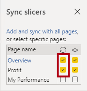](../media/lab-3-ssm.png#lightbox)

3.  Select **Create**.

   In the lower-right corner, in the status bar, notice that the live connection has been established.

   In the **Fields** pane, notice that the data model table are listed.

> [!NOTE] 
> Power BI Desktop can no longer be used to develop the data model; in live connection mode, it's only a report authoring tool. However, it is possible to create measures, but they are measures that are only available within the report. You won't add any report-scoped measures in this lab.

4. Save the Power BI Desktop file.

You're the owner of the Power BI dataset, and you can see all data.

When you share reports and dashboards to non-owners of the dataset, their accounts (or a security group of which they're a member) must be mapped to the **Salespeople** role. You will configure this before sharing content.

### Design page one

In this task, you will design the first report page. When you've completed the design, the page will look like the following image.

> [!div class="mx-imgBorder"]
> [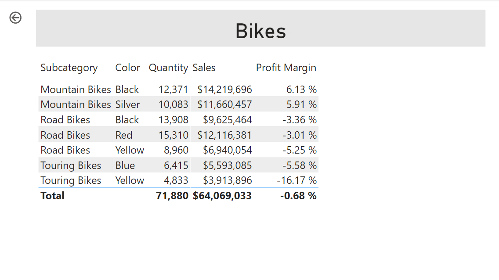](../media/lab-4-ss.png#lightbox)

1. To rename the page, in the lower-left corner, right-click **Page 1** and then select **Rename**.

	> [!div class="mx-imgBorder"]
	> [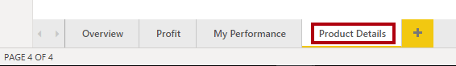](../media/lab-5-ssm.png#lightbox)

	> [!TIP]
	> You can also double-click the page name.

1. Rename the page as **Overview** and then press **Enter**.

	> [!div class="mx-imgBorder"]
	> [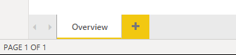](../media/lab-6-ss.png#lightbox)

1. To add an image, on the **Insert** ribbon tab, from inside the **Elements** group, select **Image**.

1. In the **Open** window, go to the **D:\DA100\Data** folder.

1. Select the **AdventureWorksLogo.jpg** file and then select **Open**.

1. Drag the image to reposition it in the upper-left corner. Drag the guide markers to resize the image.

	> [!div class="mx-imgBorder"]
	> 

1. To add a slicer, first clear the image by selecting an empty area of the report page.

1. In the **Fields** pane, select the **Date | Year** field (not the **Year** level of the hierarchy).

   Notice that a table of year values has been added to the report page.

1. To convert the visual from a table to a slicer, in the **Visualizations** pane, select **Slicer**.

	> [!div class="mx-imgBorder"]
	> 

1. To convert the slicer from a list to a drop-down menu, in the upper-right corner of the slicer, select the arrow, and then select **Dropdown**.

	> [!div class="mx-imgBorder"]
	> [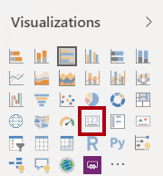](../media/lab-9-ssm.png#lightbox)

1. Resize and reposition the slicer so that it sits beneath the image and so that it is the same width as the image.

	> [!div class="mx-imgBorder"]
	> [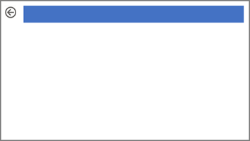](../media/lab-10-ss.png#lightbox)

1. In the **Year** slicer, select **FY2020** and then collapse the drop-down list.

	> [!div class="mx-imgBorder"]
	> [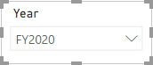](../media/lab-11-ss.png#lightbox)

	The report page is now filtered by year **FY2020**.

1. Clear the slicer by selecting an empty area of the report page.

1. Create a second slicer based on the **Region | Region** field (not the **Region** level of the hierarchy).

1. Leave the slicer as a list, and then resize and reposition the slicer beneath the **Year** slicer.

	> [!div class="mx-imgBorder"]
	> 

1. To format the slicer, beneath the **Visualizations** pane, open the **Format** pane.

	> [!div class="mx-imgBorder"]
	> 

1. Expand the **Selection Controls** group.

	> [!div class="mx-imgBorder"]
	> 

1. Set the **Show "Select all" option** to **On**.

	> [!div class="mx-imgBorder"]
	> [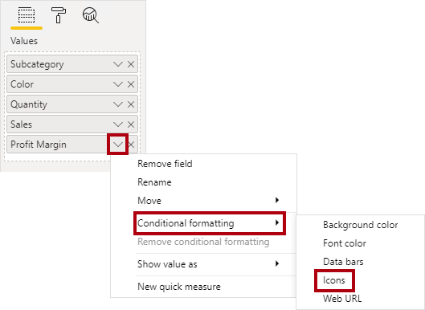](../media/lab-15-ssm.png#lightbox)

   In the **Region** slicer, notice that the first item is now **Select All**.

   When selected, this item either selects all or clears all items, which makes it easier for report users to set the right filters.

1. Clear the slicer by selecting an empty area of the report page.

1. To add a chart to the page, in the **Visualizations** pane, select the **Line and Stacked Column Chart** visual type.

	> [!div class="mx-imgBorder"]
	> [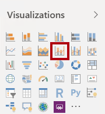](../media/lab-16-ssm.png#lightbox)

1. Resize and reposition the visual so that it sits to the right of the logo and so that it fills the width of the report page.

	> [!div class="mx-imgBorder"]
	> 

1. Drag the following fields into the visual:

	-   Date | Month
	
	-   Sales | Sales

1. In the **Visual fields** pane (not the **Fields** pane, the **Visual fields** pane is located beneath the **Visualizations** pane), notice that the fields are assigned to the **Shared Axis** and **Column Values** wells.

	> [!div class="mx-imgBorder"]
	> [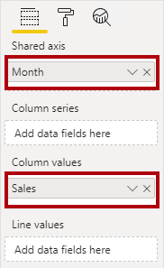](../media/lab-18-ssm.png#lightbox)

	By dragging visuals into a visual, they will be added to default wells. For precision, you can drag fields directly into the wells, as you will do now.

1. From the **Fields** pane, drag the **Sales | Profit Margin** field into the **Line Values** well.

	> [!div class="mx-imgBorder"]
	> 

1. Notice that the visual has 11 months only.

	The last month of the year, 2020 June, does not have any sales (yet). By default, the visual has eliminated months with BLANK sales. You will now configure the visual to show all months.

1. In the **Visual fields** pane, in the **Shared Axis** well, for the **Month** field, select the arrow and then select **Show items with no data**.

	> [!div class="mx-imgBorder"]
	> [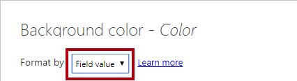](../media/lab-20-ssm.png#lightbox)

   Notice that the month **2020 June** now appears.

1. Clear the chart by selecting an empty area of the report page.

1. To add a chart to the page, in the **Visualizations** pane, select the **Map** visual type.

	> [!div class="mx-imgBorder"]
	> 

1. Resize and reposition the visual so that it sits beneath the column/line chart and so that it fills half the width of the report page.

	> [!div class="mx-imgBorder"]
	> 

1. Add the following fields to the visual wells:

	-   Location: **Region | Country**
	
	-   Legend: **Product | Category**
	
	-   Size: **Sales | Sales**

1. Clear the chart by selecting an empty area of the report page.

1. To add a chart to the page, in the **Visualizations** pane, select the **Stacked Bar Chart** visual type.

	> [!div class="mx-imgBorder"]
	> [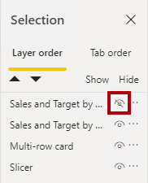](../media/lab-23-ssm.png#lightbox)

1. Resize and reposition the visual so that it fills the remaining report page space.

	> [!div class="mx-imgBorder"]
	> 

1. Add the following fields to the visual wells:

	-   Axis: **Product | Category**
	
	-   Value: **Sales | Quantity**

1. To format the visual, open the **Format** pane.

1. Expand the **Data Colors** group, and then set the **Default Color** property to a suitable color (in contrast to the column/line chart).

1. Set the **Data Labels** property to **On**.

1. Save the Power BI Desktop file.

The design of the first page is now complete.

### Design page two

In this task, you will design the second report page. When you've completed the design, the page will look like the following image.

> [!div class="mx-imgBorder"]
> 

Because detailed instructions have already been provided in previous steps, the ensuing steps will now provide more concise instructions. If you need the detailed instructions, you can refer to previous tasks.

1. To create a new page, in the lower-left corner, select the plus (**+**) icon.

1. Rename the page to **Profit**.

1. Add a slicer based on the **Region | Region** field.

1. In the **Format** pane, select **Show "Select all" option** (in the **Selection Controls** group).

1. Resize and reposition the slicer so that it sits at the left side of the report page and so that it is about half the page height.

	> [!div class="mx-imgBorder"]
	> [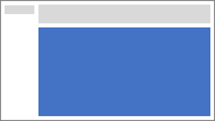](../media/lab-26-ss.png#lightbox)

1. Add a **Matrix** visual, and then resize and reposition it so that it fills the remaining space of the report page.

	> [!div class="mx-imgBorder"]
	> 

1. Add the **Date | Fiscal** hierarchy to the matrix **Rows** well.

	> [!div class="mx-imgBorder"]
	> [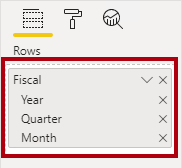](../media/lab-28-ssm.png#lightbox)

1. Add the following five **Sales** table fields to the **Values** well:

	-   Orders (from the **Counts** folder)
	
	-   Sales
	
	-   Cost
	
	-   Profit
	
	-   Profit Margin

	> [!div class="mx-imgBorder"]
	> 

   In the **Filters** pane (located to the left of the **Visualizations** pane), notice that the **Filters on this page** well is available (you might need to scroll down).

1. From the **Fields** pane, drag the **Product | Category** field into the **Filters on this page** well.

1. Inside the filter card, in the upper-right corner, select the arrow to collapse the card.

	Fields that are added to the **Filters** pane can achieve the same result as a slicer. One difference is they don't take up space on the report page. Another difference is that they can be configured for more advanced filtering requirements.

1. Add each of the following Product table fields to the **Filters on this page** well, collapsing each directly beneath the **Category** card:

	-   Subcategory
	
	-   Product
	
	-   Color

	> [!div class="mx-imgBorder"]
	> [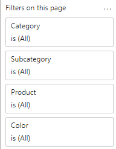](../media/lab-31-ss.png#lightbox)

1. To collapse the **Filters** pane, in the upper-right corner of the pane, select the arrow.

1. Save the Power BI Desktop file.

The design of the second page is now complete.

### Design page three

In this task, you will design the third and final report page. When you've completed the design, the page will look like the following image.

> [!div class="mx-imgBorder"]
> 

1. Create a new page and then rename it as **My Performance**.

	Recall that row-level security was configured to ensure that users only ever see data for their sales regions and targets. When this report is distributed to salespeople, they will only see their sales performance results.

1. To simulate the row-level security filters during report design and testing, add the **Salesperson (Performance) | Salesperson** field to the **Filters** pane, inside the **Filters on this page** well.

1. In the filter card, scroll down the list of salespeople, and then select **Michael Blythe**.

1. Add a drop-down slicer based on the **Date | Year** field, and then resize and reposition it so that it sits in the upper-left corner of the page.

	> [!div class="mx-imgBorder"]
	> 

1. In the slicer, select **FY2019**.

1. Add a **Multi-row card** visual, and then resize and reposition it so that it sits to the right of the slicer and fills the remaining width of the page.

	> [!div class="mx-imgBorder"]
	> 

	> [!div class="mx-imgBorder"]
	> 

1. Add the following four fields to the visual:

	- **Sales | Sales**
	
	- **Targets | Target**
	
	- **Targets | Variance**
	
	- **Targets | Variance Margin**

1. Format the visual as follows:

	-   In the **Data Labels** group, increase the **Text Size** property to **28pt**.
	
	-   In the **Background** group, set **Color** to a light gray color.

	> [!div class="mx-imgBorder"]
	> [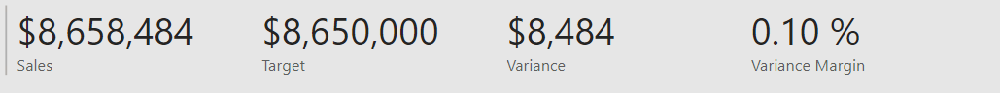](../media/lab-37-ss.png#lightbox)

1. Add a **Clustered Bar Chart** visual, and then resize and reposition it so that it sits beneath the multi-row card visual, fills the remaining height of the page, and fills half the width of the multi-row card visual.

	> [!div class="mx-imgBorder"]
	> 

	> [!div class="mx-imgBorder"]
	> 

1. Add the following fields to the visual wells:
	
	-   Axis: **Date | Month**
	
	-   Value: **Sales | Sales** and **Targets | Target**

	> [!div class="mx-imgBorder"]
	> 

1. To create a copy of the visual, press **Ctrl+C** and then press **Ctrl+V**.

1. Position the copied visual to the right of the original visual.

	> [!div class="mx-imgBorder"]
	> 

1. To modify the visualization type, in the **Visualizations** pane, select **Clustered Column Chart**.

	> [!div class="mx-imgBorder"]
	> 

It's now possible to see the same data expressed by two different visualization types. This isn't a good use of the page layout, but you will improve it in subsequent labs.

### Publish the report

In this task, you will publish the report.

1. Select the **Overview** page.

1. Save the Power BI Desktop file.

1. On the **Home** ribbon tab, from inside the **Share** group, select **Publish**.

	> [!div class="mx-imgBorder"]
	> 

1. Publish the report to your **Sales Analysis** workspace.

1. Keep Power BI Desktop open.

In the next exercise, you will explore the report in Power BI service.

## Explore the report

In this exercise, you will explore the **Sales Report** in Power BI service.

### Explore the sales report

In this task, you will explore the **Sales Report** in Power BI service.

1. In Microsoft Edge, in Power BI service, in the **Navigation** pane, review the contents of your **Sales Analysis** workspace and then select the **Sales Report** report.

	> [!div class="mx-imgBorder"]
	> 

	The report publication has added a report to your workspace. If you don't see it, press **F5** to reload the browser, and then expand the workspace again.

1. In the **Regions** slicer, while pressing the **Ctrl** key, select multiple regions.

1. In the column/line chart, select any month column to cross-filter the page.

1. While pressing the **Ctrl** key, select an additional month.

	By default, cross-filtering will filter the other visuals on the page.

   Notice that the bar chart is filtered and highlighted, with the bold portion of the bars representing the filtered months.

1. Hover the cursor over the visual and then, in the upper-right corner, select the filter icon.

	> [!div class="mx-imgBorder"]
	> 

	The filter icon allows you to understand all filters that are applied to the visual, including slicers and cross-filters from other visuals.

1. Hover the cursor over a bar, and then glance at the tooltip information.

1. To undo the cross-filter, in the column/line chart, select an empty area of the visual.

1. Hover the cursor over the map visual and then, in the upper-right corner, select the **In Focus** icon.

	> [!div class="mx-imgBorder"]
	> 

	In focus mode will zoom the visual to full page size.

1. Hover the cursor over different segments of the pie charts to reveal tooltips.

1. To return to the report page, in the upper-left corner, select **Back to Report**.

	> [!div class="mx-imgBorder"]
	> 

1. Hover the cursor over the map visual again, select the ellipsis (**...**), and then notice the menu options.

	> [!div class="mx-imgBorder"]
	> 

1. Try each of the options.

1. At the left, in the **Pages** pane, select the **Profit** page.

	> [!div class="mx-imgBorder"]
	> 

1. Notice that the **Region** slicer has a different selection to the **Region** slicer on the Overview page.

	The slicers are not synchronized. In the next lab, you will modify the report design to ensure that they sync between pages.

1. In the **Filters** pane (located at the right), expand a filter card and then apply some filters.

	The **Filters** pane allows you to define more filters than could possibly fit on a page as slicers.

1. In the **Matrix** visual, use the plus (**+**) button to expand the **Fiscal** hierarchy.

1. Select the **My Performance** page.

1. In the upper-right corner of the menu bar, select **View > Full Screen**.

1. Interact with the page by modifying the slicer and cross-filtering the page.

   In the lower-left corner, notice the commands to change pages, navigate backward or forward between pages, or to exit full screen mode.

1. Exit full screen mode.

	> [!div class="mx-imgBorder"]
	> 

1. To return to the workspace, in the breadcrumb trail, select your workspace name.

	> [!div class="mx-imgBorder"]
	> 
