The page layout of the reports that you create in Power BI Desktop will likely depend on the business requirements, the context of the underlying data, and the output requirements. For example, if you are designing a dashboard, you'll need to present high-level information on a single page. If you are designing a report, it is a multi-perspective view into your dataset, with visuals that represent different findings and insights from that dataset.

## Report design best practice

The first step in designing an exceptional report layout is to choose the correct format. Likely, your manager (or whoever requested the report) will give you some requirements in terms of format. If not, you'll need to consider the audience and speculate about the kind of format that they'll want.

For example, if your report users have a technical background and are looking for specific facts, you can use multiple, complex visuals that offer the most detail, along with interactive slicers. Conversely, if your users are looking for quick data insights at a high level, you could use a small range of basic visuals.

If you have been given some layout requirements, you still need to carefully consider the report audience. Your goal is to provide the audience with the information that they need, in an optimal way. While you might have a strong opinion about what data to display and how to display it, ultimately, the report is not for you, it is for a dedicated audience that needs to make business decisions based on your report.

Considering the different needs of the report audience is crucial. Your report audience might have hearing, motor, cognitive, or visual impairment. To accommodate those needs, you should create a report that offers an accessible experience, which means that the report will be simple to navigate and understand by keyboard or screen-reader users. You'll learn more about design and configuring your report for accessibility in subsequent sections.

Carefully consider each visual and element that you plan on using in the report. Everything should have a purpose, and you should consider how each element will appear to your report users. While you might consider using different types of visuals for the sake of variety or to demonstrate your skillset, sometimes a simple visual is all that you need. Likely, your organization will have style guidelines for reports, in which case, you'll have to adhere to particular color scheme and font. Do keep in mind that the more visuals you use in your report, the more that they impact the performance of your report. 

Other key guidelines for creating a well-designed report layout include:

-   Draw a sketch of your report layout. This approach will help you get an idea of what it will look like before you spend considerable time physically designing it. Alternatively, you could draw multiple sketches, where you try out different ideas and then discuss these ideas with your team to help select the best layout design.

-   Focus on the most important information. Highlight key parts of your report with a bright color or summary icon so that it stands out and draws users to the most critical metrics.

-   Select the right background for the context of your report. A white background can make your report look clean and professional, whereas a black background can draw attention to colorful highlights on the report. Using images as a background can add visual interest.

The following image shows a poorly designed report layout, which you should avoid. A later section will provide an example of the same report but with an improved design.

> [!div class="mx-imgBorder"]
> [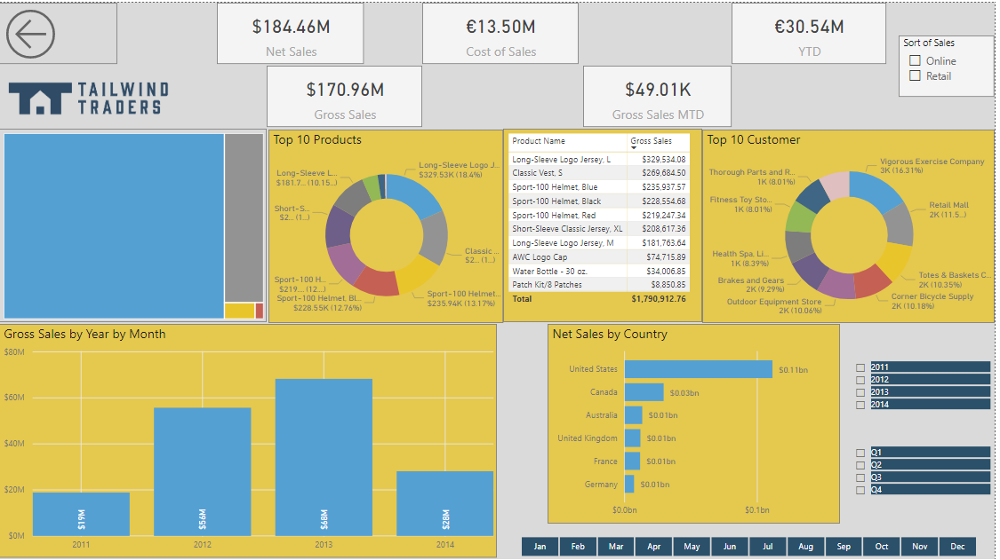](../media/2-example-bad-report-design-ss.png#lightbox)

The following sections provide more detailed guidance for setting up the report page and using visuals.

### Report page

It is important to consider that you and the report users might view the reports on screens with different aspect ratios and sizes.

The default display view is **Fit to page**, which means that the contents are scaled to best fit the page. If you need to change this view, go to the **View** tab, select **Page view**, and then select your preferred page view option, as illustrated in the following screenshot.

> [!div class="mx-imgBorder"]
> [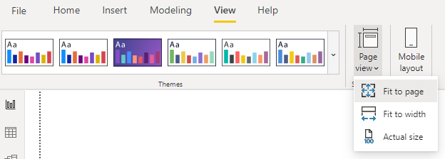](../media/2-page-view-options-ss.png#lightbox)

To access the page settings, select the white space on your report canvas to open the **Format** pane. You can then configure the following settings to suit your needs: **Page information**, **Page alignment**, **Page size**, **Wallpaper**, **Page background**, and **Filter pane**.

> [!div class="mx-imgBorder"]
> [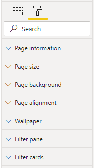](../media/2-page-configuration-options-ssm.png#lightbox)

### Visuals 

You might want to use a combination of visuals in your report, such as cards, charts, tables, slicers, and so on. It is important to use the right number of visuals on a page, and then size and position those visuals strategically.

#### Number of visuals

Consider the number of visuals (including slicers) that you want to use on each report page. Using more visuals might have the opposite effect to what you are trying to achieve. More visuals might make your report look too busy, causing users to feel overwhelmed because they don't know where to focus their attention. Also, visuals are key factors in the performance of your report; they contribute to performance issues. The fewer visuals you use, the better the performance will be.

It's best to limit the number of visuals that you use on a page. Examine each visual and ask yourself if it's necessary. If a visual does not add value to the audience, you should not use it in your report.

Rather than using multiple visuals, you can provide information in other ways, such as drillthrough pages and report page tooltips. You'll learn more about these elements later in this module.

#### Position of visuals

When you add visualizations to a report, you can move those visuals to specific locations on the page and make them larger or smaller for a more effective display.

It is best practice to place the most important visual in the upper-left corner of your report because your users most likely read left-to-right and top-to-bottom. You might also want to place your organization's logo in or near this area. You can then arrange the other visuals accordingly.

To move a visualization, select any area of the visualization and then drag it to the new location.

To evenly distribute distance between visuals that are located on the canvas, you can also use the **Align** function. Use **CTRL**+click to select all visuals that you want to align, select the **Format** tab, and then select **Distribute horizontally**.

> [!div class="mx-imgBorder"]
> [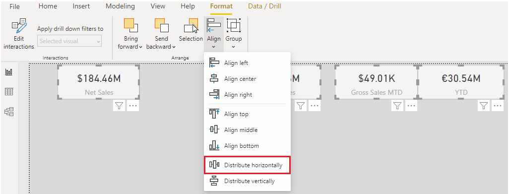](../media/2-page-alignment-options-ssm.png#lightbox)

The visuals will then be evenly distributed.

> [!div class="mx-imgBorder"]
> [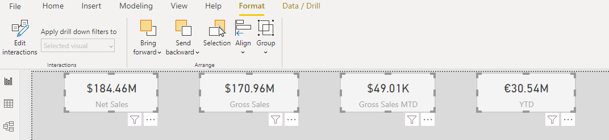](../media/2-evenly-distributed-visuals-ss.png#lightbox)

#### Size of visuals

When you add a visual to a report, Power BI determines the size of that visual by default. You can resize that visual to ensure that it presents the displayed information most optimally. For example, if the visual is of a small car, you might want to make the visual smaller. Similarly, if you are working with a scatter chart visual with extensive data, you might want to make that visual larger in size so users can see the data clearly.

To resize a visual, select the visual to display its border, and then select and drag the dark frame handles to the size that you want it to be.

#### Interaction of visuals

The visuals that you add to your report will interact with each other. For example, when you select an element in one visual, such as a product category, the other visuals will update in relation to that element; they might highlight or filter the specific data that they display. Therefore, when you are designing the report, it is important to understand these interactions and consider how they might affect the overall user experience of the report. You have control over how interactions flow between the visuals; therefore, you might want to change a filter action to a highlight (and contrariwise), or prevent an interaction from happening. This process will be further explained later in this module.

#### Hierarchies in visuals

Likely, you'll have a number of hierarchies in your data, so you should consider how these hierarchies will affect how the data displays in the visuals and the navigation experience of your report users. You can set how hierarchies are presented in the visuals. You can also determine the hierarchical path of visuals so that you have full control over what level of detail can be accessed. You'll learn more about hierarchies later in this module.

## Report accessibility

It is essential that you consider the possibility that your users might have hearing, motor, cognitive, or visual impairments. Therefore, make sure that you design a report that adheres to accessibility standards and that uses the available accessibility features within Power BI Desktop.

Designing a report that offers an accessible experience will benefit all report users because it ensures that your report has an effective design and uses consistent formatting and color scheme or theme.

Generally, when you are using Power BI with a screen reader, we recommend that you turn scan mode or browse mode off.

To improve the process of creating reports with screen readers, a context menu is available. The menu allows you to move fields in the well up or down in the **Fields** list. The menu also allows you to move fields to other wells, such as **Legend**, **Value**, or others.

> [!div class="mx-imgBorder"]
> [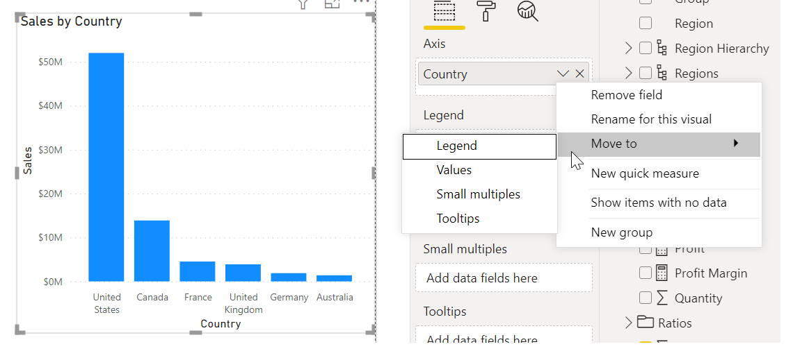](../media/2-context-menu-options-ssm.png#lightbox)

### Accessibility standards

Power BI is committed to accessibility standards under the Web Content Accessibility Guidelines (WCAG). The standards help ensure that your Power BI experiences are accessible to as many people as possible. When you build accessible reports or dashboards, that content is accessible for anyone who views them by using Power BI Mobile.

Web Content Accessibility Guidelines (WCAG) help make web content accessible to people with disabilities. The key principles of the guidelines are:

-   Perceivable - Information and user interface components must be presentable to users in ways that they can perceive.

-   Operable - User interface components and navigation must be operable.

-   Understandable - Information and the operation of the user interface must be understandable.

### Accessibility features

The following accessibility features are built in to Power BI Desktop, so you don't need to do any configuration in this regard:

-   Keyboard navigation

-   Screen-reader compatibility

-   High contrast colors view

-   Focus mode

-   Show data table

Accessibility features that you do need to configure include:

- Alt text

- Tab order

- Titles and labels

- Markers

- Themes

#### Alt text

To accommodate report consumers who use screen readers, you can use alternative (alt) text to describe the appearance and function of objects (such as a visual, shape, and so on) on the report page. Alt text helps you ensure that users understand what you are trying to communicate with those objects, even if they are unable to see them.

To add alt text to an object, select that object and, in the **Visualizations** pane, open the **Format** pane. Expand the **General** section, scroll to the bottom of the options, and then enter a description in the **Alt Text** box. Repeat this step for every object that conveys meaningful information on a report.

If you do not want to use static text, you can use Data Analysis Expressions (DAX) measures and conditional formatting to create dynamic alt text. Screen readers will then call out values that are specific to the data that a report user is viewing.

To apply conditional formatting, right-click the **Alt Text** box, select **Conditional formatting**, and then configure the settings as required.

> [!div class="mx-imgBorder"]
> [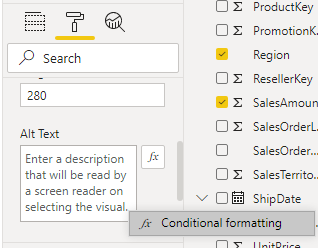](../media/2-add-alt-text-option-ssm.png#lightbox)

#### Tab order

To help keyboard users navigate your report in an order that matches the way that visual users would, you can set the tab order.

To set the tab order, select the **View** tab in the ribbon and then select **Selection Pane**. On the **Selection** pane that displays, use the arrow buttons to move the objects to the correct order, or select an object with your mouse and drag it into the position that you want in the list.

To hide an object from the tab order, select the number next to that object. For example, it's best to hide decorative shapes and images that you have in your report.

> [!div class="mx-imgBorder"]
> [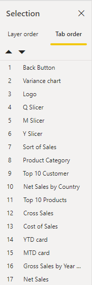](../media/2-set-tab-order-objects-ss.png#lightbox)

#### Titles and labels

To help all users, you should provide clear, concise, descriptive titles for your visuals and report pages. Avoid using acronyms or jargon that new users or users who are external to your organization will not understand.

Compare the following images, where the image on the left shows a visual with an acronym in the title, and the image on the right shows a visual with a clearer title.

> [!div class="mx-imgBorder"]
> [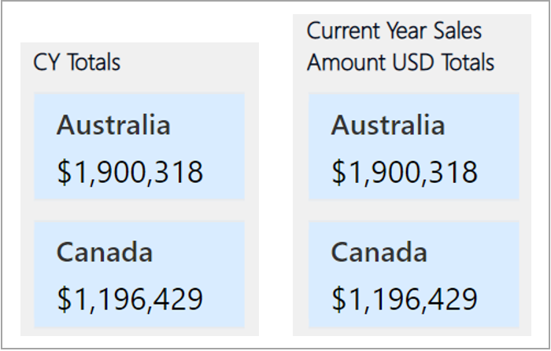](../media/2-comparison-visual-titles-ss.png#lightbox)

Make sure that all labels within a visual are easy to read and understand. You can turn on or off the labels for each series in your visual or position them above or below a series to make them clearer. Don't turn on labels for every visual because it might have the opposite effect by distracting users and making your report less accessible.

Compare the following images, where the first image has fewer numbers or descriptions of the data, whereas the second has several. 

> [!div class="mx-imgBorder"]
> [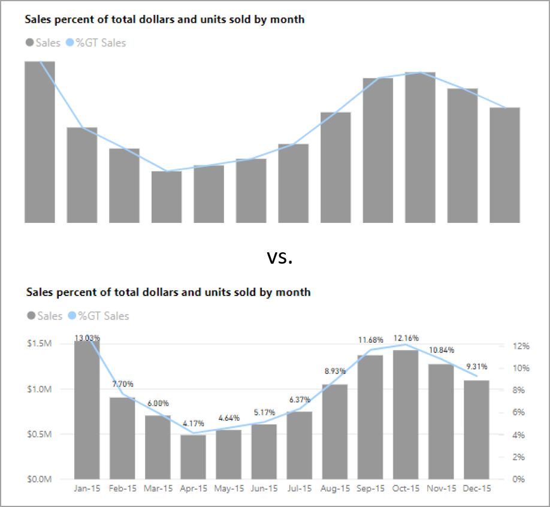](../media/2-comparison-visual-labels-ss.png#lightbox)

#### Markers

It's best practice to avoid using color (including the feature's conditional formatting) as the only way of conveying information. Instead, you can use markers to convey different series. For line, area, and combo visuals, including scatter and bubble visuals, you can turn on markers and use a different shape for each line.

Keep in mind that, if you turn on markers for every visual, it might be distracting and make your report less accessible for users.

To turn on markers, in the **Format** pane, expand the **Shapes** section, and then scroll down and move the **Show marker** slider to the **On** position.

> [!div class="mx-imgBorder"]
> [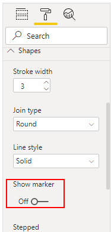](../media/2-turn-markers-ssm.png#lightbox)

> [!div class="mx-imgBorder"]
> [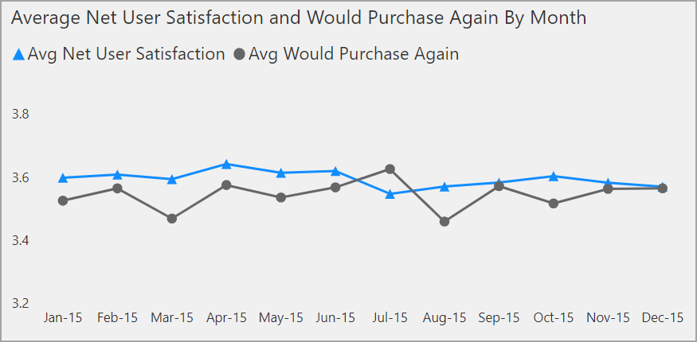](../media/2-view-markers-visual-ss.png#lightbox)

#### Themes

To make your reports even more accessible, ensure that enough contrast exists between the text and background colors; the contrast ratio should be at least 4.5:1. Several tools are available for you to use to check your report colors, such as Color Contrast Analyzer, WebAIM, and Accessible Colors.

Some of your report viewers might have color vision deficiencies. Using fewer colors or a monochrome palette in your report can help mitigate the creation of inaccessible reports. The following color combinations are difficult for users with color vision deficiencies to distinguish, so you should avoid using them together in a chart or on the same report page.

-   Green and red

-   Green and brown

-   Blue and purple

-   Green and blue

-   Light green and yellow

-   Blue and grey

-   Green and grey

-   Green and black

Power BI Desktop has built-in themes that you can use to make your report more accessible and generally look better. You can access these themes from the **View** tab. Select the **Expand** button to view all available themes and related options. Select any theme and it will automatically apply across the whole report. All visuals will use the colors and formatting from your selected theme as their defaults.

> [!div class="mx-imgBorder"]
> [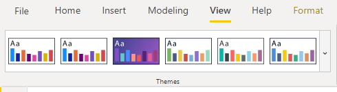](../media/2-view-theme-options-ss.png#lightbox)

You can also import or create your custom themes by expanding the following **Themes** options.

> [!div class="mx-imgBorder"]
> [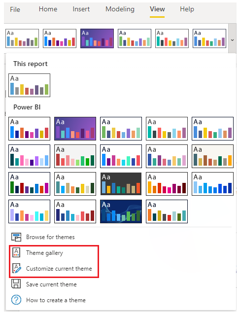](../media/2-view-theme-options-ssm.png#lightbox)

The following image depicts the same report that was shown at the beginning of this unit. However, in this image, the report has a better design; it has a planned layout and consistent color scheme and formatting.

> [!div class="mx-imgBorder"]
> [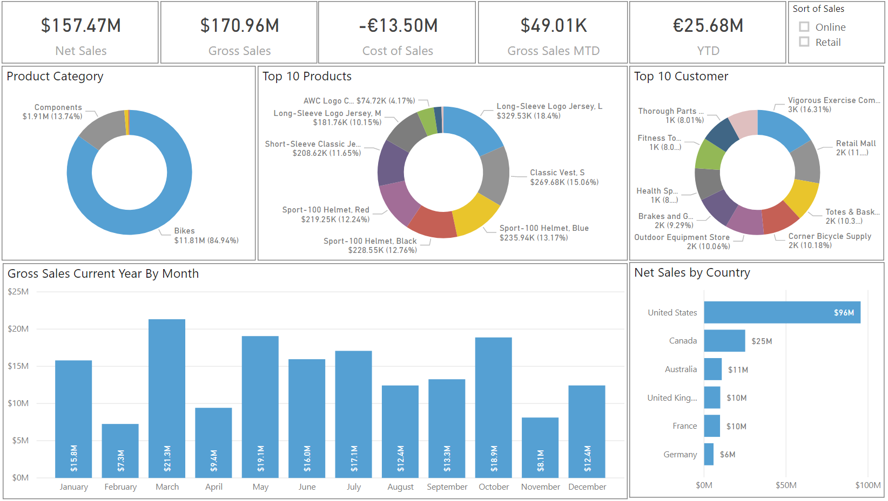](../media/2-example-improved-report-design-ss.png#lightbox)
