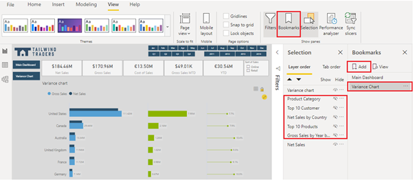
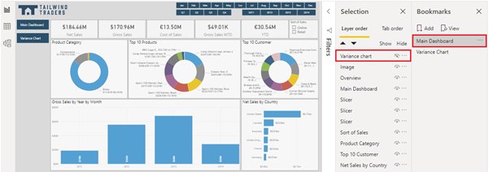
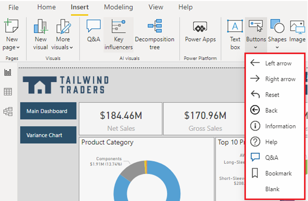
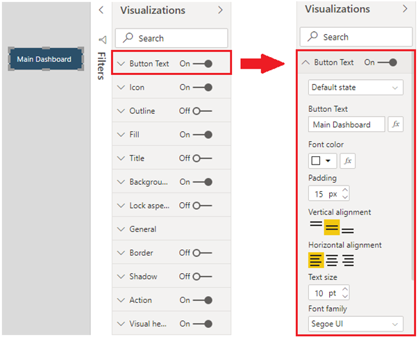
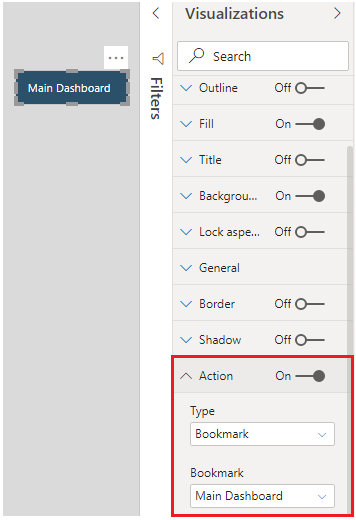
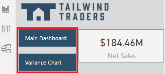

You can use the **Bookmarks**, **Buttons**, and **Selections** features in Power BI Desktop to make your report more compelling, interactive, and simpler for users to navigate.

-   **Bookmarks** - Capture the currently configured view of a report page so you can quickly return to that view later. You can use bookmarks for different reasons. For example, you can use them to keep track of your own progress when creating reports. You can also use them to build a PowerPoint-like presentation that goes through the bookmarks in order, thereby telling a story with your report.

-   **Buttons** - Create a more interactive experience for the report users. With the addition of buttons that have assigned actions, your report behaves similar to an app, where users can hover, select, and interact more with the content.

-   **Selections** - Allow you to determine what items in the report are visible and what items are hidden. Selections are used alongside bookmarks and buttons.

Consider a situation where you have designed a report page and want to have a second page that looks almost the same, except that one of the visuals will be different. Rather than creating a second page and manually making changes, you can use a combination of selections, bookmarks, and buttons to switch between the two visuals on one page.

## Add bookmarks

When you add a bookmark, the following elements are saved with it:

-   Current page

-   Filters

-   Slicers, including slicer type (for example, drop-down or list) and slicer state

-   Visual selection state (such as cross-highlight filters)

-   Sort order

-   Drill location

-   Visibility of an object (by using the **Selection** pane)

-   Focus or Spotlight modes of any visible object

In this example, you want to add bookmarks to allow users to switch between two visuals on one page. First, you need to set up how you want the page to initially display.

When you have added and formatted all the visuals and other items on the page, you can add a bookmark to capture a snapshot of the page in its current state.

Before adding a bookmark, go to the **View** tab in the ribbon and select **Selection**. The displayed **Selection** pane includes a list of all items on your page, along with an eye icon that indicates the items that are currently visible. You can rename the items in the list by double-clicking them so you clearly know which one is which.

Now you are ready to add the bookmark. On the **View** tab, select **Bookmarks**. On the **Bookmarks** panel that displays, select **Add**. It's good practice to rename the new bookmark so its purpose is clear; this notion is especially true if you plan on adding multiple bookmarks. To rename a bookmark, double-click the bookmark and enter the new name. In this example, you want to change the bookmark name from **Bookmark 1** to **Variance Chart** because the **Variance** chart is the main focus of the page, as shown in the following image. In the **Selection** pane, the **Variance** chart displays and the other visuals are hidden.

> [!div class="mx-imgBorder"]
> 

Next, you can add the second bookmark. Start by making changes to how the page currently appears. In this example, you will add another bookmark for the main dashboard charts. Because you only want to see charts from the main dashboard, you can hide the **Visual** chart by selecting its eye icon on the **Selections** pane. Then, add a bookmark for this new view of the page and rename it as **Main Dashboard**.

> [!div class="mx-imgBorder"]
> 

Now, you can switch between the two bookmarks to see the difference in the page.

> [!div class="mx-imgBorder"]
> 

Repeat these steps to add more bookmarks. In summary, you would select items that you want to show/hide on the report page, add a bookmark, and then give it a descriptive name.

You can now assign those bookmarks to buttons so that users can switch between the bookmarks. 

## Add buttons

You can use buttons for many reasons, such as to switch between two visuals in a report (as required in the previous example), to drill down into the data in a visual, or to move from one page in your report to another. Power BI Desktop provides a range of button types that you can add to your report, as illustrated in the following image.

> [!div class="mx-imgBorder"]
> 

In this example, you want to add customized buttons that are used to switch between two bookmarks. To add a button, go to the **Insert** tab on the ribbon and select **Buttons**. Then, select the type of button that you want to add from the list, which in this case, you would select the **Blank** option.

When the button is added to the page, reposition the button to above the visual on the right side. Next, select the button and then, in the **Visualizations** pane, move the **Button Text** slider to the **On** position. Expand the **Button Text** section, and then enter the text that you want to display on the button, for example, **Main Dashboard**. You can then format the button text by changing its font, color, alignment, and text size. Expand the **Background** section and select a suitable color for the button.

> [!div class="mx-imgBorder"]
> 

Now, you can add an action to the button. Go to the **Action** slider near the bottom of the **Visualizations** pane and move the slider to the **On** position. Then, expand the **Actions** section to view the options. The options for the button action types are as follows, some of which are explained in more detail in the subsequent sections.

-   **Back** - Returns the user to the previous page of the report. This option is useful for drillthrough pages or pages that are accessed from one main page.

-   **Bookmark** - Presents the report page that's associated with a bookmark that is defined for the current report.

-   **Drill through** - Brings the user to a drillthrough page that is filtered to their selection, without using bookmarks.

-   **Page navigation** - Brings the user to a different page within the report, also without using bookmarks, which is an effective way to create a navigation experience for your report users. This type of button is discussed later in this module.

-   **Q&A** - Opens a **Q&A Explorer** window, where users can enter questions to quickly find the information that they are looking for and specify the type of visual that they want to see the information displayed in. This option can be useful if you want to save space in the report but still offer **Q&A** functionality to the user.

-   **Web URL** - Opens a website in a new browser window. For example, you might want to give users quick access to your organization's website or intranet from within a report.

In this example, you select **Bookmark** as the action type. In the **Bookmark** list that displays, select the bookmark that you want to assign to the action, the **Main Dashboard** bookmark that you created previously. For enhanced accessibility, you should add a tooltip that users will see when they hover over the button, but in this case, it's not required because you have a descriptive button label.

> [!div class="mx-imgBorder"]
> 

Now that your button is set up, you can copy and paste the button so that you have two buttons with consistent formatting on the page. In this example, you rename the second button to **Variance Chart** and change the assigned action to the **Variance Chart** bookmark.

You can then reposition the buttons anywhere on your canvas. For this example, you will position the new buttons on the left side of the canvas for easy navigation.

> [!div class="mx-imgBorder"]
> 

Your buttons are now ready for use. You can use them to switch between two bookmarks with a different layout on the same page. When you select the **Main Dashboard** button, the main dashboard charts display, and when you select the **Variance Chart** button, the **Variance** chart displays.
