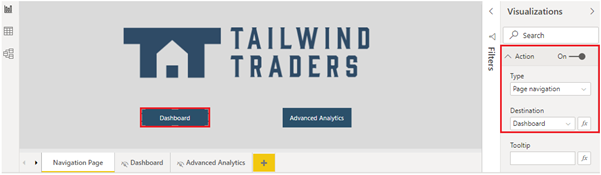
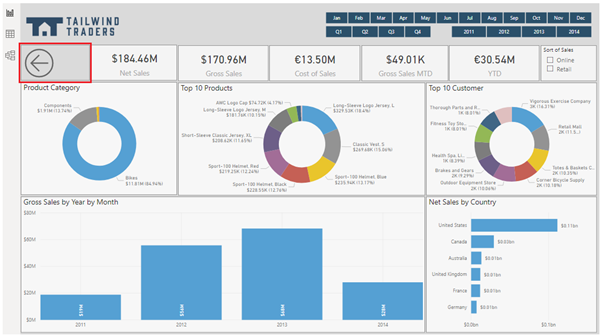
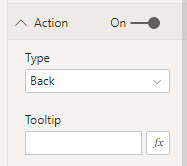
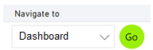
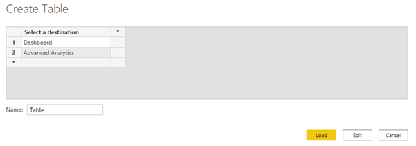
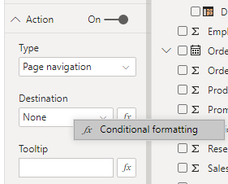
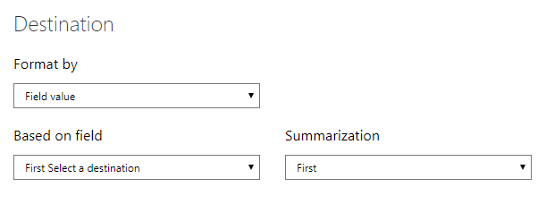

Report navigation is the way in which your report users move from one page in your report to the next, move from one visual to another, and go back to where they started from. The design of your report navigation is very important because if users cannot easily find their way around your reports, they will become frustration and have a negative experience.

You can use a range of buttons and bookmarks when designing your report navigation, and you can further enhance this navigation experience with the use of conditional formatting.

## Add navigation buttons

To design the navigation within your report, you can create a new Navigation page in your report, and add navigation buttons there. You can also use a combination of both options. When users click on one of these buttons, they are brought directly to a different page within the report, which you can hide, so it can be only be accessed through the Navigation page buttons.

In this example, you create a Navigation page on which you add two navigation buttons to your other pages.

Start by adding a button, as you did in the previous unit. This time, when you expand the **Actions** section in the **Visualizations** pane, select **Page navigation** as the action type, and then select the page in your report that is the **Destination** for the button.

When you have set up the first navigation button, copy and paste that button to create the second navigation button, so you preserve the formatting you applied to the first button. Then change the title and destination for the second button.

> [!div class="mx-imgBorder"]
> 

Now when you select a button, you are brought directly to the assigned page destination. When you are on that destination page, to return to the Navigation page, you can use a **Back** button. Here are two back navigation options:

-   Select **Back** button from the main **Buttons** menu, then reposition the button to where you want it to sit on the page.

> [!div class="mx-imgBorder"]
> 

-   Select **Blank** button from the main **Buttons** menu, reposition and customize the button as required, then select **Back** as the action type.

> [!div class="mx-imgBorder"]
> 

## Conditionally set the navigation destination

You can use conditional formatting to set the navigation destination based on the output of a measure. One reason you might want to use this type of navigation method is to save space in your report. For example, rather than using multiple navigation buttons (as illustrated in the previous image), you can use a single button to navigate to different pages based on the user's selection (as illustrated in the following image).

> [!div class="mx-imgBorder"]
> 

Other reasons for using this type of navigation include:

-   To specify the logical path that your report users should take. In other words, you determine the order in which users view each page.

-   To tell a data-driven story. For example, you could use it to give your employees a message that is backed up by the data. This could be useful to help drive change, such as increase sales.

-   To create a reporting portal where users can navigate to a set of reports.

To use conditional formatting to set the navigation, start by creating a single-column table that has the names of the navigation destinations. In the table, ensure that the entered values match your report page names.

> [!div class="mx-imgBorder"]
> 

When you load the table, add it to the report page as a single-select slicer. Next, add a page navigation button. In the **Actions** section, ensure **None** is set as the **Destination**, then right-click the destination and select **Conditional formatting**. 

> [!div class="mx-imgBorder"]
> 

On the **Destination** window, select the name of the column you created. Then you'll see that based on the user's selection the button can navigate to different pages. Configure the conditional formatting to complete your navigation design.

> [!div class="mx-imgBorder"]
> 