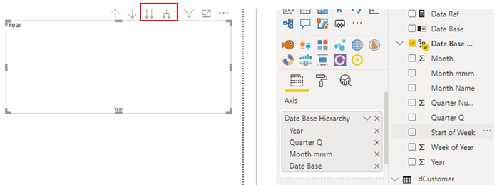
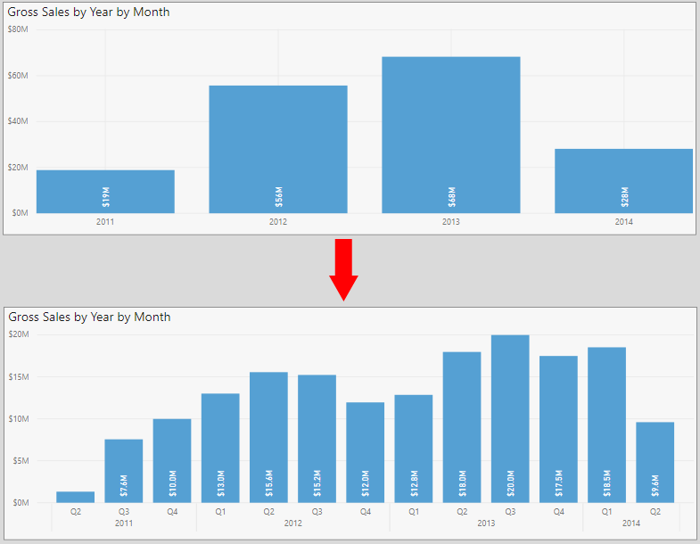
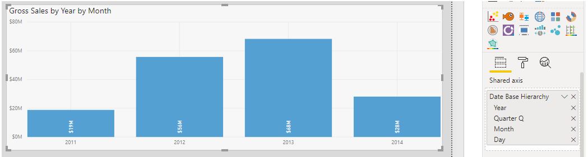
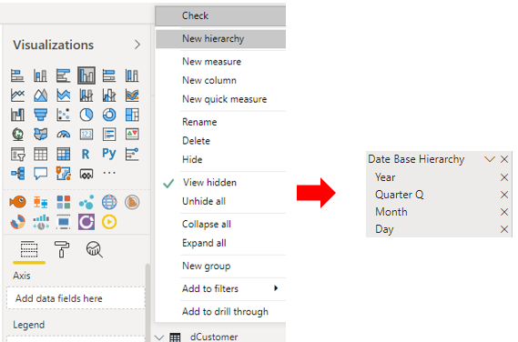
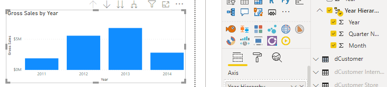

In Power BI Desktop your report is dynamic. When you make a selection on one visual in the report, other visuals might change to reflect that selection. Similarly, if there are hierarchies in your data, you can move up and down the hierarchy to see the data at different levels.

In this unit you'll learn about how the basic interactions work, and also how to use hierarchies in your visuals. In the next unit, you'll learn how to edit the interactions, and use the drill-through features.

## View interactions

When you have multiple visuals on the same report page, they all interact with each other, so you should become familiar with these interactions and see how your report changes.

Compare the following two images. In the first image, the data displays at a high level. 

> [!div class="mx-imgBorder"]
> 

When you select an element in a visual, such as **Components** in the **Product Category** visual, the other visuals update to reflect your selection, as illustrated in the second image.

> [!div class="mx-imgBorder"]
> 

When you have become familiar with the interactions, you might want to make changes in order to control how those interactions flow between the visuals. You'll learn how to do this in the next unit.

## Use hierarchies

A hierarchy is a structure in which groups are ranked one above the other, according to a specific status. Think of your own organizational hierarchy, where you have the CEO at the top level, then managers in the middle level, and employees at the lower level. Similarly, you'll likely have hierarchies for your data in Power BI. For example, you could have a time hierarchy, with levels such as year, quarter, month and day, or a product hierarchy, with levels such as category, subcategory and product.

In regards to dates, Power BI creates hierarchies for you automatically. When you select the hierarchy in the **Fields** pane, the date hierarchy is added to the **Axis** field well on the **Visualizations** pane, and a blank visual is created for you, ready for additional fields. You'll also see the hierarchy icons above the visual, as illustrated in the following image.

> [!div class="mx-imgBorder"]
> 

When you add another field to the visual, the visual becomes useful, and you can then use the hierarchy icons to navigate through the hierarchy - Power BI creates a predefined drill path for the data. In the following image, the **Gross Sales** field was added to the visual and you can see the data at the highest level (year), then when the **Expand all down one level in the hierarchy** button was selected, the hierarchy was expanded down by one level (quarter). If you were to select the button again, the visual would update to display the next lower level in the hierarchy (month), and so on.

> [!div class="mx-imgBorder"]
> 

Another navigation option is the **Go the next level in the hierarchy** button. When you select either hierarchy option, select the **Drill** up button to move back up hierarchy.

As you can see, the default date hierarchy feature in Power BI is quick and easy to use. However, if you have your own date table, you can use that to create the hierarchy instead. In the following image, the **Year**, **Month**, **Quarter** and **Week of Year** fields were added to the **Axis** field well on the **Visualizations** pane. The data result is the same as with the default hierarchy, and you can navigate through the hierarchy in the same way.

> [!div class="mx-imgBorder"]
> 

You can also predefine the hierarchy path for your report users, and remove the guess work from them. For example, you might want t prevent them from viewing a particular hierarchy level. To do so, remove all of the fields from the **Axis** well, then in the **Fields** pane, right-click the field you want to set as the top level of the hierarchy, and then select **New hierarchy**. The new hierarchy displays ion the list in the **Fields** pane. You can now drag and drop other fields into the new hierarchy, or right-click each field and select **Add to hierarchy**.

> [!div class="mx-imgBorder"]
> 

Ensure your visual is selected, then select the new hierarchy field in the **Fields** pane to apply it to the visual.

> [!div class="mx-imgBorder"]
> 

Once again, you can use the hierarchy buttons above the visual to expand down the hierarchy and drill back up again.
