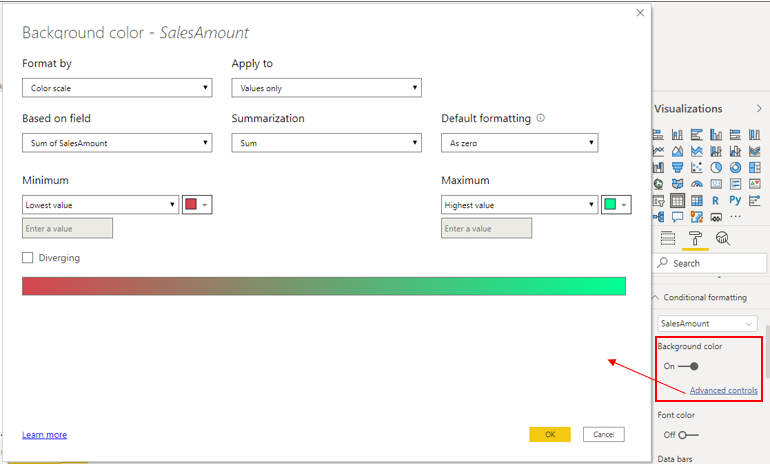
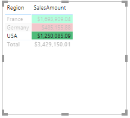
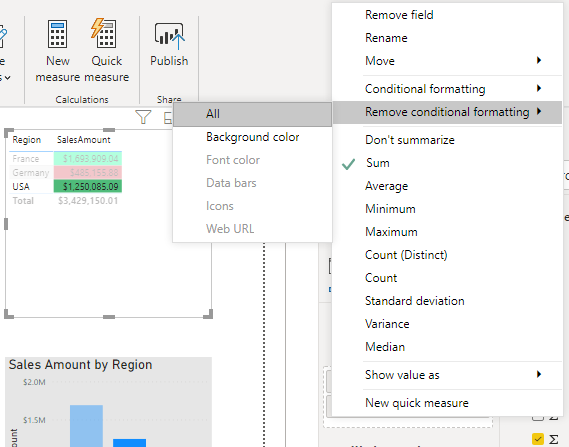

Conditional formatting in Power BI Desktop allows you to specify customized cell colors, including color gradients, based on field values, or represent cell values with data bars or KPI icons, or as active web links.

You might want to use conditional formatting to highlight or differentiate the data that is displayed in your visual. This will allow you and other users to see key data insights at a glance.

For example, you could set up conditional formatting for your sales figures. If the sales amount falls below zero, you could display this in red, a color that is associated with danger, so users will see this clearly and know that they need to take action. Conversely, you could set a value for your sales target, then display amounts over that target amount in a green color, to signify that target is met and all is going well.

Conditional formatting is available in Power BI. Here we see it used in two visuals: **Table** and **Matrix**, where it is possible to set different conditions on a column. You can apply conditional formatting to any text or data field but the formatting needs to be based on a field that has numeric, color name or hex code, or web URL values.

In this example, you select the table visualization, then in the **Format** pane, expand the **Conditional formatting** section. Turn the background color on, then select the **Advanced controls** option. In the window that displays, set a condition to change background color of the cell to red for cells with low values and green background to cells with high values.

> [!div class="mx-imgBorder"]
> 

The Power BI conditioning function will automatically detect highest and the lowest number in each column and apply background coloring according to the values. 

> [!div class="mx-imgBorder"]
> 

If you want to remove the conditional formatting that you set, select the **Values** tab on the **Visualizations** pane and right-click the value (field) that you set the formatting against. Select **Remove conditional formatting**, then select the type of formatting you want to remove, for example **All** or **Background color**.

> [!div class="mx-imgBorder"]
> 

