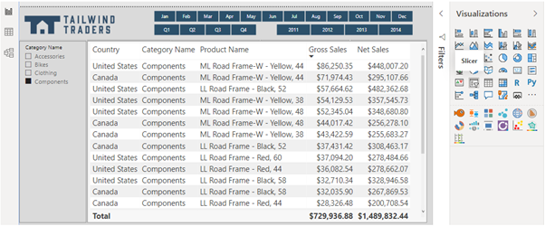
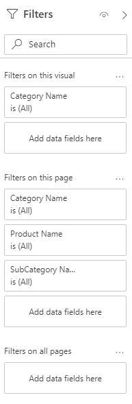
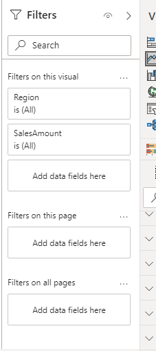
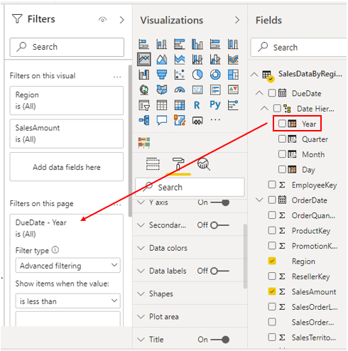
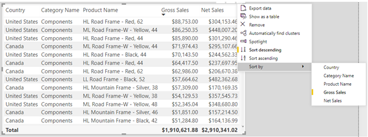

Power BI Desktop provides three tools that you can use to edit and configure interactions between the visualizations you add to your report: slicers, filters and sorting.

The process of filtering allows you to remove all of the data you do not need, so you can focus on the data that you do need. You can apply filtering directly using the **Filters** pane, or by adding and using a slicer. Slicers and filters are similar -- they both let you filter out the unnecessary data. You should try out both options to see which one is the best mechanism for your report situation. You might decide to use one option over the other, or use a combination of both.

Contrary to filtering, the process of sorting allows you to highlight the important information without removing any of the data.

## Add a slicer

A slicer is a type of filter that you can add to your report, so users can segment the data in the report by a specific value, such as by year or geographical location. The slicer narrows the portion of the dataset that is shown in the other visualizations in the report.

You might want to use a slicer to:

-   Provide quicker access to commonly used or important filters.

-   Make it easier to see the current filtered state without having to open a drop-down list.

-   Filter by columns that are unneeded and hidden in the data tables.

-   Create more focused reports (by putting slicers next to important visuals).

-   Defer queries to the data model by using a dropdown slicer, particularly when using DirectQuery.

Slicers are not supported for input fields and drilldown functions.

When you add a slicer, you can change that slicer to populate a list of items that you want to use to filter the elements of your page, and you can make that list appear in a dropdown format, if you want to save space for more important data on your report page. Rather than using a list format, you can turn your slicer into buttons, to make it easier for end-users to filter data. You can also use your slicer with date type columns, so you can select a different data range using the slider.

To apply a slicer, select the **Slicer** icon in the **Visualizations** pane. Then in the **Fields** pane, select the fields you want to include in the slicer, or drag them into the slicer visualization.

The visualization turns into a list of items (filters) with check boxes that you can use to segment the data. When you select the box of an item, Power BI will filter (slice) all of the other visualizations on the same report page, as illustrated in the following image.

> [!div class="mx-imgBorder"]
> 

You can add as many slicers as you want to a report page. If you use a list type of slicer, you can configure the selection controls. Select the slicer, then in the **Format** pane, expand the **Selection controls** section to view the options:

-   **Single select** - This option is **Off** by default. It ensures only one item can be selected at a time.

-   **Multi-select with CTRL** - This option is **On** by default. It allows you to select multiple items by holding down the **Ctrl** key.

-   **Show "Select all"** - This option is **Off** by default. If you turn this option on, a **Select all** check box is added to the slicer. You might want to add this option so you can quickly select or deselect all of the items in the list. If you select all items, selecting an item deselects it, allowing an is-not type of filter.

> [!div class="mx-imgBorder"]
> 

While slicers are very useful, if you want to filter your data in a basic way, you do not need to add slicers to your report. Power BI Desktop has a **Filter** pane that can handle the basic slicer operations. So, depending on your requirements, you might save time and effort by avoiding the use of slicers and simply using the **Filter** pane instead. This has the added benefit of reducing the total number of visuals on a report, which will improve performance.

## Customize the filters

From the report user perspective, the **Filters** pane contains filters that you, as the report designer, have added to the report. The filters allow users to interact with the visuals at the report, the page, and the visual level.

As a report designer, you can customize the **Filters** pane in Power BI Desktop as follows:

-   Add and remove fields to filter on.

-   Change the filter state.

-   Format and customize the **Filters** pane so that it feels part of your report.

-   Define whether the **Filters** pane is open or collapsed by default when a consumer opens the report.

-   Hide the entire **Filters** pane or specific filters that you don't want report consumers to see.

-   Control and even bookmark the visibility, open, and collapsed state of the **Filters** pane.

-   Lock filters that you don't want consumers to edit.

You can expand and collapse the **Filters** pane, so you can hide it when you do not need it. When you expand the **Filters** pane, depending on the item in the report that you have selected, you will see the following sections:

-   **Filters on this visual** - Filters that apply to the selected visual and nothing else. This section only displays if you have a visual selected.

-   **Filter on this page** - Filters that apply to the whole page you have currently open.

-   **Filter on all pages** - Filters that apply to all of the pages in your report.

-   **Drillthrough** - filters that apply to a single entity in a report

> [!div class="mx-imgBorder"]
> 

To apply a filter, drag and drop a field from the **Fields** pane into the relevant section of the **Filter** pane.

> [!div class="mx-imgBorder"]
> 

## Sort data

You can sort the data displayed in your visuals, so they display exactly how you want them to.

Sorting helps you to display the most important data in the most logical way, such as in alphabetical or numeric order. This basic task can help you to make big business decisions. For example, if you display products with the highest sales first, you help the end-user to see what product is the most popular among the customer base. Similarly, the products with low sales can be discontinued or replaced with new products, in order to increase revenue.

To sort a visual, start by selecting the **More options** (...) button in the upper-right corner of the visual. You have three sorting options:

-   **Sort descending** - Sorts the visual by the selected column in the order of greatest value to smallest value.

-   **Sort Ascending** - Sorts the visual by the selected column in the order of smallest value to greatest value.

-   **Sort by** - Sorts the data by a specific column. Hover over this option to display the list of columns that you can select from.

> [!div class="mx-imgBorder"]
> 