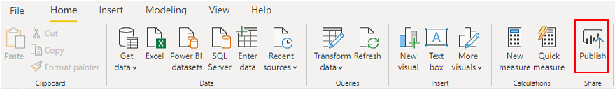
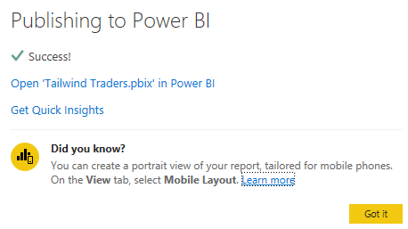
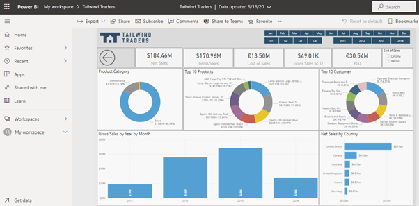

When you are finished designing your report, you can publish the report to your Power BI workspace. There are also options to export to Microsoft Excel.

## Publish reports

When you publish a report, Power BI Desktop packages your report and data, including all your visualizations, queries, and custom measures, and uploads them to the Power BI service.

To publish your report, select the **Publish** button on the **Home** tab.

> [!div class="mx-imgBorder"]
> 

You might be prompted to save your changes, in which case, select **Save**, and proceed to save your Power BI (.pbix) file.

You might also be required to sign in to Power BI, in which case, enter your sign in credentials to continue.

On the **Publish to Power BI** window, select the destination in which you want to publish the report. For example, you can publish to a workspace within Power BI. For production reports, it's recommended to publish to an App Workspace.

When the report is successfully published, you'll get a success message that contains a link to your report in your Power BI site. Select **Got it** to close the **Publishing to BI** window and return to your report in Power BI Desktop. From here, you can click on the URL provided to navigate to the Power BI Service and see your new report.

> [!div class="mx-imgBorder"]
> 

> [!div class="mx-imgBorder"]
> 

## Export reports

Power BI allows you to export visual data, reports, and datasets. You can export to several different formats including CSV, Excel, and PDF.
