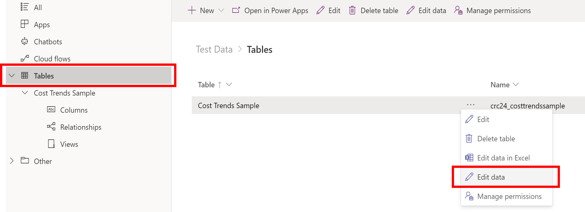
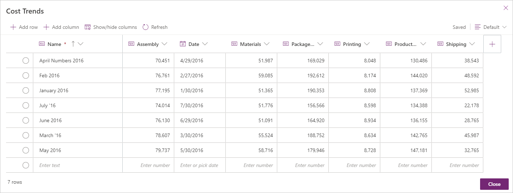
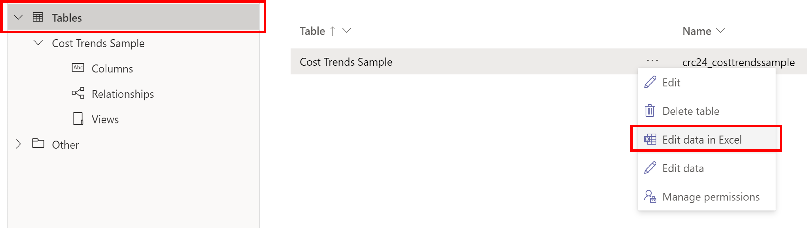
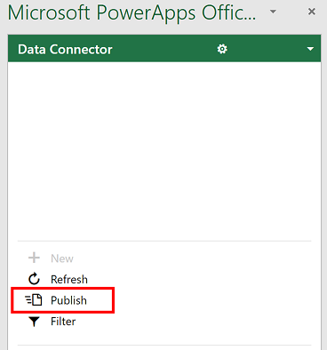

Data empowers employees to make better decisions, accelerate business transformation, and grow the organization. Providing business intelligence reports and dashboards offers users a way to visualize, interact, and share insights with others. Microsoft Power BI and Dataverse for Teams embeds powerful self-service reports and dashboards so that users can access your organization's data and insights without having to leave Microsoft Teams.

The learning objectives for this module are:

- Import a Microsoft Dataverse dataset into Power BI.

- Create a new Power BI report based on the dataset.

- Edit a report.

- Share a report with others.

> [!NOTE]
> You must have the appropriate Power BI license to build and share Power BI reports. For more information about Power BI licenses, see the links that are provided in the Summary unit at the end of this module.

> [!Note]
> For this learning module you will need to have provisioned a Dataverse for Teams environment. Please see the links that are provided in the Summary unit at the end of the module for resources on how to provision the environment.

## Dataverse for Teams sample data

In order to show how to import data from Dataverse for Teams into Power BI, we need to first have some data in Dataverse for Teams. For the purposes of this learning path, we will use a table called **Cost Trends** that stores information captured by a Power App. You can use the [Cost trends](https://github.com/MicrosoftDocs/mslearn-developer-tools-power-platform/blob/master/power-apps/dataverse-power-bi/cost-trends.zip) spreadsheet to upload data. Select **Download** and then extract the spreadsheet to your local computer. Select a Microsoft team that has a Dataverse for Teams environment then create a new table named **Cost Trends** with the fields and data types that are shown in the following table.

> [!NOTE]
> Please see the links that are provided in the Summary unit at the end of the module on how to create tables in Dataverse for Teams.

| Column name | Data type |
|-------------|-----------|
| Name | Text |
| Assembly | Number |
| Date | Date |
| Materials | Number |
| Package Total | Number |
| Printing | Number |
| Production Total | Number |
| Shipping | Number |

After creating the column names and data types in **Columns**, there are two ways to enter the sample data into the table. One way is to enter it directly in the table, or you can open Excel and edit the sample data. 

To enter the sample data into the table, select **Tables** and then select the ellipsis(...) for the table. Select **Edit data** for the visual table editor experience.

 

You will need to manually input the data. Copy and paste is not currently an option. Save the table.
> [!div class="mx-imgBorder"]
> 

To enter the sample data in Excel, follow the next few steps.

  1. Select **Tables**, select the ellipses (...) and select **Edit data in Excel**.
  
  1. A successful Excel notification will appear at the top of the screen. Open the downloaded file in **Excel**.
  1. There will be additional columns listed in the spreadsheet. Do not delete those columns. Reorder the columns to match the first eight columns on the CostTrends spreadsheet.
  1. Enter the sample data into the table, and save the table.
  1. To push the data back to Dataverse, navigate to the **Data Connector** section in the lower right, and select **Publish**.
  
