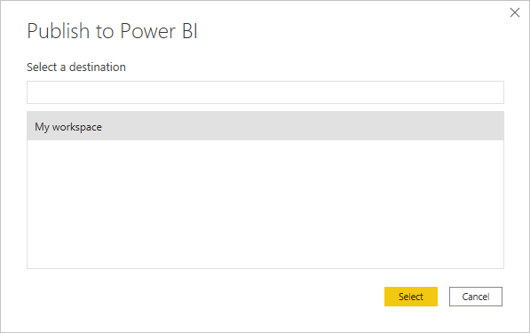
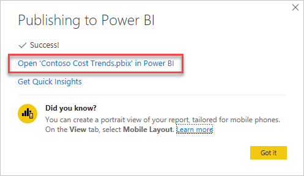
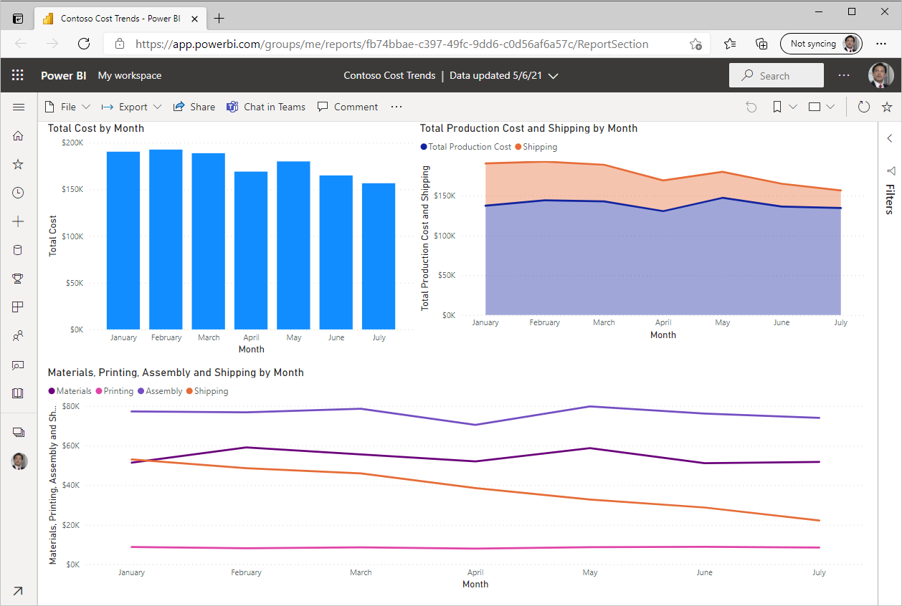

For users to access the report in Teams, the report and dataset need to be published to a workspace. A Power BI *workspace* is an area to store reports, workbooks, datasets, and dashboards in Power BI service. Every Power BI user has a **My workspace** area that only they have access to. From **My workspace**, users can share reports and dashboards. Members of workspaces that are created in Power BI have access to any reports that are published to them. For more information about Power BI workspaces, see the links in the Summary unit at the end of the module.

1. Open the report in Power BI Desktop.

1. From the **Report** view in Power BI, select **Publish** from the **Home** ribbon.

   If you haven't signed in to Power BI Desktop yet, you will be prompted for credentials.

1. After you have successfully signed in, select a Power BI workspace to publish the report.

    > [!div class="mx-imgBorder"]
    > 

1. A **Publishing to Power BI** pop-up window appears. When the publishing process has completed, select **Open 'Contoso Cost Trends.pbix' in Power BI**.

    > [!div class="mx-imgBorder"]
    > 

1. The default web browser connects to the Power BI website with the published report.

    > [!div class="mx-imgBorder"]
    > 
