Power BI reports are meant to have people view and interact with them to gain insights and make better decisions. The Power BI for Teams App allows you to collaborate with your team members on data and take action. In this unit we will:

- **Add the Power BI for Teams app** so you can access your Power BI data without having to leave Teams.

- **Grant permissions to reports** to allow your coworkers and team members access.

- Use the Power BI tab for Microsoft Teams to **embed interactive reports in channel and chat tabs**.

- **Start a chat in Teams** while viewing the report to start a conversation.

- Easily **reference a report in the Teams message box** when collaborating with coworkers.

- **Add a comment to a report** to start a conversation with colleagues.

## Add the Power BI for Teams app

1. Launch Teams or use your browser to open [https://teams.microsoft.com](https://teams.microsoft.com/?azure-portal=true).

1. In Teams, select **Apps** in the lower-left corner of the screen.

1. In the search box, type in **Power BI** and then select it from the search results.

    > [!div class="mx-imgBorder"]
    > [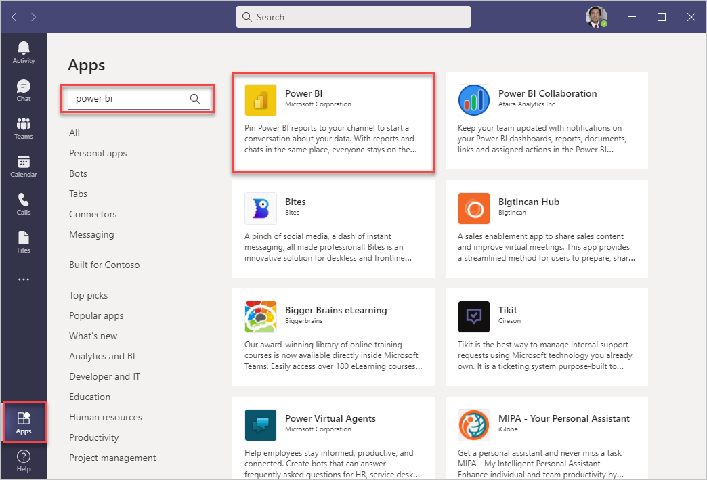](../media/image-39.png#lightbox)

1. Select **Add** to install Power BI.

If you've never signed into Power BI before, sign in and go through the new user setup prompts.

> [!Note]
> Pin the Power BI app to the app launcher to quickly access it at any time. Right-click the Power BI icon and select **Pin.** You can also run the app as a separate window from Teams by selecting **Pop out app**.
>
> [!div class="mx-imgBorder"]
> [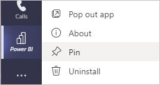](../media/image-40.png#lightbox)

The Power BI app for Teams launch page gives you quick access to your favorite reports, dashboards, and workspaces. Also, you can explore Power BI training, highlighted content published by the Power BI community, and recommended apps.

> [!div class="mx-imgBorder"]
> [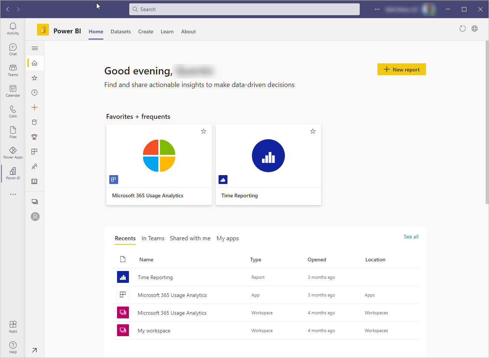](../media/image-41.png#lightbox)

## Share a report

Reports published to Power BI workspaces automatically grant access to everybody who is a member of the workspace. If you published the report to **My workspace,** only you have access to the report by default.

> [!NOTE]
> When a user tries to access a Power BI report that they don't have access to, they are prompted through a request access dialog to provide a note explaining their reason for access. The owner of the report receives an email to review the request and approve if appropriate.

To create a share link:

1. Open the report in Power BI for Teams app.

1. Select **Share** from the menu bar.

    > [!div class="mx-imgBorder"]
    > [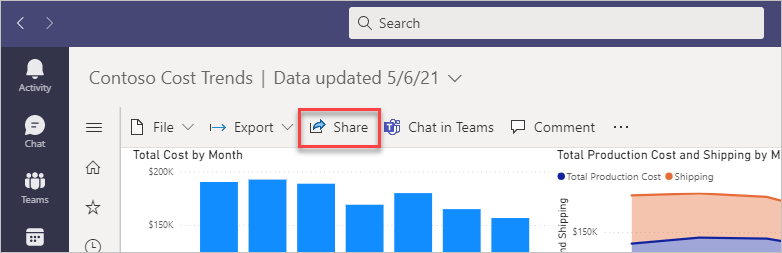](../media/image-42.png#lightbox)

1. Expand the dialog to define who can use the link. Choose the appropriate settings, then select **Apply.**

    - **People in your organization:** This link grants access to people in your organization. It doesn't work for external users.
    - **People with existing access:** Use this option when you want to generate a link and not change the existing permissions.
    - **Specific people:** This link prompts you to provide the name of specific people, groups, or external guests in your organization's Azure Active Directory. You can't grant access to external users that aren't guests of your organization.

    > [!div class="mx-imgBorder"]
    > [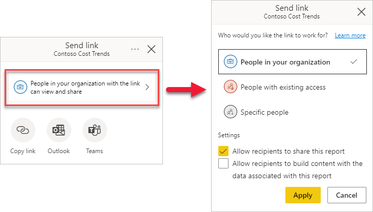](../media/image-43.png#lightbox)

1. Select whether you want to **Copy link** to the clipboard, open an **Outlook** email with the link, or post the link to a **Teams** channel. If you share with **Specific people,** you can type in a message and **Send** an email immediately.

    > [!div class="mx-imgBorder"]
    > [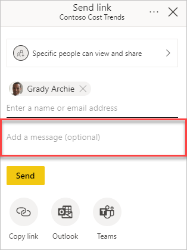](../media/image-44.png#lightbox)

To manage report permissions:

1. Open the report in Power BI for Teams.

1. Select **Share** from the menu bar.

1. Select the **More options** ellipsis in the **Send link** windows title, then **Manage permissions**.

    > [!div class="mx-imgBorder"]
    > [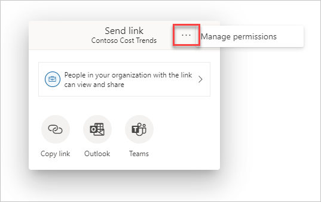](../media/image-45.png#lightbox)

1. From the **Managed permissions** panel, you can review **Links giving access** and who has **Direct access** permissions to the report.

    > [!div class="mx-imgBorder"]
    > [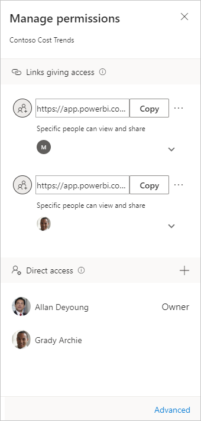](../media/image-46.png#lightbox)

## Embed interactive reports in channel and chat tabs

Adding a Power BI tab in Teams makes it easier for your team members to find the report. They can view and interact with the report without having to leave the channel or chat.

1. Open the Teams app or use your browser to open [https://teams.microsoft.com](https://teams.microsoft.com/?azure-portal=true).

1. Open a chat or channel to add the BI Report.

1. Select the **Add tab** **+** icon.

    > [!div class="mx-imgBorder"]
    > [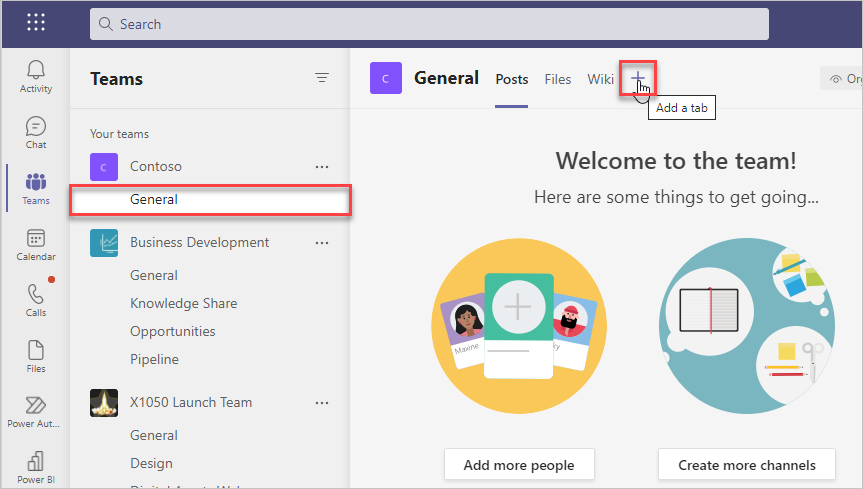](../media/image-47.png#lightbox)

1. Select the **Power BI** app.

1. Type in a **Tab name** and then select the report from the workspace section; select **Save** to continue.

    > [!div class="mx-imgBorder"]
    > [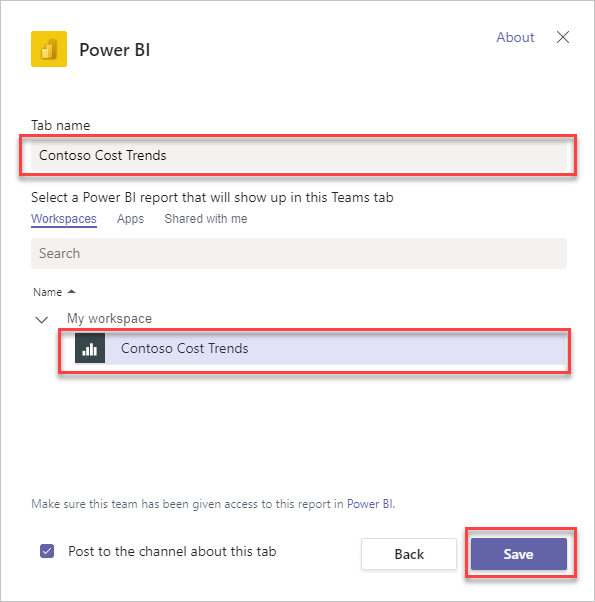](../media/image-48.png#lightbox)

The report appears as a tab in the channel or chat.

> [!div class="mx-imgBorder"]
> [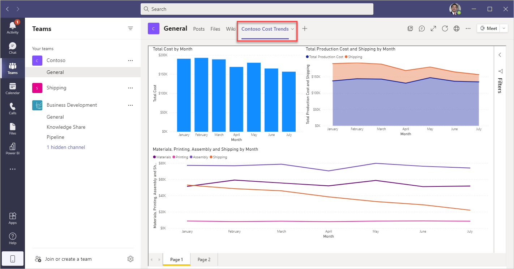](../media/image-49.png#lightbox)

> [!NOTE]
> Adding a Power BI tab does not change permissions, and only users that have access can view the report. Users who don't have access are prompted to request access when they select the tab.

## Start a chat in Teams

Start a conversation in a Teams channel when viewing reports in the Power BI for Teams app. The conversation can be about the report, or you can direct it to an individual visual.

To start a chat in Teams about the report:

1. Open the report in the Power BI app for Teams.

1. Select **Chat in Teams**.

    > [!div class="mx-imgBorder"]
    > [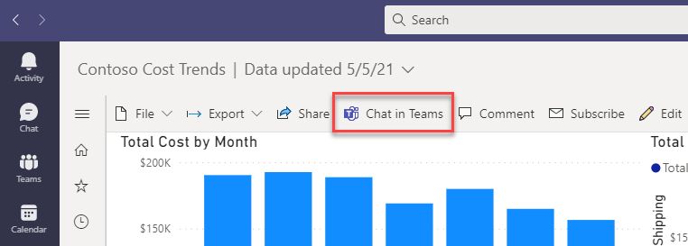](../media/image-50.png#lightbox)

1. If prompted, fill out the authentication prompts for Teams.

1. Type in the name of a Team or Channel in the **Share to** field. Type in a message without overwriting or changing the URL.

    > [!div class="mx-imgBorder"]
    > [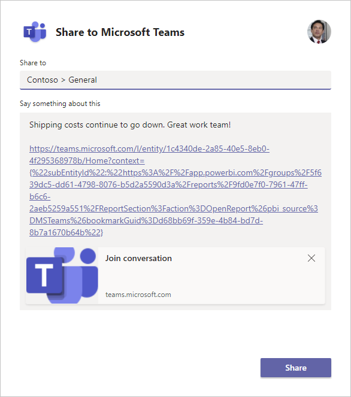](../media/image-51.png#lightbox)

1. Select **Share** when finished.

    In the channel, a new conversation is started with a link to the report.

    > [!div class="mx-imgBorder"]
    > [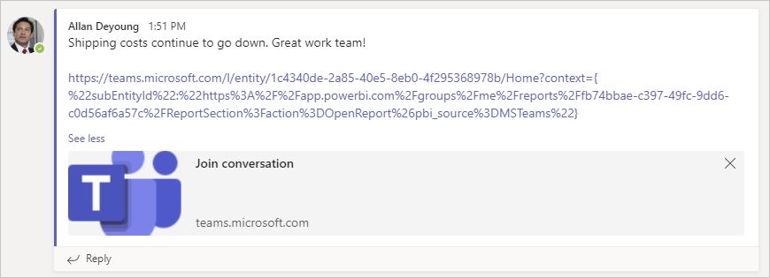](../media/image-52.png#lightbox)

To start a chat in Teams about an individual visual:

1. Open the report in the Power BI app for Teams.

1. On the report visual, select the **More option** ellipsis and then **Add a comment**.

    > [!div class="mx-imgBorder"]
    > [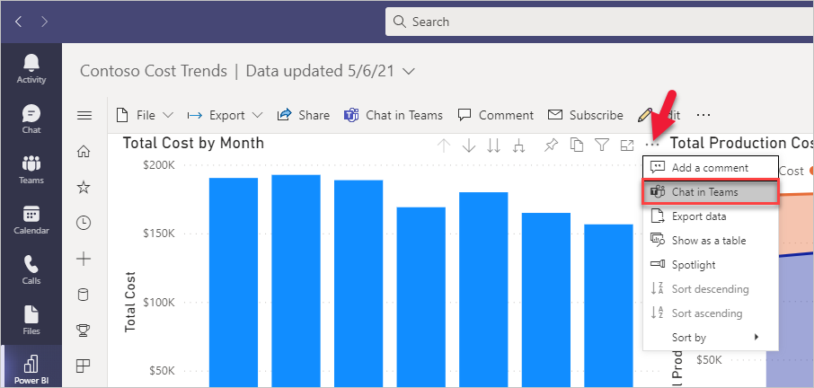](../media/image-53.png#lightbox)

1. If prompted, fill out the authentication prompts for Teams.

1. Type in the name of a Team or Channel in the **Share to** field. Type in a message without overwriting or changing the URL. Select **Share** when finished.

    > [!div class="mx-imgBorder"]
    > [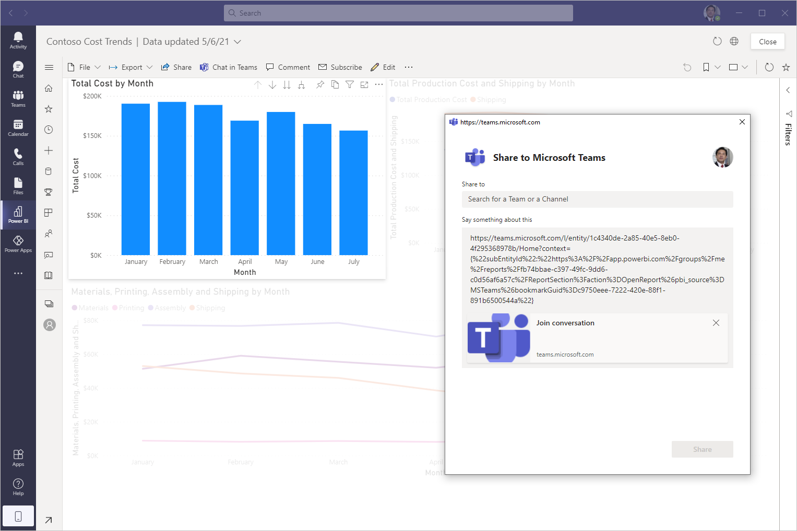](../media/image-54.png#lightbox)

    When users select the link in Teams, the selected visual is highlighted.

> [!Note]
> **Chat in Teams** starts a Microsoft Team conversation with a link to the report. It does not update the permissions, and only users with permissions to the report can access it. Users who don't have access are prompted to request access when they select the link.

## Reference a report in the Teams message box

To reference a Power BI report from a channel or chat:

1. From a Teams message box, select the **Power BI** icon.

    > [!div class="mx-imgBorder"]
    > [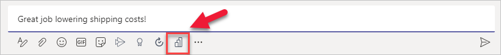](../media/image-55.png#lightbox)

1. Search for and select the report to include in the chat.

    > [!div class="mx-imgBorder"]
    > [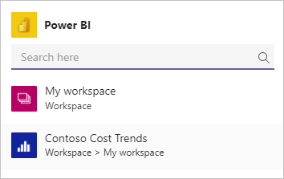](../media/image-56.png#lightbox)

1. **Send** the message when done.

    > [!div class="mx-imgBorder"]
    > 

Users can **Open** the Power BI report or **Subscribe** to set up a schedule to receive email updates. For more information about subscribing to a Power BI report, see the links in the Summary unit at the end of the module.

## Add comments to a report

Comments can be added to a report or even on individual visuals on the report. Target comments to individuals using @mention to grab their attention. Any report filters or slicer settings are captured with the comment to view the report as it was when first commented.

To create a general comment on the report:

1. Open the report in the Power BI app for Teams.

1. Select **Comment** to open the Comments pane.

    > [!div class="mx-imgBorder"]
    > [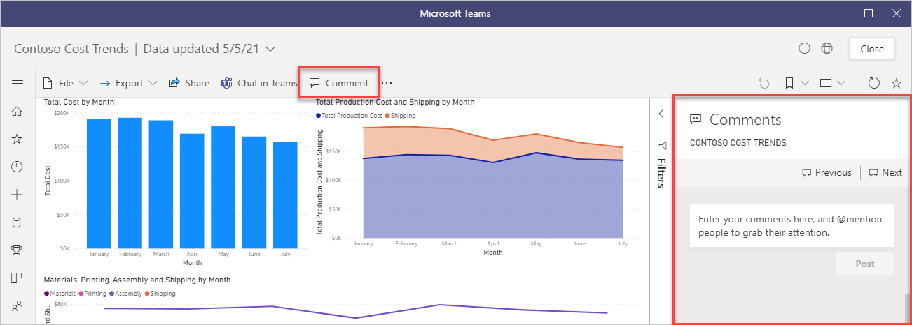](../media/image-58.png#lightbox)

1. Use @mention to alert others to your comment so they can respond, select **Post** when finished.

    > [!div class="mx-imgBorder"]
    > [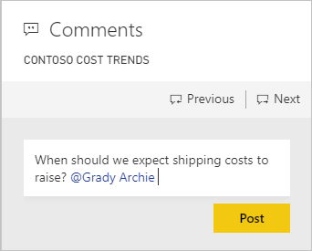](../media/image-59.png#lightbox)

1. An email is sent to the person that is @mentioned.

    > [!div class="mx-imgBorder"]
    > [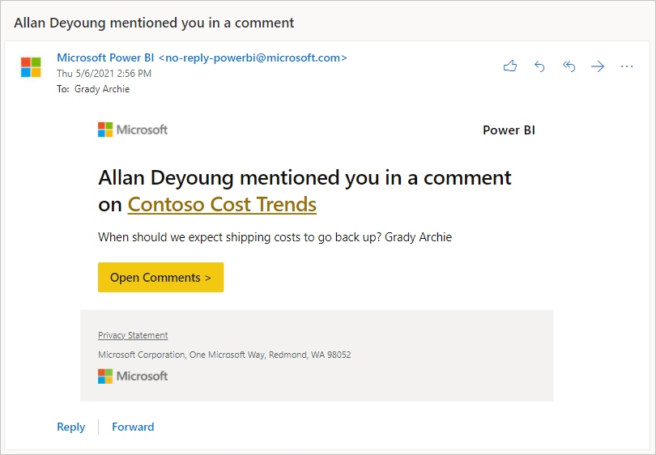](../media/image-60.png#lightbox)

1. When selecting **Open Comments**, a browser window opens to the report on the Power BI website where they can reply to the comment.

To comment on an individual visual:

1. Open the report in the Power BI app for Teams.

1. On the report visual, select the **More option** ellipsis and then **Add a comment**.

    > [!div class="mx-imgBorder"]
    > [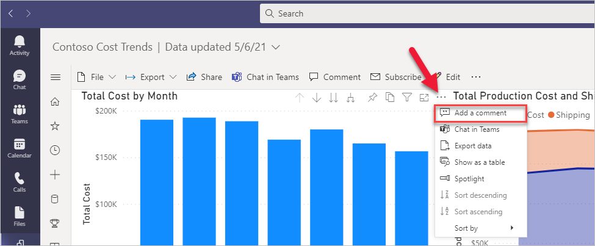](../media/image-61.png#lightbox)

1. The selected report visuals are highlighted when entering a comment. Use @mentions in the same way you would for general comments.

    > [!div class="mx-imgBorder"]
    > [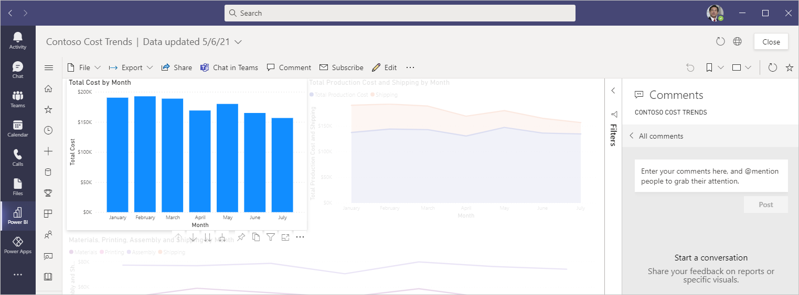](../media/image-62.png#lightbox)
