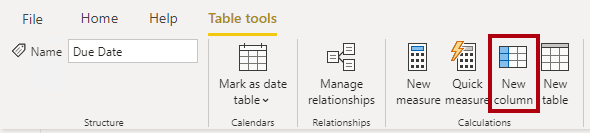
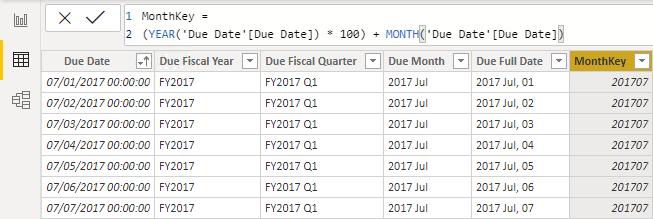

You can write a DAX formula to add a *calculated column* to any table in your model. A calculated column formula must return a scalar or single value.

Calculated columns in import models have a cost: They increase the model storage size and they can prolong the data refresh time. The reason is because calculated columns recalculate when they have formula dependencies to refreshed tables.

In data view, in the **Fields** pane, ensure that the Due Date table is selected. Before you create a calculated column, first rename the **Date** column to **Due Date**.

Now, you can add a calculated column to the Due Date table. To create a calculated column, in the **Table tools** contextual ribbon, from inside the **Calculations** group, select **New column**.

> [!div class="mx-imgBorder"]
> [](../media/dax-due-date-table-tools-contextual-ribbon-ssm.png#lightbox)

In the formula box, enter the following calculated column definition and then press the **Enter** key.

```dax
Due Fiscal Year =
"FY"
	& YEAR('Due Date'[Due Date])
		+ IF(
			MONTH('Due Date'[Due Date]) > 6,
			1
		)
```

The calculated column definition adds the **Due Fiscal Year** column to the Due Date table. The following steps describe how Microsoft Power BI evaluates the calculated column formula:

1.  The addition operator (+) is evaluated before the text concatenation operator (&).

1.  The [YEAR](https://docs.microsoft.com/dax/year-function-dax/?azure-portal=true) DAX function returns the whole number value of the due date year.

1.  The [IF](https://docs.microsoft.com/dax/if-function-dax/?azure-portal=true) DAX function returns the value when the due date month number is 7-12 (July to December); otherwise, it returns BLANK. (For example, because the Adventure Works financial year is July-June, the last six months of the calendar year will use the next calendar year as their financial year.)

1.  The year value is added to the value that is returned by the IF function, which is the value one or BLANK. If the value is BLANK, it's implicitly converted to zero (0) to allow the addition to produce the fiscal year value.

1.  The literal text value "FY" concatenated with the fiscal year value, which is implicitly converted to text.

Add a second calculated column by using the following definition:

```dax
Due Fiscal Quarter =
'Due Date'[Due Fiscal Year] & " Q"
	& IF(
		MONTH('Due Date'[Due Date]) <= 3,
		3,
		IF(
			MONTH('Due Date'[Due Date]) <= 6,
			4,
			IF(
				MONTH('Due Date'[Due Date]) <= 9,
				1,
				2
			)
		)
	)
```

The calculated column definition adds the **Due Fiscal Quarter** column to the Due Date table. The IF function returns the quarter number (Quarter 1 is July-September), and the result is concatenated to the **Due Fiscal Year** column value and the literal text **Q**.

Add a third calculated column by using the following definition:

```dax
Due Month =
FORMAT('Due Date'[Due Date], "yyyy mmm")
```

The calculated column definition adds the **Due Month** column to the Due Date table. The [FORMAT](https://docs.microsoft.com/dax/format-function-dax/?azure-portal=true) DAX function converts the **Due Date** column value to text by using a format string. In this case, the format string produces a label that describes the year and abbreviated month name.

> [!NOTE]
> Many user-defined date/time formats exist. For more information, see [Custom date and time formats for the FORMAT function](https://docs.microsoft.com/dax/custom-date-and-time-formats-for-the-format-function/?azure-portal=true).

Add a fourth calculated column by using the following definition:

```dax
Due Full Date =
FORMAT('Due Date'[Due Date], "yyyy mmm, dd")
```

Add a fifth calculated column by using the following definition:

```dax
MonthKey =
(YEAR('Due Date'[Due Date]) * 100) + MONTH('Due Date'[Due Date])
```

The **MonthKey** calculated column multiplies the due date year by the value 100 and then adds the month number of the due date. It produces a numeric value that can be used to sort the **Due Month** text values in chronological order.

Verify that the Due Date table has six columns. The first column was added when the calculated table was created, and the other five columns were added as calculated columns.

> [!div class="mx-imgBorder"]
> [](../media/dax-due-date-table-data-view-2-ss.png#lightbox)

To complete the design of the Due Date table, you can:

-   Sort the **Due Full Date** column by the **Due Date** column.

-   Sort the **Due Month** column by the **MonthKey** column.

-   Hide the **MonthKey** column.

-   Create a hierarchy named **Fiscal** with the following levels:

    -   Due Fiscal Year

    -   Due Fiscal Quarter

    -   Due Month

    -   Due Full Date

-   Mark the Due Date table as a date table by using the **Due Date** column.
