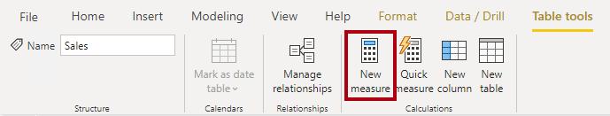
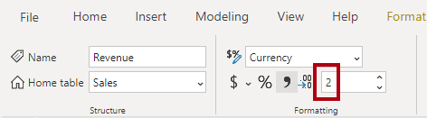

You can write a DAX formula to add a measure to any table in your model. A measure formula must return a scalar or single value.

> [!NOTE]
> In tabular modeling, no such concept as a calculated measure exists. The word *calculated* is used to describe calculated tables and calculated columns. It distinguishes them from tables and columns that originate from Power Query, which doesn't have the concept of an explicit measure.

Measures don't store values in the model. Instead, they're used at query time to return summarizations of model data. Additionally, measures can't reference a table or column directly; they must pass the table or column into a function to produce a summarization.

A *simple* measure is one that aggregates the values of a single column; it does what implicit measures do automatically.

In the next example, you will add a measure to the Sales table. In the **Fields** pane, select the Sales table. To create a measure, in the **Table Tools** contextual ribbon, from inside the **Calculations** group, select **New measure**.

> [!div class="mx-imgBorder"]
> [](../media/dax-sale-table-new-measure-ssm.png#lightbox)

In the formula box, enter the following measure definition and then press the **Enter** key.

```dax
Revenue =
SUM(Sales[Sales Amount])
```

The measure definition adds the **Revenue** measure to the Sales table. It uses the [SUM](https://docs.microsoft.com/dax/sum-function-dax/?azure-portal=true) DAX function to sum the values of the **Sales Amount** column.

On the **Measure tools** contextual ribbon, inside the **Formatting** group, set the decimal places to **2**.

> [!div class="mx-imgBorder"]
> [](../media/dax-revenue-measure-format-ssm.png#lightbox)

> [!TIP]
> Immediately after you create a measure, set the formatting options to ensure well-presented and consistent values in all report visuals.

Now, add the **Revenue** measure to the matrix visual. Notice that it produces the same result as the **Sales Amount** implicit measure.

In the matrix visual, remove **Sales Amount** and **Sum of Unit Price**.

Next, you will create more measures. Create the **Cost** measure by using the following measure definition, and then set the format with two decimal places.

```dax
Cost =
SUM(Sales[Total Product Cost])
```

Create the **Profit** measure, and then set the format with two decimal places.

```dax
Profit =
SUM(Sales[Profit Amount])
```

Notice that the **Profit Amount** column is a calculated column. This topic will be discussed later in this module.

Next, create the **Quantity** measure and format it as a whole number with the thousands separator.

```dax
Quantity =
SUM(Sales[Order Quantity])
```

Create three unit price measures and then set the format of each with two decimal places. Notice the different DAX aggregation functions that are used: [MIN](https://docs.microsoft.com/dax/min-function-dax/?azure-portal=true), [MAX](https://docs.microsoft.com/dax/max-function-dax/?azure-portal=true), and [AVERAGE](https://docs.microsoft.com/dax/average-function-dax/?azure-portal=true).

```dax
Minimum Price =
MIN(Sales[Unit Price])
```

```dax
Maximum Price =
MAX(Sales[Unit Price])
```

```dax
Average Price =
AVERAGE(Sales[Unit Price])
```

Now, hide the **Unit Price** column, which results in report authors losing their ability to summarize the column except by using your measures.

> [!TIP]
> Adding measures and hiding columns is how you, the data modeler, can limit summarization options.

Next, create the following two measures, which count the number of orders and order lines. Format both measures with zero decimal places.

```dax
Order Line Count =
COUNT(Sales[SalesOrderLineKey])
```

```dax
Order Count =
DISTINCTCOUNT('Sales Order'[Sales Order])
```

The [COUNT](https://docs.microsoft.com/dax/count-function-dax/?azure-portal=true) DAX function counts the number of non-BLANK values in a column, while the [DISTINCTCOUNT](https://docs.microsoft.com/dax/distinctcount-function-dax/?azure-portal=true) DAX function counts the number of distinct values in a column. Because an order can have one or more order lines, the **Sales Order** column will have duplicate values. A distinct count of values in this column will correctly count the number of orders.

Alternatively, you can choose the better way to write the **Order Line Count** measure. Instead of counting values in a column, it's semantically clearer to use the [COUNTROWS](https://docs.microsoft.com/dax/countrows-function-dax/?azure-portal=true) DAX function. Unlike the previously introduced aggregation functions, which aggregate column values, the COUNTROWS function counts the number of rows *for a table*.

Modify the **Order Line Count** measure formula to the following parameters:

```dax
Order Line Count =
COUNTROWS(Sales)
```

Add each of the measures to the matrix visual.

All measures that you've created are considered simple measures because they aggregate a single column or single table.
