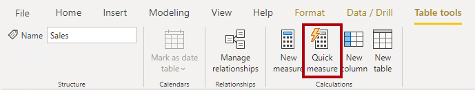
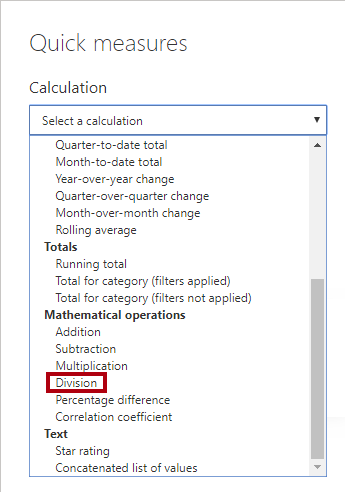
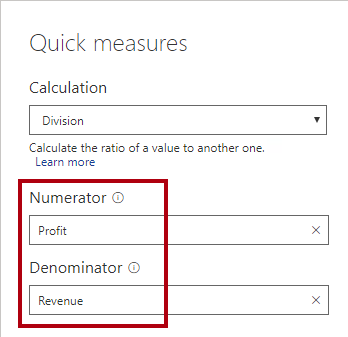

Power BI Desktop includes a feature named [Quick Measures](https://docs.microsoft.com/power-bi/transform-model/desktop-quick-measures/?azure-portal=true). Use quick measures to quickly and easily perform common, powerful calculations. It does so by generating the DAX expression for you.

There are many available categories of calculations and ways to modify each calculation to fit your needs. Perhaps best of all, you can see the DAX that's generated by the quick measure and use it to jump-start or expand your DAX knowledge.

Let's now create another compound measure to calculated profit margin. But this time, we'll create it as a quick measure.

In the **Fields** pane, select the **Sales** table. Then on the **Table Tools** contextual ribbon, from inside the **Calculations** group, click **Quick Measure**.

> [!div class="mx-imgBorder"]
> [](../media/dax-sales-create-quick-measure-ssm.png#lightbox)

In the **Quick Measures** window, in the **Calculated** dropdown list, locate the **Mathematical Operations** group (you may need to scroll down the list), and then select **Division**.

> [!div class="mx-imgBorder"]
> [](../media/dax-configure-quick-measure-calculation-ssm.png#lightbox)

From the **Fields** list (in the **Quick Measures** window), expand the **Sales** table, and then drag the **Profit** measure into the **Numerator** box. Then, drag the **Revenue** measure into the **Denominator** box.

> [!div class="mx-imgBorder"]
> [](../media/dax-configure-quick-measure-fields-ssm.png#lightbox)

Click **OK**. In the **Fields** pane, notice the addition of the new compound measure. And, in the formula bar, review the measure definition.

```dax
Profit divided by Revenue = 
DIVIDE([Profit], [Revenue])
```

> [!NOTE]
> Once the quick measure is created, you must apply changes in the formula bar.

Rename the measure as **Profit Margin**, and then set for the format to a percentage with two decimal places.

Add the **Profit Margin** measure to the matrix visual.