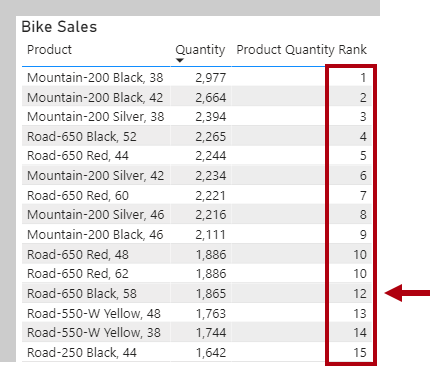
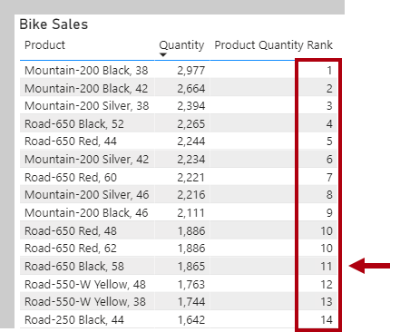
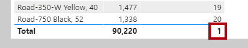
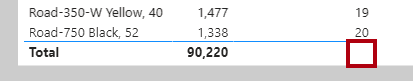

The [RANKX](https://docs.microsoft.com/dax/rankx-function-dax/?azure-portal=true) DAX function is a special iterator function you can use to calculate ranks. Its syntax is:

```dax
RANKX(<table>, <expression>[, <value>[, <order>[, <ties>]]])
```

Like for all iterator functions, you must pass in a table and an expression. Optionally, you can pass in a rank value to find, the order direction, or how to handle ranks when values are tied.

### Order direction

Order direction is either ascending or descending. When ranking something favorable, like revenue values, you're likely to use descending order the highest revenue will be ranked first. When ranking something unfavorable, like customer complaints, you might use ascending order the lowest number of complaints will be ranked first. When you don't pass in an order argument, the function will use **descending** order.

### Handling ties

Ties can be handled by skipping rank values or using dense ranking, which uses the next rank value after a tie. When you don't pass in a ties argument, the function will use **skipped**. We'll work with an example of each tie argument in this unit.

### Create ranking measures

Go ahead and add the following measure:

```dax
Product Quantity Rank =
RANKX(
	ALL('Product'[Product]),
	[Quantity]
)
```

Add the **Product Quantity Rank** measure to the table visual found on **Page 2** of the report. The table visual groups bike products and displays quantity, ordering products by descending quantity.

The RANKX function iterates over a table returned by the [ALL](https://docs.microsoft.com/dax/all-function-dax/?azure-portal=true) DAX function. The ALL function is used to return all rows in a model table or values in one or more columns, and it *ignores all filters*. So, in this case, it returns a table comprising all **Product** table **Product** column values. The RANKX function must use the ALL function because the table visual groups by product (which is a filter on the **Product** table).

In the table visual, notice that two products tie for 10th place. And, that the next product is rank 12. It's an example of using the **Skipped** ties argument.

> [!div class="mx-imgBorder"]
> [](../media/dax-table-bike-product-quanity-rank-skipped-ssm.png#lightbox)

Let's now modify the **Product Quantity Rank** measure definition to use dense ranking:

```dax
Product Quantity Rank =
RANKX(
	ALL('Product'[Product]),
	[Quantity],
	,
	,
	DENSE
)
```

In the table visual, notice that there's no longer a skipped ranking. After the two products that tie for 10th place, the next ranking is 11.

> [!div class="mx-imgBorder"]
> [](../media/dax-table-bike-product-quantity-rank-dense-ssm.png#lightbox)

Lastly, notice that the table visual total for the **Product Quantity Rank** is 1. It's because the total for all products is ranked.

> [!div class="mx-imgBorder"]
> [](../media/dax-table-bike-product-quantity-rank-dense-total-ssm.png#lightbox)

It's not appropriate to rank total products, so let's now modify the measure definition to return BLANK, unless a single product is filtered:

```dax
Product Quantity Rank =
IF(
	HASONEVALUE('Product'[Product]),
	RANKX(
		ALL('Product'[Product]),
		[Quantity],
		,
		,
		DENSE
	)
)
```

> [!div class="mx-imgBorder"]
> [](../media/dax-table-bike-product-quantity-rank-dense-total-gone-ssm.png#lightbox)

Notice that the total **Product Quantity Rank** is now BLANK. It was achieved by using the [HASONEVALUE](https://docs.microsoft.com/dax/hasonevalue-function-dax/?azure-portal=true) DAX function to test whether the **Product** table **Product** column has a single value in filter context. It's the case for each product group, but not for the total, which represents all products.

Filter context and the HASONEVALUE function will be introduced in the filter context module.
