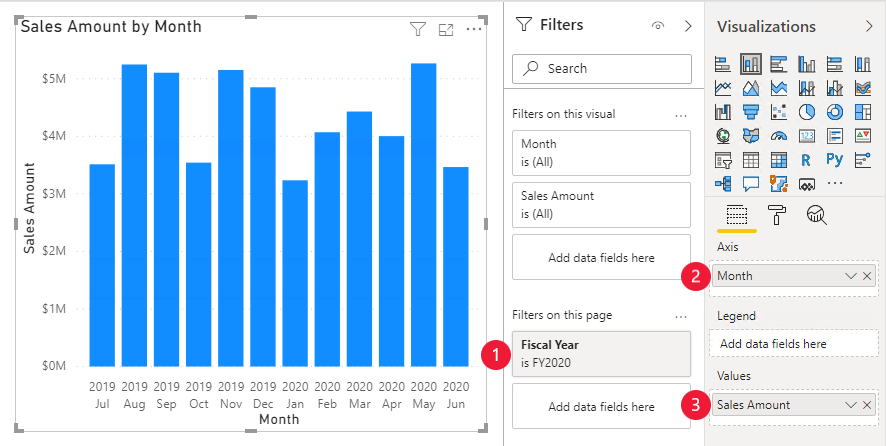
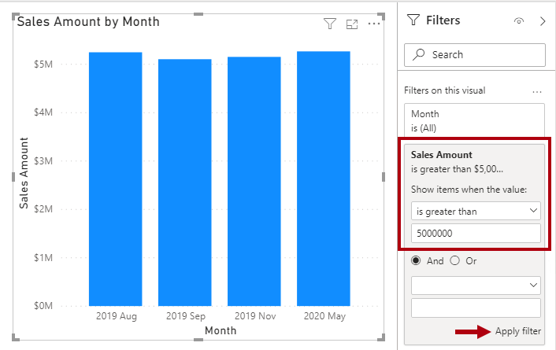

Report authors produce report designs by adding report visuals and other elements to pages. Other elements include text boxes, buttons, shapes, and images. Each of these elements is configured independently of dataset fields.

At design time, adding and configuring a report visual involves the following methodology:

1.  Select a visual type, like a bar chart.

1.  Map dataset fields, which are displayed in the **Fields** pane, to the visual field wells. For a bar chart, the wells are **Axis**, **Legend**, **Values**, and **Tooltips**.

1.  Configure mapped fields. It's possible to rename mapped fields or toggle the field to summarize or not summarize. If the field summarizes, you can select the summarization method.

1.  Apply format options, like axis properties, data labels, and many others.

The following example shows how to configure the analytic query for a report visual. To begin, add a stacked column chart visual to a report page of the **Adventure Works DW 2020 M01.pbix** Power BI Desktop file, and then follow these steps:

1.  **Filter** the page by using **Fiscal Year** from the Date table and then selecting **FY2020**.

1.  **Group** the visual by adding **Month** from the Date table to the **Axis** field well.

1.  **Summarize** the visual by adding **Sales Amount** from the Sales table to the **Values** field well.

> [!div class="mx-imgBorder"]
> 

*Fields* is a collective term that is used to describe a model resource *that can be used to configure a visual*. The three different model resources that are fields include:

-   Columns

-   Hierarchy levels

-   Measures

Each of these resource types can be used to configure a visual, which in the background configures an analytic query. The following table illustrates how to use each of the model resources.

|     Model resource     |     Filter    |     Group    |     Summarize    |
|------------------------|---------------|--------------|------------------|
|     Column             |     X         |     X        |     X            |
|     Hierarchy level    |     X         |     X        |                  |
|     Measure            |     X         |              |     X            |

## Columns

Use columns to filter, group, and summarize column values. Summarizing numeric columns is common, and it can be done by using sum, count, distinct count, minimum, maximum, average, median, standard deviation, and variance. You can also summarize text columns by using first (alphabetic order), last, count, and distinct count. Additionally, you can summarize date columns by using earliest, latest, count, and distinct count.

At design time, the data modeler can set the column default summarization property. This property can be set to any of the supported summarization types or to **Do not summarize**. The latter option means that the column, by default, is only to be used to group. If your data model has a numeric column that stores year values, it would be appropriate to set its default summarization to **Do not summarize** because the column will likely be used only for grouping or filtering, and that numeric summarization of years, like an average, doesn't produce a meaningful result.

## Hierarchy levels

While hierarchy levels are based on columns, they can be used to filter and group but not to summarize. Report authors can summarize the column that the hierarchy level is based on, provided that it's visible in the **Fields** pane.

## Measures

Measures are designed to summarize model data; they can't be used to group data. However, measures can be used to filter data in one special case: to use a measure to filter a visual when the visual displays the measure and the filter is a visual-level filter (so, not a report or page-level filter). When used in this way, a measure filter is applied *after* the analytic query has summarized data. This process is done to eliminate groups where the measure filter condition is not true. (For those who are familiar with SQL syntax, a measure that used to filter a visual is like the HAVING clause in a SELECT statement.)

The following figure shows the stacked column visual adjusted to display groups (months) when sales amounts exceed $5 million. This adjustment is done in the **Filters** pane by applying a filter to the **Sales Amount** field: Configure the filter to show items when the value *is greater than 5000000*. Remember to select **Apply filter**, which is located in the lower-right corner of the card.

Notice that only four groups (months) have sales amounts exceeding $5 million.

> [!div class="mx-imgBorder"]
> 
