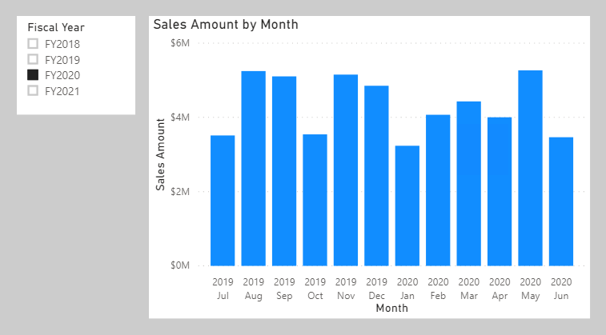
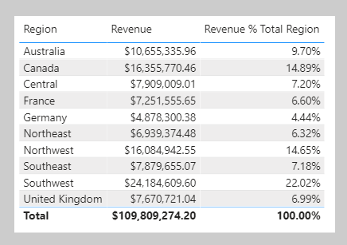

First, watch this video to learn about filter context.

> [!VIDEO https://www.microsoft.com/videoplayer/embed/]

**Filter context** describes the filters that are applied during the evaluation of a measure or measure expression. Filters can be applied directly to columns, like a filter on the **Date** table **Fiscal Year** column for the value **FY2020**. They can be applied indirectly, too, which happens when model relationships propagate filters to other tables. For example, the **Sales** table receives a filter via its relationship with the **Date** table, filtering the **Sales** table rows to those with an **OrderDateKey** column value in **FY2020**.

> [!NOTE]
> Calculated tables and calculated columns aren't evaluated within filter context. Calculated columns are evaluated in row context, though the formula can transition the row context to filter context, if it needs to summarize model data. We'll introduce context transition in Unit 5.

At report design time, filters are applied in the **Filters** pane or to report visuals. The slicer visual is an example of a visual whose only purpose is to filter the report page (and other pages when configured as a synced slicer). Report visuals which perform grouping also apply filters. They're implied filters; the difference is that the filter result is visible in the visual. For example, a stacked column chart visual can filter by fiscal year FY2020, group by month, and summarize sales amount. The fiscal year filter isn't visible in the visual result, yet the grouping, which results in a column for each month, behaves as a filter.

> [!div class="mx-imgBorder"]
> 

Not all filters are applied at report design time. Filters can be added when a report user interacts with the report. They can modify filter settings in the **Filters** pane, and they can cross-filter or cross-highlight visuals by selecting visual elements like columns, bars, or pie chart segments. These interactions apply additional filters to report page visuals (unless interactions have been disabled).

It's important to understand how filter context works. It guides you to define the right formula for your calculations. As you author more complex formulas, you'll identify times when you need to add, modify, or remove filters to achieve the desired result.

Let's consider an example that requires your formula to modify the filter context. Your objective is to produce a report visual that shows each sales region together with its revenue and revenue *as a percentage of total revenue*.

> [!div class="mx-imgBorder"]
> 

The **Revenue % Total Region** result is achieved by defining a measure expression that's the ratio of revenue divided by revenue *for all regions*. So, for Australia, the ratio is $10,655,335.96 divided by $109,809,274.20, which is 9.7%.

The numerator expression doesn't need to modify filter context---it should use the current filter context (remember, a visual that groups by region is applying a filter for that region). The denominator expression, however, needs to remove any region filters to achieve the result for all regions.

> [!TIP]
> Key to authoring complex measures is mastering several concepts:

-   Understanding how filter context works

-   Understanding when and how to modify filter context to achieve a required result

-   Composing a formula to accurately and efficiently modify filter context

Mastering these concepts takes practice and time. Rarely do we see students understand the concepts from the very beginning of their training. So, be patient and persevere with the theory and activities. We recommend you repeat this module at a later time to help reinforce the key lessons.

In the next unit, we'll introduce the [CALCULATE](https://docs.microsoft.com/dax/calculate-function-dax/?azure-portal=true) DAX function. It's one of the most powerful DAX functions, allowing you to modify filter context when your formulas are evaluated.
