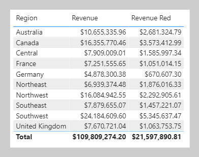
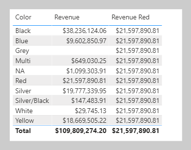

You can use the [CALCULATE](https://docs.microsoft.com/dax/calculate-function-dax/?azure-portal=true) DAX function to modify filter context in your formulas. The syntax for the CALCULATE function is as follows:

```dax
CALCULATE(<expression>, [[<filter1>], <filter2>]…)
```

The function requires passing in an expression that returns a scalar value and as many filters as you need. The expression can be a measure (which is a named expression) or any expression that can be evaluated in filter context.

Filters can be Boolean expressions or table expressions. It's also possible to pass in filter modification functions that provide additional control when you are modifying filter context. 

When you have multiple filters, they're evaluated by using the AND logical operator, which means that all conditions must be TRUE at the same time.

> [!NOTE]
> The [CALCULATETABLE](https://docs.microsoft.com/dax/calculatetable-function-dax/?azure-portal=true) DAX function performs exactly the same functionality as the CALCULATE function, except that it modifies the filter context that is applied to an expression that returns a table object. In this module, the explanations and examples use the CALCULATE function, but keep in mind that these scenarios could also apply to the CALCULATETABLE function.

## Apply Boolean expression filters

A Boolean expression filter is an expression that evaluates to TRUE or FALSE. Boolean filters must abide by the following rules:

-   They can reference only a single column

-   They cannot reference measures

-   They cannot use functions that scan or return a table that includes aggregation functions like SUM.

In this example, you will create a measure. First, download and open the [**Adventure Works DW 2020 M06.pbix**](https://github.com/MicrosoftDocs/mslearn-dax-power-bi/raw/main/activities/Adventure%20Works%20DW%202020%20M06.pbix) file. Then, add the following measure definition that filters the **Revenue** measure by using a Boolean expression filter for red products.

```dax
Revenue Red = CALCULATE([Revenue], 'Product'[Color] = "Red")
```

Add the **Revenue Red** measure to the table visual that is found on **Page 1** of the report.

> [!div class="mx-imgBorder"]
> [](../media/dax-table-region-revenue-red-ss.png#lightbox)

In this next example, the following measure filters the **Revenue** measure by multiple colors. Notice the use of the IN operator followed by a list of color values.

```dax
Revenue Red or Green = CALCULATE([Revenue], 'Product'[Color] IN {"Red", "Green"})
```

The following measure filters the **Revenue** measure by expensive products. Expensive products are those with a list price greater than USD 1000.

```dax
Revenue Expensive Products = CALCULATE([Revenue], 'Product'[List Price] > 1000)
```

## Apply table expression filters

A table expression filter applies a table object as a filter. It could be a reference to a model table; however, it's likely a DAX function that returns a table object.

Commonly, you'll use the [FILTER](https://docs.microsoft.com/dax/filter-function-dax/?azure-portal=true) DAX function to apply complex filter conditions, including those that can't be defined by a Boolean filter expression. The FILTER function is classed as an iterator function, and so you would pass in a table, or table expression, and an expression to evaluate for each row of that table.

The FILTER function returns a table object with exactly the same structure as one that the table passed in. Its rows are a subset of those rows that were passed in, meaning the rows where the expression evaluated as TRUE.

The following example shows a table filter expression that uses the FILTER function:

```dax
Revenue High Margin Products =
CALCULATE(
	[Revenue],
	FILTER(
		'Product',
		'Product'[List Price] > 'Product'[Standard Cost] * 2
	)
)
```

In this example, the FILTER function filters all rows of the Product table that are in filter context. Each row for a product where its list price exceeds double its standard cost is displayed as a row of the filtered table. Therefore, the **Revenue** measure is evaluated for all products that are returned by the FILTER function.

All filter expressions that are passed in to the CALCULATE function are table filter expressions. A Boolean filter expression is a shorthand notation to improve the writing and reading experience. Internally, Microsoft Power BI translates Boolean filter expressions to table filter expressions, which is how it translates your **Revenue Red** measure definition.

```dax
Revenue Red =
CALCULATE(
	[Revenue],
	FILTER(
		'Product',
		'Product'[Color] = "Red"
	)
)
```

## Filter behavior

Two possible standard outcomes occur when you add filter expressions to the CALCULATE function:

-   If the columns (or tables) aren't in filter context, then new filters will be added to the filter context to evaluate the CALCULATE expression.

-   If the columns (or tables) are already in filter context, the existing filters will be overwritten by the new filters to evaluate the CALCULATE expression.

The following examples show how adding filter expressions to the CALCULATE function works.

> [!NOTE]
> In each of the examples, no filters are applied to the table visual.

As in the previous activity, the **Revenue Red** measure was added to a table visual that groups by region and displays revenue.

> [!div class="mx-imgBorder"]
> [](../media/dax-table-region-revenue-red-ss.png#lightbox)

Because no filter is applied on the **Color** column in the Product table, the evaluation of the measure adds a new filter to filter context. In the first row, the value of $2,681,324.79 is for red products that were sold in the Australian region.

Switching the first column of the table visual from **Region** to **Color** will produce a different result because the **Color** column in the Product table is now in filter context.

> [!div class="mx-imgBorder"]
> [](../media/dax-table-color-revenue-red-ss.png#lightbox)

The **Revenue Red** measure formula evaluates the **Revenue** measure by adding a filter on the **Color** column (to red) in the Product table. Consequently, in this visual that groups by color, the measure formula overwrites the filter context with a new filter.

This result might or might not be what you want. The next unit introduces the [KEEPFILTERS](https://docs.microsoft.com/dax/keepfilters-function-dax/?azure-portal=true) DAX function, which is a filter modification function that you can use to preserve filters rather than overwrite them.
