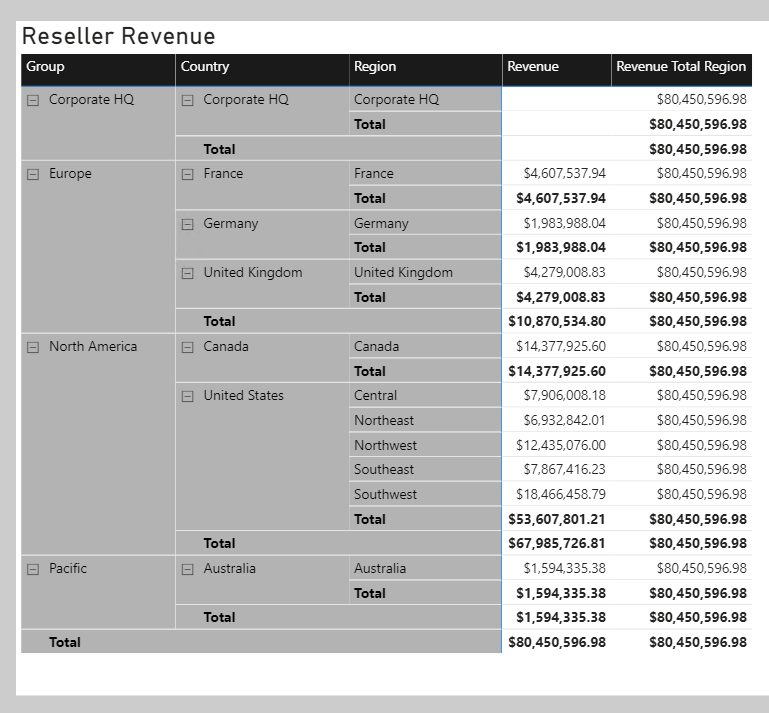
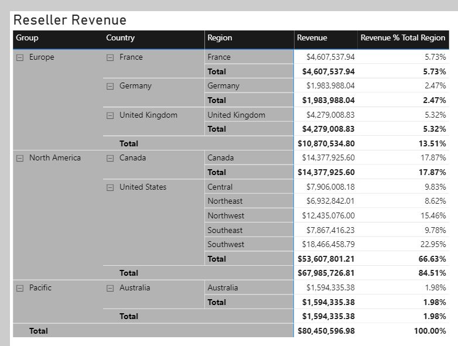
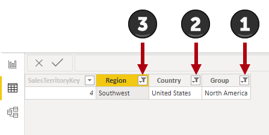
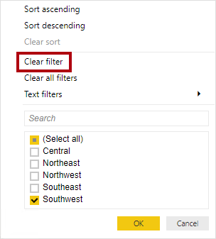
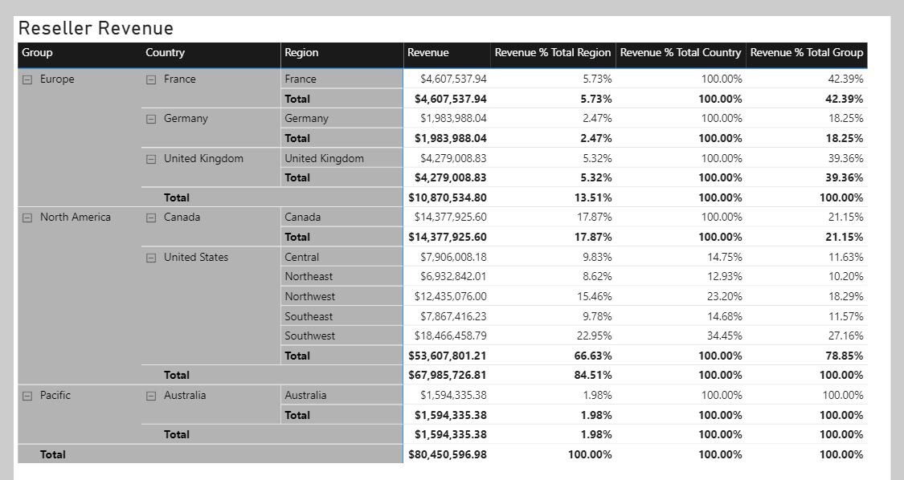
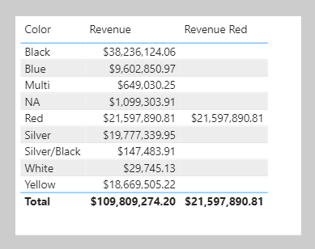

When using the CALCULATE function, you can pass in filter modification functions, which allow you to accomplish more than adding filters.

## Remove filters

Use the [REMOVEFILTERS](https://docs.microsoft.com/dax/removefilters-function-dax/?azure-portal=true) DAX function as a CALCULATE filter expression to remove filters from filter context. It can remove filters from one or more columns or from all columns of a single table.

> [!NOTE]
> The REMOVEFILTERS function is relatively new. In previous versions of DAX, you removed filters by using the [ALL](https://docs.microsoft.com/dax/all-function-dax/?azure-portal=true) DAX function or variants including the [ALLEXCEPT](https://docs.microsoft.com/dax/allexcept-function-dax/?azure-portal=true) and the [ALLNOBLANKROW](https://docs.microsoft.com/dax/allnoblankrow-function-dax/?azure-portal=true) DAX functions. These functions behave as both filter modifiers and as functions that return table objects of distinct values. These functions are mentioned now because you're likely to find documentation and formula examples that remove filters by using them.

In the following example, you will create a new measure that evaluates the **Revenue** measure but does so by removing filters from the Sales Territory table. Format the measure as currency with two decimal places.

```dax
Revenue Total Region = CALCULATE([Revenue], REMOVEFILTERS('Sales Territory'))
```

Now, add the **Revenue Total Region** measure to the matrix visual that is found on **Page 2** of the report. The matrix visual will group by three columns from the Sales Territory table on the rows: **Group**, **Country**, and **Region**.

> [!div class="mx-imgBorder"]
> [](../media/dax-matrix-sales-territory-revenue-1-ss.png#lightbox)

Notice that each **Revenue Total Region** value is the same. It's the value of total revenue.

While this result on its own isn't useful, when it's used as a denominator in a ratio, it calculates a percent of grand total. Therefore, you will now overwrite the **Revenue Total Region** measure definition with the following definition. (This new definition changes the measure name. Be sure to format the measure as a percentage with two decimal places.)

```dax
Revenue % Total Region =
VAR CurrentRegionRevenue = [Revenue]
VAR TotalRegionRevenue =
	CALCULATE(
		[Revenue],
		REMOVEFILTERS('Sales Territory')
	)
RETURN
	DIVIDE(
		CurrentRegionRevenue,
		TotalRegionRevenue
	)
```

Verify that the matrix visual now displays the **Revenue % Total Region** values.

> [!div class="mx-imgBorder"]
> [](../media/dax-matrix-sales-territory-revenue-2-ss.png#lightbox)

You'll now create another measure, but this time, you will calculate the ratio of revenue for a region divided by its country's revenue.

Before you complete this task, notice that the **Revenue % Total Region** value for the Southwest region is 22.95 percent. Investigate the filter context for this cell. Switch to data view and then, in the **Fields** pane, select the Sales Territory table. 

Apply the following column filters:

- **Group** - North America
- **Country** - United States
- **Region** - Southwest

> [!div class="mx-imgBorder"]
> [](../media/dax-table-sales-territory-column-filters-ssm.png#lightbox)

Notice that the filters reduce the table to only one row. Now, while thinking about your new objective to create a ratio of the region revenue over its country's revenue, clear the filter from the **Region** column.

> [!div class="mx-imgBorder"]
> [](../media/dax-sales-territory-table-column-filters-clear-ssm.png#lightbox)

Notice that five rows now exist, each row belonging to the country United States. Accordingly, when you clear the **Region** column filters, while preserving filters on the **Country** and **Group** columns, you will have a new filter context that's for the region's country.

In the following measure definition, notice how you can clear or remove a filter from a column. In DAX logic, it's a small and subtle change that is made to the **Revenue % Total Region** measure formula: The REMOVEFILTERS function now removes filters from the **Region** column instead of all columns of the Sales Territory table.

```dax
Revenue % Total Country =
VAR CurrentRegionRevenue = [Revenue]
VAR TotalCountryRevenue =
	CALCULATE(
		[Revenue],
		REMOVEFILTERS('Sales Territory'[Region])
	)
RETURN
	DIVIDE(
		CurrentRegionRevenue,
		TotalCountryRevenue
	)
```

Add the **Revenue % Total Country** measure and then format it as a percentage with two decimal places. Add the new measure to the matrix visual.

> [!div class="mx-imgBorder"]
> [](../media/dax-matrix-sales-territory-revenue-3-ssm.png#lightbox)

Notice that all values, except those values for United States regions, are 100 percent. The reason is because, at the Adventure Works company, the United States has regions, while all other countries do not.

> [!NOTE]
> Tabular models don't support ragged hierarchies, which are hierarchies with variable depths. Therefore, it's a common design approach to repeat parent (or other ancestor) values at lower levels of the hierarchy. For example, Australia doesn't have a region, so the country value is repeated as the region name. It's always better to store a meaningful value instead of BLANK.

The next example is last measure that you will create. Add the **Revenue % Total Group** measure, and then format it as a percentage with two decimal places. Then, add the new measure to the matrix visual.

```dax
Revenue % Total Group =
VAR CurrentRegionRevenue = [Revenue]
VAR TotalGroupRevenue =
	CALCULATE(
		[Revenue],
		REMOVEFILTERS(
			'Sales Territory'[Region],
			'Sales Territory'[Country]
		)
	)
RETURN
	DIVIDE(
		CurrentRegionRevenue,
		TotalGroupRevenue
	)
```

> [!div class="mx-imgBorder"]
> [](../media/dax-matrix-sales-territory-revenue-4-ss.png#lightbox)

When you remove filters from the **Region** and **Country** columns in the Sales Territory table, the measure will calculate the region revenue as a ratio of its group's revenue.

## Preserve filters

You can use the [KEEPFILTERS](https://docs.microsoft.com/dax/keepfilters-function-dax/?azure-portal=true) DAX function as a filter expression in the CALCULATE function to preserve filters. 

To observe how to accomplish this task, switch to **Page 1** of the report. Then, modify the **Revenue Red** measure definition to use the KEEPFILTERS function.

```dax
Revenue Red =
CALCULATE(
	[Revenue],
	KEEPFILTERS('Product'[Color] = "Red")
)
```

> [!div class="mx-imgBorder"]
> [](../media/dax-table-color-revenue-red-keep-filters-ss.png#lightbox)

In the table visual, notice that only one **Revenue Red** value exists. The reason is because the Boolean filter expression preserves existing filters on the **Color** column in the Product table. The reason why colors other than red are BLANK is because the filter contexts and the filter expressions are combined for these two filters. The color black and color red are intersected, and because both can't be TRUE at the same time, the expression is filtered by no product rows. It's only possible that both red filters can be TRUE at the same time, which explains why the one **Revenue Red** value is shown.

## Use inactive relationships

An inactive model relationship can only propagate filters when the [USERELATIONSHIP](https://docs.microsoft.com/dax/userelationship-function-dax/?azure-portal=true) DAX function is passed as a filter expression to the CALCULATE function. When you use this function to engage an inactive relationship, the active relationship will automatically become inactive.

Review an example of a measure definition that uses an inactive relationship to calculate the **Revenue** measure by shipped dates:

```dax
Revenue Shipped =
CALCULATE (
	[Revenue],
	USERELATIONSHIP('Date'[DateKey], Sales[ShipDateKey])
)
```

## Modify relationship behavior

You can modify the model relationship behavior when an expression is evaluated by passing the [CROSSFILTER](https://docs.microsoft.com/dax/crossfilter-function-dax/?azure-portal=true) DAX function as a filter expression to the CALCULATE function. It's an advanced capability.

The CROSSFILTER function can modify filter directions (from both to single or from single to both) and even disable a relationship.
