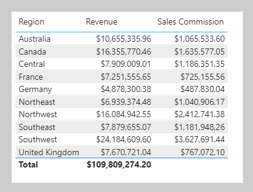

The [VALUES](https://docs.microsoft.com/dax/values-function-dax/?azure-portal=true) DAX function lets your formulas determine what values are in filter context. The VALUES function syntax is as follows:

```dax
VALUES(<TableNameOrColumnName>)
```

The function requires passing in a table reference or a column reference. When you pass in a table reference, it returns a table object with the same columns that contain rows for what's in filter context. When you pass in a column reference, it returns a single-column table of unique values that are in filter context.

The function always returns a table object and it's possible for a table to contain multiple rows. Therefore, to test whether a specific value is in filter context, your formula must first test that the VALUES function returns a single row. Two functions can help you accomplish this task: the [HASONEVALUE](https://docs.microsoft.com/dax/hasonevalue-function-dax/?azure-portal=true) and the [SELECTEDVALUE](https://docs.microsoft.com/dax/selectedvalue-function/?azure-portal=true) DAX functions.

The HASONEVALUE function returns TRUE when a given column reference has been filtered down to a single value.

The SELECTEDVALUE function simplifies the task of determining what a single value could be. When the function is passed a column reference, it'll return a single value, or when more than one value is in filter context, it'll return BLANK (or an alternate value that you pass to the function).

In the following example, you will use the HASONEVALUE function. Add the following measure, which calculates sales commission. Note that, at Adventure Works, the commission rate is 10 percent of revenue for all countries except the United States. In the United States, salespeople earn 15 percent commission. Format the measure as currency with two decimal places, and then add it to the table that is found on **Page 3** of the report.

```dax
Sales Commission =
[Revenue]
	* IF(
		HASONEVALUE('Sales Territory'[Country]),
		IF(
			VALUES('Sales Territory'[Country]) = "United States",
			0.15,
			0.1
		)
	)
```

> [!div class="mx-imgBorder"]
> [](../media/dax-table-region-sales-commission-1-ss.png#lightbox)

Notice that the total **Sales Commission** result is BLANK. The reason is because multiple values are in filter context for the **Country** column in the Sales Territory table. In this case, the HASONEVALUE function returns FALSE, which results in the **Revenue** measure being multiplied by BLANK (a value multiplied by BLANK is BLANK). To produce a total, you will need to use an iterator function, which is explained later in this module.

Three other functions that you can use to test filter state are:

-   **[ISFITLERED](https://docs.microsoft.com/dax/isfiltered-function-dax/?azure-portal=true) DAX function** - Returns TRUE when a passed-in column reference is *directly* filtered.

-   **[ISCROSSFILTERED](https://docs.microsoft.com/dax/iscrossfiltered-function-dax/?azure-portal=true) DAX function** - Returns TRUE when a passed-in column reference is *indirectly* filtered. A column is cross-filtered when a filter that is applied to another column in the same table, or in a related table, affects the reference column by filtering it.

-   **[ISINSCOPE](https://docs.microsoft.com/dax/isinscope-function-dax/?azure-portal=true) DAX function** - Returns TRUE when a passed-in column reference is the level in a hierarchy of levels.

Return to **Page 2** of the report, and then modify the **Revenue % Total Country** measure definition to test that the **Region** column in the Sales Territory table is in scope. If it's not in scope, the measure result should be BLANK.

```dax
Revenue % Total Country =
VAR CurrentRegionRevenue = [Revenue]
VAR TotalCountryRevenue =
	CALCULATE(
		[Revenue],
		REMOVEFILTERS('Sales Territory'[Region])
	)
RETURN
	IF(
		ISINSCOPE('Sales Territory'[Region]),
		DIVIDE(
			CurrentRegionRevenue,
			TotalCountryRevenue
		)
	)
```

> [!div class="mx-imgBorder"]
> [](../media/dax-matrix-sales-territory-revenue-5-ssm.png#lightbox)

In the matrix visual, notice that **Revenue % Total Country** values are now only displayed when a region is in scope.
