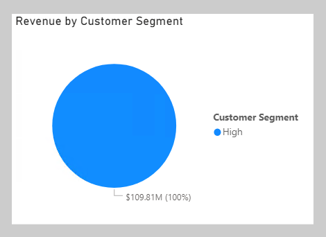
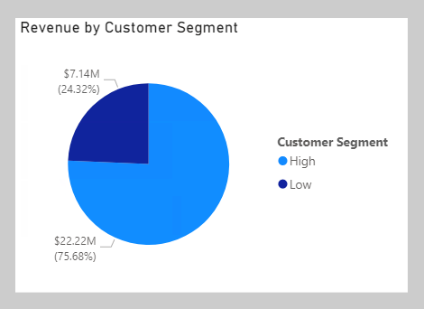
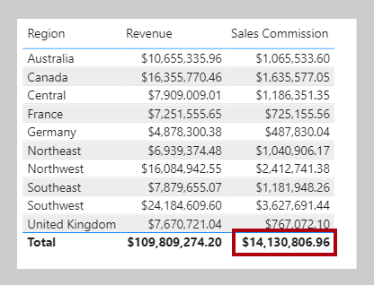

What happens when a measure or measure expression is evaluated within row context? This scenario can happen in a calculated column formula or when an expression in an iterator function is evaluated.

In the following example, you will create a calculated column definition in the Customer table to classify customers into a loyalty class. The scenario is simple: When the revenue that is produced by the customer is less than USD 2500, the customer is classified as **Low**; otherwise they're classified as **High**.

```dax
Customer Segment =
VAR CustomerRevenue = SUM(Sales[Sales Amount])
RETURN
	IF(CustomerRevenue < 2500, "Low", "High")
```

On **Page 4** of the report, add the **Customer Segment** column as the legend of the pie chart.

> [!div class="mx-imgBorder"]
> [](../media/dax-pie-customer-segment-1-ss.png#lightbox)

Notice that only one **Customer Segment** value exists. The reason is because the calculated column formula produces an incorrect result: Each customer is assigned the value of **High** because the expression `SUM(Sales[Sales Amount])` isn't evaluated in a filter context. Consequently, each customer is assessed on the sum of *every* **Sales Amount** column value in the Sales table.

To force the evaluation of the `SUM(Sales[Sales Amount])` expression *for each customer*, a context transaction must take place that applies the row context column values to filter context. You can accomplish this transaction by using the CALCULATE function without passing in filter expressions.

Modify the calculated column definition so that it produces the correct result.

```dax
Customer Segment =
VAR CustomerRevenue = CALCULATE(SUM(Sales[Sales Amount]))
RETURN
	IF(CustomerRevenue < 2500, "Low", "High")
```

In the pie chart visual, verify that two pie segments now display.

> [!div class="mx-imgBorder"]
> [](../media/dax-pie-customer-segment-2-ss.png#lightbox)

In this case, the CALCULATE function applies row context values as filters, known as *context transition*. To be accurate, the process doesn't quite work that way when a unique column is on the table. When a unique column is on the table, you only need to apply a filter on that column to make the transition happen. In this case, Power BI applies a filter on the **CustomerKey** column for the value in row context.

If you reference measures in an expression that's evaluated in row context, context transition is automatic. Thus, you don't need to pass measure references to the CALCULATE function.

Modify the calculated column definition, which references the **Revenue** measure, and notice that it continues to produce the correct result.

```dax
Customer Segment = 
VAR CustomerRevenue = [Revenue]
RETURN
	IF(CustomerRevenue < 2500, "Low", "High")
```

Now, you can complete the **Sales Commission** measure formula. To produce a total, you need to use an iterator function to iterate over all regions in filter context. The iterator function expression must use the CALCULATE function to transition the row context to the filter context. Notice that it no longer needs to test whether a single **Country** column value in the Sales Territory table is in filter context because it's known to be filtering by a single country (because it's iterating over the regions in filter context and a region belongs to only one country).

Switch to **Page 3** of the report, and then modify the **Sales Commission** measure definition to use the SUMX iterator function:

```dax
Sales Commission =
SUMX(
	VALUES('Sales Territory'[Region]),
	CALCULATE(
		[Revenue]
		* IF(
			VALUES('Sales Territory'[Country]) = "United States",
			0.15,
			0.1
		)
	)
)
```

The table visual now displays a sales commission total for all regions.

> [!div class="mx-imgBorder"]
> [](../media/dax-table-region-sales-commission-2-ssm.png#lightbox)
