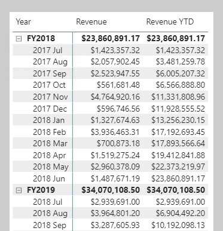

Time intelligence relates to calculations over time. To be more specific, it relates to calculations over dates, months, quarters, or years and, possibly time. There's not often the need to calculate over time in the sense of hours, minutes, or seconds.

In DAX calculations, time intelligence means *modifying the filter context for date filters*.

Let's consider an example. At the Adventure Works company, their financial year begins on July 1 and ends of June 30 of the following year. They produce a table visual that displays monthly revenue and year-to-date (YTD) revenue.

> [!div class="mx-imgBorder"]
> 

The filter context for **2017 August** is each of the 30 dates of August, which are stored in the **Date** table. Yet, the calculated year-to-date revenue for **2017 August** applies a different filter context. It's the first date of the year through to the last date in filter context. In this example, that's July 1, 2017 through to August 30, 2017.

Time intelligence calculations modify date filter contexts. They can help you answer these time-related questions:

-   What's the accumulation of revenue for the year, quarter, or month?

-   What revenue did we produce for the same period last year?

-   What growth in revenue have we achieved over the same period last year?

-   How many new customers made their first order in each month?

-   What's the inventory stock on hand value for our products?

In this module, we'll describe how to author time intelligence measures to answer these questions.

