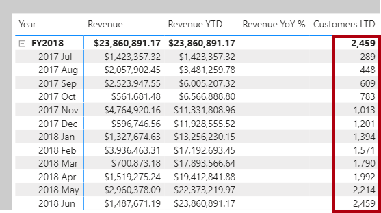
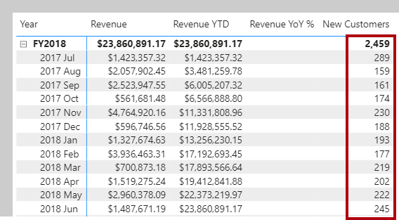
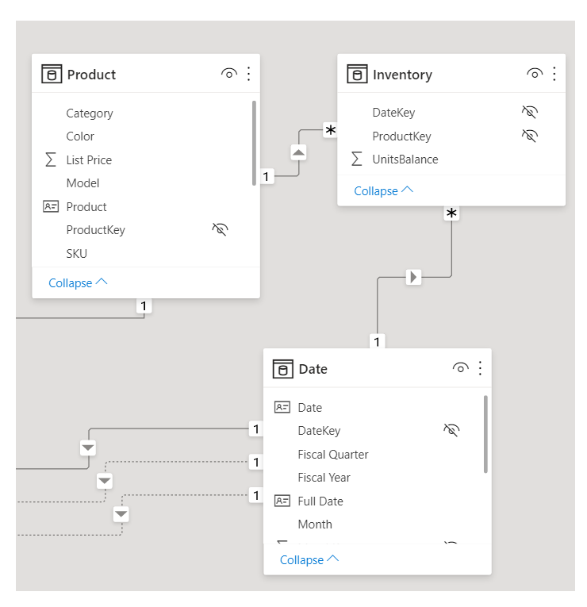
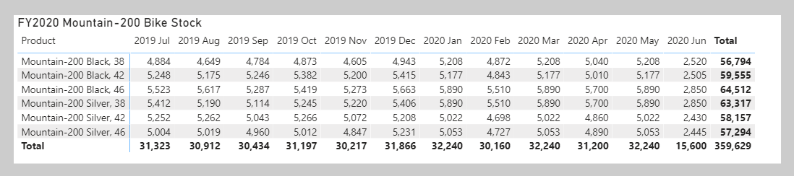
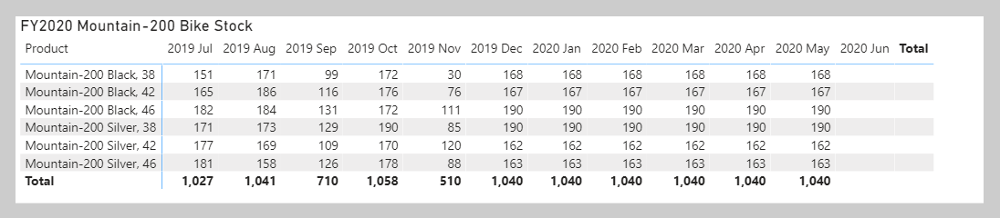
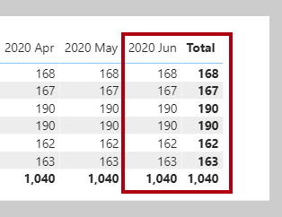

Other DAX time intelligence functions exist that are concerned with returning a single date. You'll learn about these functions by applying them in two different scenarios.

The [FIRSTDATE](https://docs.microsoft.com/dax/firstdate-function-dax/?azure-portal=true) and the [LASTDATE](https://docs.microsoft.com/dax/lastdate-function-dax/?azure-portal=true) DAX functions return the first and last date in the current filter context for the specified column of dates.

## Calculate new occurrences

Another use of time intelligence functions is to count new occurrences. The following example shows how you can calculate the number of new customers for a time period. A new customer is counted in the time period in which they made their first purchase.

Your first task is to add the following measure definition that counts the number of distinct customers *life-to-date* (LTD). Life-to-date means from the beginning of time until the last date in filter context. Format the measure as a whole number by using the thousands separator.

```dax
Customers LTD =
VAR CustomersLTD =
	CALCULATE(
		DISTINCTCOUNT(Sales[CustomerKey]),
		DATESBETWEEN(
			'Date'[Date],
			BLANK(),
			MAX('Date'[Date])
		),
		'Sales Order'[Channel] = "Internet"
	)
RETURN
	CustomersLTD
```

Add the **Customers LTD** measure to the matrix visual. Notice that it produces a result of distinct customers LTD until the end of each month.

> [!div class="mx-imgBorder"]
> [](../media/dax-matrix-customers-ltd-ssm.png#lightbox)

The DATESBETWEEN function returns a table that contains a column of dates that begins with a given start date and continues until a given end date. When the start date is BLANK, it will use the first date in the date column. (Conversely, when the end date is BLANK, it will use the last date in the date column.) In this case, the end date is determined by the MAX function, which returns the last date in filter context. Therefore, if the month of August 2017 is in filter context, then the MAX function will return August 30, 2017 and the DATESBETWEEN function will return all dates through to August 30, 2017.

Next, you will modify the measure by renaming it to **New Customers** and by adding a second variable to store the count of distinct customers *before* the time period in filter context. The RETURN clause now subtracts this value from LTD customers to produce a result, which is the number of new customers in the time period.

```dax
New Customers =
VAR CustomersLTD =
	CALCULATE(
		DISTINCTCOUNT(Sales[CustomerKey]),
		DATESBETWEEN(
			'Date'[Date],
			BLANK(),
			MAX('Date'[Date])
		),
		'Sales Order'[Channel] = "Internet"
	)
VAR CustomersPrior =
	CALCULATE(
		DISTINCTCOUNT(Sales[CustomerKey]),
		DATESBETWEEN(
			'Date'[Date],
			BLANK(),
			MIN('Date'[Date]) - 1
		),
		'Sales Order'[Channel] = "Internet"
	)
RETURN
	CustomersLTD - CustomersPrior
```

> [!div class="mx-imgBorder"]
> [](../media/dax-matrix-new-customers-ssm.png#lightbox)

For the **CustomersPrior** variable, notice that the DATESBETWEEN function includes dates until the first date in filter context *minus* one. Because Microsoft Power BI internally stores dates as numbers, you can add or subtract numbers to shift a date.

## Snapshot calculations

Occasionally, fact data is stored as snapshots in time. Common examples include inventory stock levels or account balances. A snapshot of values is loaded into the table on a periodic basis.

When summarizing snapshot values (like inventory stock levels), you can summarize values across any dimension except date. Adding stock level counts across product categories produces a meaningful summary, but adding stock level counts across dates does not. Adding yesterday's stock level to today's stock level isn't a useful operation to perform (unless you want to average that result).

When you are summarizing snapshot tables, measure formulas can rely on DAX time intelligence functions to enforce a single date filter.

In the following example, you will explore a scenario for the Adventure Works company. Switch to model view and select the **Inventory** model diagram.

> [!div class="mx-imgBorder"]
> [](../media/dax-model-diagram-inventory-ss.png#lightbox)

Notice that the diagram shows three tables: Product, Date, and Inventory. The Inventory table stores snapshots of unit balances for each date and product. Importantly, the table contains no missing dates and no duplicate entries for any product on the same date. Also, the last snapshot record is stored for the date of June 15, 2020.

Now, switch to report view and select **Page 2** of the report. Add the **UnitsBalance** column of the Inventory table to the matrix visual. Its default summarization is set to sum values.

> [!div class="mx-imgBorder"]
> [](../media/dax-matrix-mountain-200-bike-stock-1-ss.png#lightbox)

This visual configuration is an example of how not to summarize a snapshot value. Adding daily snapshot balances together doesn't produce a meaningful result. Therefore, remove the **UnitsBalance** field from the matrix visual.

Now, you will add a measure definition that sums the **UnitsBalance** value *for a single date*. The date will be the last date of each time period. It's achieved by using the LASTDATE function. Format the measure as a whole number with the thousands separator.

```dax
Stock on Hand =
CALCULATE(
	SUM(Inventory[UnitsBalance]),
	LASTDATE('Date'[Date])
)
```

> [!NOTE]
> Notice that the measure formula uses the SUM function. An aggregate function must be used (measures don't allow direct references to columns), but given that only one row exists for each product for each date, the SUM function will only operate over a single row.

Add the **Stock on Hand** measure to the matrix visual. The value for each product is now based on the last recorded units balance for each month.

> [!div class="mx-imgBorder"]
> [](../media/dax-matrix-mountain-200-bike-stock-2-ss.png#lightbox)

The measure returns BLANKs for June 2020 because no record exists for the last date in June. According to the data, it hasn't happened yet.

Filtering by the last date in filter context has inherent problems: A recorded date might not exist because it hasn't yet happened, or perhaps because stock balances aren't recorded on weekends.

Your next step is to adjust the measure formula to determine the last date *that has a non-BLANK result* and then filter by that date. You can achieve this task by using the [LASTNONBLANK](https://docs.microsoft.com/dax/lastnonblank-function-dax/?azure-portal=true) DAX function.

Use the following measure definition to modify the **Stock on Hand** measure.

```dax
Stock on Hand =
CALCULATE(
	SUM(Inventory[UnitsBalance]),
	LASTNONBLANK(
		'Date'[Date],
		CALCULATE(SUM(Inventory[UnitsBalance]))
	)
)
```

In the matrix visual, notice the values for June 2020 and the total (representing the entire year).

> [!div class="mx-imgBorder"]
> [](../media/dax-matrix-mountain-200-bike-stock-2020-june-ssm.png#lightbox)

The LASTNONBLANK function is an iterator function. It returns the last date that produces a non-BLANK result. It achieves this result by iterating through all dates in filter context *in descending chronological order*. (Conversely, the FIRSTNONBLANK iterates in ascending chronological order.) For each date, it evaluates the passed in expression. When it encounters a non-BLANK result, the function returns the date. That date is then used to filter the CALCULATE function.

> [!NOTE]
> The LASTNONBLANK function evaluates its expression in row context. The CALCULATE function must be used to transition the row context to filter context to correctly evaluate the expression.

You should now hide the **Inventory** table **UnitsBalance** column. It will prevent report authors from inappropriately summarizing snapshot unit balances.
