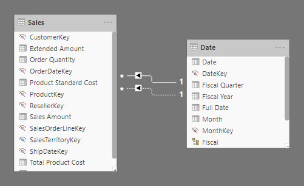
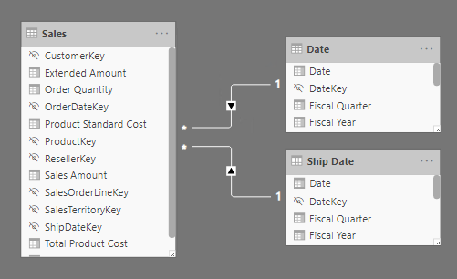
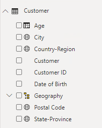
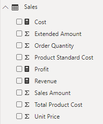

By using Data Analysis Expressions (DAX), you can add three types of calculations to your data model:

-   Calculated tables

-   Calculated columns

-   Measures

> [!NOTE]
> DAX can also be used to define row-level security (RLS) rules, which are expressions that enforce filters over model tables. However, rules aren't considered to be model calculations so they're out of scope for this module. For more information, see [Row-level security (RLS) with Power BI](https://docs.microsoft.com/power-bi/admin/service-admin-rls/?azure-portal=true).

## Calculated tables

You can write a DAX formula to add a calculated table to your model. The formula can duplicate or transform *existing model data*, or create a series of data, to produce a new table. Calculated table data is always imported into your model, so it increases the model storage size and can prolong data refresh durations.

> [!NOTE]
> A calculated table can't connect to external data; you need to use Power Query to accomplish that task.

Calculated tables can be useful in various scenarios:

-   Date tables

-   Role-playing dimensions

-   What-if analysis

### Date tables

Date tables are required to apply special time filters known as *time intelligence*. A family of DAX functions, known as time-intelligence functions, only work correctly when a date table is set up. When your source data doesn't include a date table, you can create one as calculated tables by using the [CALENDAR](https://docs.microsoft.com/dax/calendar-function-dax/?azure-portal=true) or [CALENDARAUTO](https://docs.microsoft.com/dax/calendarauto-function-dax/?azure-portal=true) DAX functions.

### Role-playing dimensions

When two model tables have multiple relationships, it could be because your model has a role-playing dimension. For example, if you have a table named **Sales** that includes two date columns, **OrderDateKey** and **ShipDateKey**, both columns are related to the **Date** column in the Date table. In this case, the Date table is described as a role-playing dimension because it could play the role of *order date* or *ship date*.

> [!div class="mx-imgBorder"]
> 

Microsoft Power BI models only allow one active relationship between tables, which in the model diagram is indicated as a solid line. The active relationship is used by default to propagate filters, which in this case would be from the Date table to the **OrderDateKey** column in the Sales table. Any remaining relationships between the two tables are inactive. In a model diagram, the relationships are represented as dashed lines. Inactive relationships are only used when they're expressly requested in a calculated formula by using the [USERELATIONSHIP](https://docs.microsoft.com/dax/userelationship-function-dax/?azure-portal=true) DAX function.

Perhaps a better model design could have two date tables, each with an active relationship to the Sales table. Thus, report users can filter by order date or ship date, or both at the same time. A calculated table can duplicate the Date table data to create the Ship Date table.

> [!div class="mx-imgBorder"]
> 

### What-if analysis

Power BI Desktop supports a feature called [What-if parameters](https://docs.microsoft.com/power-bi/transform-model/desktop-what-if/?azure-portal=true). When you create a **what-if** parameter, a calculated table is automatically added to your model.

**What-if** parameters allow report users to select or filter by values that are stored in the calculated table. Measure formulas can use selected value(s) in a meaningful way. For example, a **what-if** parameter could allow the report user to select a hypothetical currency exchange rate, and a measure could divide revenue values (in a local currency) by the selected rate.

Notably, what-if calculated tables aren't related to other model tables because they're not used to propagate filters. For this reason, they're sometimes called *disconnected tables*.

## Calculated columns

You can write a DAX formula to add a calculated column to any table in your model. The formula is evaluated for each table row and it returns a single value. When added to an Import storage mode table, the formula is evaluated when the data model is refreshed and it increases the storage size of your model. When added to a DirectQuery storage mode table, the formula is evaluated by the underlying source database when the table is queried.

In the **Fields** pane, calculated columns are enhanced with a special icon. The following example shows a single calculated column in the Customer table called **Age**.

> [!div class="mx-imgBorder"]
> 

> [!NOTE]
> The calculated column special icon is only visible in Power BI Desktop when you are developing the model. Report users that create a live connection to the model won't see this icon. In fact, a way now exists for them to determine that a column is a calculated column.

## Measures

You can write a DAX formula to add a measure to any table in your model. The formula is concerned with achieving summarization over model data. Similar to a calculated column, the formula must return a single value. Unlike calculated columns, which are evaluated at data refresh time, measures are evaluated at query time and their results are never stored in the model.

In the **Fields** pane, measures are shown with the calculator icon. The following example shows three measures in the Sales table: **Cost**, **Profit**, and **Revenue**.

> [!div class="mx-imgBorder"]
> 

Occasionally, measures can be described as *explicit measures*. To be clear, explicit measures are model calculations that are written in DAX and are commonly referred to as simply *measures*. Yet, the concept of *implicit measures* exists, too. Implicit measures are columns that can be summarized by visuals in simplistic ways, like count, sum, minimum, maximum, and so on. You can identify implicit measures in the **Fields** pane because they're shown with the sigma symbol (∑).

> [!NOTE]
> Any column can be summarized when added to a visual. Therefore, whether they're shown with the sigma symbol or not, when they're added to a visual, they can be configured as implicit measures.

Additionally, no such concept as a *calculated measure* exists in tabular modeling. The word *calculated* is used to describe calculated tables and calculated columns, which distinguishes them from tables and columns that originate from Power Query. Power Query doesn't have the concept of an explicit measure.
