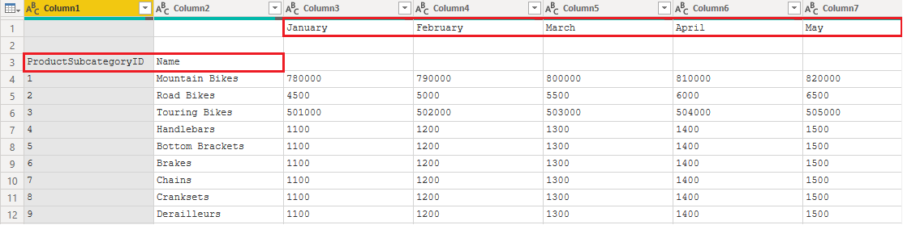
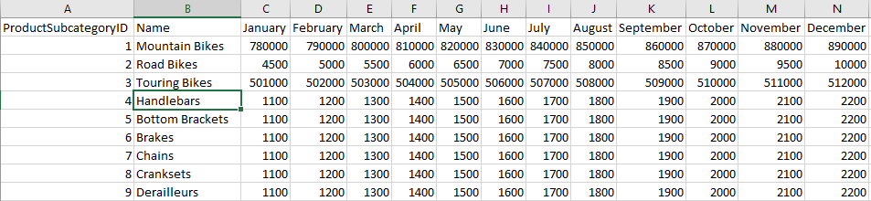
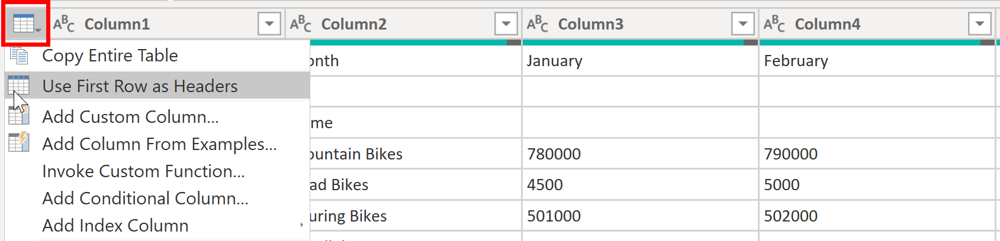
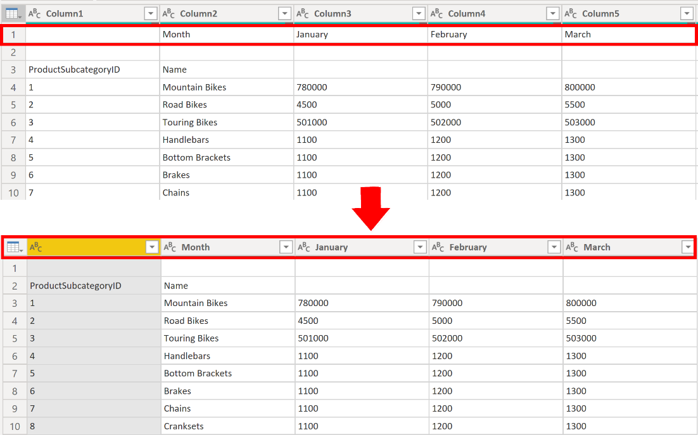

Power Query Editor in Power BI Desktop allows you to shape (transform)
your imported data. You can accomplish actions such as renaming columns
or tables, changing text to numbers, removing rows, setting the first
row as headers, and much more. It is important to shape your data to
ensure that it meets your needs and is suitable for use in reports.  

You have loaded raw sales data from two sources into a Power
BI model. Some of the data came from a .csv file that
was created manually in Microsoft Excel by the Sales team. The other
data was loaded through a connection to your organization's Enterprise
Resource Planning (ERP) system. Now, when you look at the data in Power
BI Desktop, you notice that it's in disarray; some data that you don't
need and some data that you do need are in the wrong format.  

You need to use Power Query Editor to clean up and shape this
data before you can start building reports. 

> [!div class="mx-imgBorder"]
> 

## Get started with Power Query Editor  

To start shaping your data, open Power Query Editor by
selecting the **Transform data** option on the **Home** tab of Power BI
Desktop.

> [!div class="mx-imgBorder"]
> 

In Power Query Editor, the data in your selected query displays in the
middle of the screen and, on the left side, the **Queries** pane lists
the available queries (tables).  

When you work in Power Query Editor, all steps that you take to shape
your data are recorded. Then, each time the query connects to the data
source, it automatically applies your steps, so your data is always
shaped the way that you specified. Power Query Editor only makes changes
to a particular view of your data, so you can feel confident about
changes that are being made to your original data source. You can see a
list of your steps on the right side of the screen, in the **Query
Settings** pane, along with the query's properties. 

The Power Query Editor ribbon contains many buttons you can use to
select, view, and shape your data.

To learn more about the available features and functions, see [The query ribbon](https://docs.microsoft.com/power-query/power-query-quickstart-using-power-bi.md?azure-portal=true#the-query-ribbon). 

> [!NOTE]
> In Power Query Editor, the right-click context menus and **Transform** tab in the ribbon provide many of the same options.

### Identify column headers and names 

The first step in shaping your initial data is to identify the column
headers and names within the data and then evaluate where they are
located to ensure that they are in the right place.

In the following screenshot, the source data in the SalesTarget.csv
file had a target categorized by products and a subcategory split by
months, both of which are organized into columns. 

> [!div class="mx-imgBorder"]
> 

However, you notice that the data did not import as expected.

> [!div class="mx-imgBorder"]
> 

Consequently, the data is difficult to read. A problem has occurred with
the data in its current state because column headers are in different
rows (marked in red), and several columns have undescriptive names, such
as **Column1**, **Column2**, and so on.

When you have identified where the column headers and names are located,
you can make changes to reorganize the data. 

### Promote headers

When a table is created in Power BI Desktop, Power Query Editor assumes
that all data belongs in table rows. However, a data source might have a
first row that contains column names, which is what happened in
the previous SalesTarget example. To correct this inaccuracy, you need
to promote the first table row into column headers.

You can promote headers in two ways: by selecting the **Use First Row as
Headers** option on the **Home** tab or by selecting the drop-down
button next to **Column1** and then selecting **Use First Row as
Headers**. 

> [!div class="mx-imgBorder"]
> 

The following image illustrates how the **Use First Row as Headers** feature impacts the data: 

> [!div class="mx-imgBorder"]
> 

## Rename columns 

The next step in shaping your data is to examine the column headers. You
might discover that one or more columns have the wrong headers, a header
has a spelling error, or the header naming convention is not consistent
or user-friendly. 

Refer to the previous screenshot, which shows the impact of the **Use
First Row as Headers** feature. Notice that the column that contains the
subcategory **Name** data now has **Month** as its column header.
This column header is incorrect, so it needs to be renamed. 

You can rename column headers in two ways. One approach is to
right-click the header, select **Rename**,
edit the name, and then press **Enter**. Alternatively, you
can double-click the column header and overwrite the name with
the correct name. 

You can also work around this issue by removing (skipping) the first two
rows and then renaming the columns to the correct name. 

## Remove top rows 

When shaping your data, you might need to remove some of the top rows,
for example, if they are blank or if they contain data that you do not
need in your reports. 

Continuing with the SalesTarget example, notice that the first row is
blank (it has no data) and the second row has data that is
no longer required.

> [!div class="mx-imgBorder"]
> 

To remove these excess rows, select **Remove Rows** > **Remove Top
Rows** on the **Home** tab. 

> [!div class="mx-imgBorder"]
> 

## Remove columns 

A key step in the data shaping process is to remove unnecessary
columns. It is much better to remove columns as early as possible. One
way to remove columns would be to limit the column when you get data
from data source. For instance, if you are extracting data from a
relational database by using SQL, you would want to limit the column
that you extract by using a column list in the SELECT statement.

Removing columns at an early stage in the process rather than later is
best, especially when you have established relationships between your
tables. Removing unnecessary columns will help you to focus on the data
that you need and help improve the overall performance of your Power BI
Desktop datasets and reports. 

Examine each column and ask yourself if you really need the data that it
contains. If you don't plan on using that data in a report, the column
adds no value to your data model. Therefore, the column should be
removed. You can always add the column later, if your requirements
change over time. 

You can remove columns in two ways. The first method is to select the
columns that you want to* *remove and then,
on the **Home** tab, select **Remove Columns**. 

> [!div class="mx-imgBorder"]
> 

Alternatively, you can select the columns that you want to keep and
then, on the **Home** tab, select **Remove Columns** > **Remove
Other Columns**.

> [!div class="mx-imgBorder"]
> 

## Unpivot columns 

Unpivoting is a useful feature of Power BI. You can use this feature
with data from any data source, but you would most often use it when
importing data from Excel. The following example shows a sample Excel
document with sales data.

> [!div class="mx-imgBorder"]
> 

Though the data might initially make sense, it would be difficult to
create a total of all sales combined from 2018 and 2019. Your goal would
then be to use this data in Power BI with three columns: **Month**,
**Year**, and **SalesAmount**.

When you import the data into Power Query, it will look like the
following image.

> [!div class="mx-imgBorder"]
> 

Next, rename the first column to **Month**. This column was mislabeled
because that header in Excel was labeling the 2018 and 2019 columns.
Highlight the 2018 and 2019 columns, select the **Transform** tab in
Power Query, and then select **Unpivot**.

> [!div class="mx-imgBorder"]
> 

You can rename the **Attribute** column to **Year** and the **Value**
column to **SalesAmount**.

Unpivoting streamlines the process of creating DAX measures on the data
later. By completing this process, you have now created a simpler way of
slicing the data with the **Year** and **Month** columns.

## Pivot columns 

If the data that you are shaping is flat (in other words, it has lot of
detail but is not organized or grouped in any way), the lack of
structure can complicate your ability to identify patterns in the data.

You can use the **Pivot Column** feature to convert your flat data into
a table that contains an aggregate value for each unique value in a
column. For example, you might want to use this feature to summarize
data by using different math functions such as **Count**, **Minimum**,
**Maximum**, **Median**, **Average**, or **Sum**. 

In the SalesTarget example, you can pivot the columns to get the
quantity of product subcategories in each product category.

On the **Transform** tab, select **Transform > Pivot Columns**.

> [!div class="mx-imgBorder"]
> 

On the **Pivot Column** window that displays, select a column from
the **Values Column** list, such as **Subcategory name**. Expand the
advanced options and select an option from the **Aggregate Value
Function **list, such as **Count (All)**, and then select **OK**. 

> [!div class="mx-imgBorder"]
> 

The following image illustrates how the **Pivot Column** feature changes
the way that the data is organized.

> [!div class="mx-imgBorder"]
> 

Power Query Editor records all steps that you take to shape your data,
and the list of steps are shown in the **Query Settings** pane. If you
have made all the required changes, select **Close & Apply** to
close Power Query Editor and apply your changes to your data model.
However, before you select **Close & Apply**, you can take further
steps to clean up and transform your data in Power Query Editor. These
additional steps are covered later in this module. 
