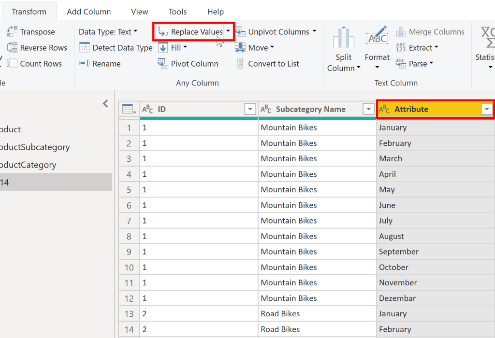
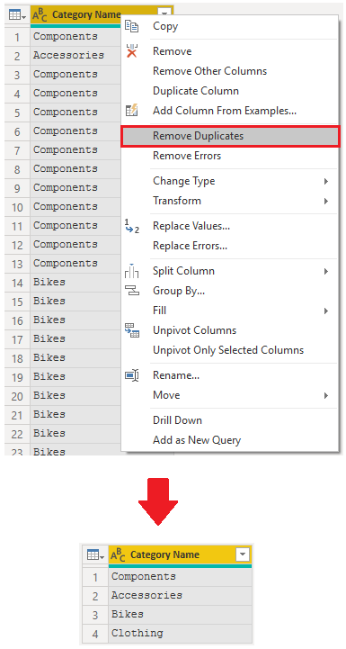

When you import data from multiple sources into Power BI
Desktop, the data retains its predefined table and column names. You
might want to change some of these names so that they are in a
consistent format, easier to work with, and more meaningful to a
user. You can use Power Query Editor in Power BI Desktop to make these
name changes and simplify your data structure. 

To continue with the previous scenario where you shaped the
initial data in your model, you need to take further action to simplify
the structure of the sales data and get it ready for developing reports
for the Sales team. You have already renamed the columns, but now you
need to examine the names of the queries (tables) to determine if any
improvements can be made. You also need to review the contents of the
columns and replace any values that require correction. 

## Rename a query 

It's good practice to change uncommon or unhelpful query names to names
that are more obvious or that the user is more familiar
with. For instance, if you import a product fact table into Power BI
Desktop and the query name displays as *FactProductTable*, you might
want to change it to a more user-friendly name, such as *Products*.
Similarly, if you import a view, the view might have a name that
contains a prefix of *v*, such as *vProduct*. People might find this
name unclear and confusing, so you might want to remove the prefix. 

In this example, you have examined the name of
the TargetSales query and realize that this name is unhelpful because
you'll have a query with this name for every year. To avoid confusion,
you want to add the year to the query name. 

In Power Query Editor, in the **Queries** pane to the left of your data,
select the query that you want to rename. Right-click the query and
select **Rename**. Edit the current name or type a new
name, and then press **Enter**.

> [!div class="mx-imgBorder"]
> 

## Replace values

You can use the **Replace Values** feature in Power Query Editor to
replace any value with another value in a selected column. 

In this example, you notice that, in the **Attribute** column, the month
December is misspelled. You need to correct this spelling
mistake. Select the column that contains the value that you want to
replace (**Attribute** in this case), and then select **Replace
Values** on the **Transform** tab. 

> [!div class="mx-imgBorder"]
> 

In the **Value to Find** box, enter the name of the value that you want
to replace, and then in the **Replace With** box, enter the correct
value name and then select **OK**. In Power Query, you can't select one
cell and change one value, like you might have done in Excel.

> [!div class="mx-imgBorder"]
> 

You can review the list of steps that you took to restructure and
correct your data in the **Query Settings** pane. When you have
completed all steps that you want to take, you can select **Close &
Apply** to close Power Query Editor and apply your changes to your data
model. However, you can take further action to clean and transform your
data.

## Replace null values

Occasionally, you might find that your data sources contain null values.
For example, a freight amount on a sales order might have a null
value if it's synonymous with zero. If the value stays null, the
averages will not calculate correctly. One solution would be to change
the nulls to zero, which will produce the more accurate freight average.
In this instance, using the same steps that you followed previously will
help you replace the null values with zero. 

> [!div class="mx-imgBorder"]
> 

## Remove duplicates 

You can also remove duplicates from columns to only keep unique names in
a selected column by using the **Remove Duplicates** feature in Power
Query. 

In this example, notice that the **Category Name** column contains
duplicates for each category. As a result, you want to create a table
with unique categories and use it in your data model. You can achieve
this action by selecting a column, right-clicking on the header of the
column, and then selecting the **Remove Duplicates** option. 

You might consider copying the table before removing the duplicates. The
**Copy** option is at the top of the context menu, as shown in the
following screenshot. Copying the table before removing duplicates will
give you a comparison of the tables and will let you use both tables, if
needed.

> [!div class="mx-imgBorder"]
> 

## Best practices for naming tables, columns, and values

Naming conventions for tables, columns, and values have no fixed rules;
however, we recommend that you use the language and abbreviations that
are commonly used within your organization and that everyone agrees on
and considers them as common terminology. 

A best practice is to give your tables, columns, and measures
descriptive business terms and replace underscores ("_") with spaces.
Be consistent with abbreviations, prefaces, and words like "number" and
"ID." Excessively short abbreviations can cause confusion if they are
not commonly used within the organization. 

Also, by removing prefixes or suffixes that you might use in table names
and instead naming them in a simple format, you will help avoid
confusion.

When replacing values, try to imagine how those values will appear on
the report. Values that are too long might be difficult to read and fit
on a visual. Values that are too short might be difficult to interpret.
Avoiding acronyms in values is also a good idea, provided that the text
will fit on the visual.

