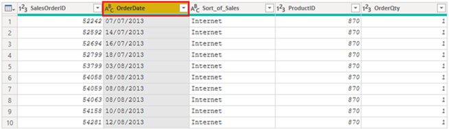
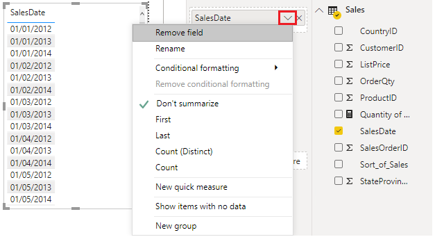
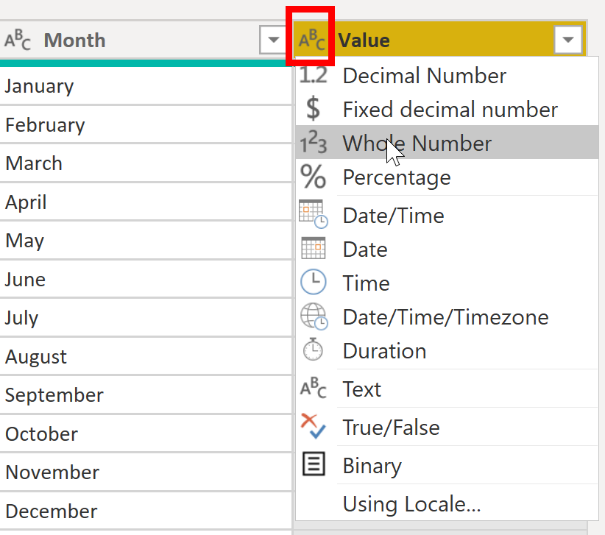

When you import a table from any data source, Power BI Desktop
automatically starts scanning the first 1,000 rows (default setting) and
tries to detect the type of data in the columns. Some situations might
occur where Power BI Desktop does not detect the correct data type.
Where incorrect data types occur, you will experience performance
issues.

You have a higher chance of getting data type errors when you are
dealing with flat files, such as comma-separated values (.CSV) files and
Excel workbooks (.XLSX), because data was entered manually into the
worksheets and mistakes were made. Conversely, in databases, the data
types are predefined when tables or views are created.

A best practice is to evaluate the column data types in Power Query
Editor before you load the data into a Power BI data model. If you
determine that a data type is incorrect, you can change it. You might
also want to apply a format to the values in a column and change the
summarization default for a column.

To continue with the scenario where you are cleaning and transforming
sales data in preparation for reporting, you now need to evaluate the
columns to ensure that they have the correct data type. You need to
correct any errors that you identify.

You evaluate the **OrderDate** column. As expected, it contains numeric
data, but Power BI Desktop has incorrectly set the column data type to
Text. To report on this column, you need to change the data type of this
column from Text to Date.

> [!div class="mx-imgBorder"]
> [](../media/04-column-data-type-setas-text-ssm.png#lightbox)

## Implications of incorrect data types

The following information provides insight into problems that can arise
when Power BI does not detect the correct data type.

Incorrect data types will prevent you from creating certain
calculations, deriving hierarchies, or creating proper relationships
with other tables. For example, if you try to calculate the Quantity of
Orders YTD, you will get the following error stating that the
**OrderDate** column data type is not Date, which is required in
time-based calculations.

```Quantity of Orders YTD = TOTALYTD(SUM('Sales'[OrderQty]), 'Sales'[OrderDate])```

> [!div class="mx-imgBorder"]
> [](../media/04-error-calculated-measure-ss.png#lightbox)

Another issue with having an incorrect data type applied on a date field
is the inability to create a date hierarchy, which would allow you to
analyze your data on yearly, monthly, or weekly basis. The following
screenshot shows that the SalesDate field is not recognized as type Date
and will only be presented as a list of dates in the Table visual.
However, it is a best practice to use a date table and turn off the auto
date/time to get rid of the auto generated hierarchy. For more
information about this process, see [Auto generated data
type](https://docs.microsoft.com/power-bi/guidance/auto-date-time/?azure-portal=true)
documentation.

> [!div class="mx-imgBorder"]
> [](../media/04-additions-sales-date-options-ssm.png#lightbox)

## Change the column data type 

You can change the data type of a column in two places: in Power Query
Editor and in the Power BI Desktop Report view by using the column
tools. It is best to change the data type in the Power Query Editor
before you load the data.

### Change the column data type in Power Query Editor 

In Power Query Editor, you can change the column data type in two ways.
One way is to select the column that has the issue, select **Data Type**
in the **Transform** tab, and then select the correct data type from the
list.

> [!div class="mx-imgBorder"]
> [](../media/04-select-data-type-ssm.png#lightbox)

Another method is to select the data type icon next to the column header
and then select the correct data type from the list.

> [!div class="mx-imgBorder"]
> [](../media/04-select-data-type-from-list-ssm.png#lightbox)

As with any other changes that you make in Power Query Editor, the
change that you make to the column data type is saved as a programmed
step. This step is called **Changed Type** and it will be iterated every
time the data is refreshed.

After you have completed all steps to clean and transform your data,
select **Close & Apply** to close Power Query Editor and apply your
changes to your data model. At this stage, your data should be in great
shape for analysis and reporting.

For more information, see [Data types in Power BI](https://docs.microsoft.com/power-bi/connect-data/desktop-data-types/?azure-portal=true) Desktop.
