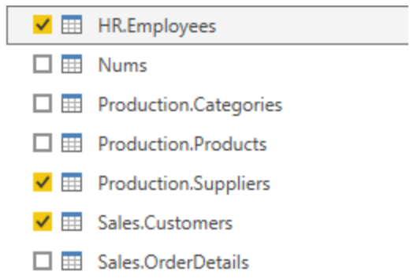
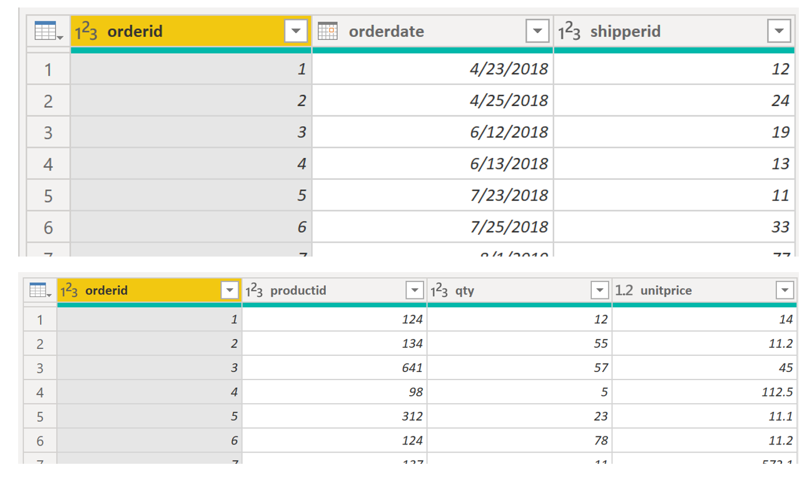

The ability to combine queries is powerful because it allows you to
append or merge different tables or queries together. You can combine
tables into a single table in the following circumstances:

-   Too many tables exist, making it difficult to navigate an overly-complicated data model.

-   Several tables have a similar role.

-   A table has only a column or two that can fit into a different table.

-   You want to use several columns from different tables in a custom column.

You can combine the tables in two different ways: merging and appending.

Assume that you are developing Power BI reports for the Sales and
HR teams. They have asked you to create a contact information report
that contains the contact information and location of every
employee, supplier, and customer. The data is in the HR.Employees,
Production.Suppliers, and the Sales.Customers tables, as shown in the
following image.

> [!div class="mx-imgBorder"]
> 

However, this data comes from multiple tables, so the dilemma is
determining how you can merge the data in these multiple tables and
create one source-of-truth table to create a report from. The inherent
functionality of Power BI allows you to combine and merge queries into a
single table.

## Append queries

When you append queries, you will be adding rows of data to another
table or query. For example, you could have two tables, one with 300
rows and another with 100 rows, and when you append queries, you will
end up with 400 rows. When you merge queries, you will be adding columns
from one table (or query) into another. To merge two tables,
you must have a column that is the key between the two tables.

For the previously mentioned scenario, you will append the HR.Employees table with the
Production.Suppliers and Sales.Customers tables so that you have one
master list of contact information. Because you want to create one table
that has all contact information for employees, suppliers, and
customers, when you combine the queries, the pertinent columns that you
require in your combined table must be named the same in your original
data tables to see one consolidated view.

Before you begin combining queries, you can remove extraneous columns
that you don't need for this task from your tables. To complete this
task, format each table to have only four columns with your pertinent
information, and rename them so they all have the same column headers:
ID, company, name, and phone. The following images are snippets of the
reformatted Sales.Customers, Production.Suppliers, and HR.Employees
tables.

> [!div class="mx-imgBorder"]
> 

After you have finished reformatting, you can combine the queries. On
the **Home** tab on the Power Query Editor ribbon, select the drop-down
list for **Append Queries**. You can select **Append Queries as
New**, which means that the output of appending will result in a new
query or table, or you can select **Append Queries**, which will add
the rows from an existing table into another.

Your next task is to create a new master table, so you need to
select **Append Queries as New**. This selection will bring you to a
window where you can add the tables that you want to append
from **Available Tables **to **Tables to Append**, as shown in the
following image.

> [!div class="mx-imgBorder"]
> 

After you have added the tables that you want to append, select **OK**.
You will be routed to a new query that contains all rows from all three
of your tables, as shown in the following image.

> [!div class="mx-imgBorder"]
> 

You have now succeeded in creating a master table that contains the
information for the employees, suppliers, and customers. You can exit
Power Query Editor and build any report elements surrounding this master
table.

However, if you wanted to merge tables instead of appending the data
from one table to another, the process would be different.

## Merge queries

When you merge queries, you are combining the data from multiple tables
into one based on a column that is common between the tables. This
process is similar to the JOIN clause in SQL. Consider a scenario where
the Sales team now wants you to consolidate orders and their
corresponding details (which are currently in two tables) into a single
table. You can accomplish this task by merging the two tables, Orders
and OrderDetails, as shown in the following image. The column that is
shared between these two tables is **OrderID**.

> [!div class="mx-imgBorder"]
>  

Go to **Home** on the Power Query Editor ribbon and select the **Merge
Queries** drop-down menu, where you can select **Merge Queries as
New**. This selection will open a new window, where you
can choose the tables that you want to merge from the drop-down list,
and then select the column that is matching between the tables, which in
this case is **orderid**. 

> [!div class="mx-imgBorder"]
> 

You can also choose how to join the two tables together, a process that
is also similar to JOIN statements in SQL. These join options include: 

-   **Left Outer** - Displays all rows from the first table and only the
    matching rows from the second.

-   **Full Outer** - Displays all rows from both tables.

-   **Inner** - Displays the matched rows between the two tables.

For this scenario, you will choose to use a **Left Outer** join. Select
**OK**, which will route you to a new window where you can view your
merged query.

> [!div class="mx-imgBorder"]
> 

Now, you can merge two queries or tables in different ways so that you
can view your data in the most appropriate way for your business
requirements.

For more information on this topic, see the [Shape and Combine Data in Power BI](https://docs.microsoft.com/power-bi/connect-data/desktop-shape-and-combine-data/?azure-portal=true) documentation.
