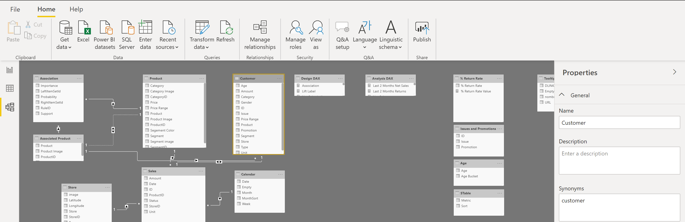
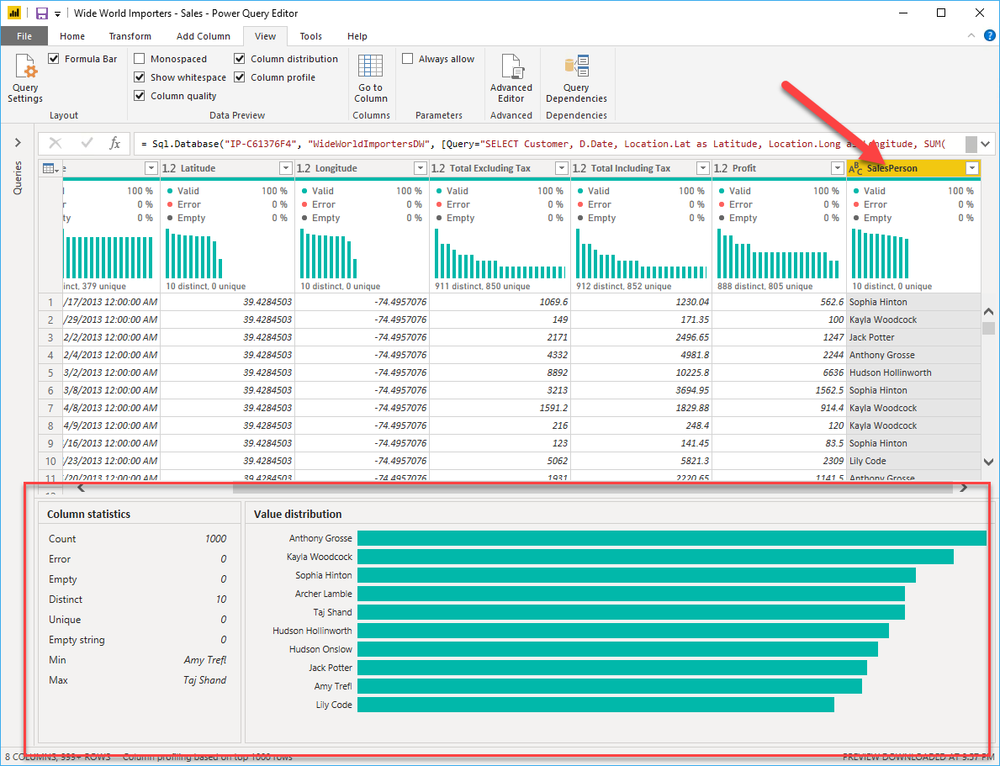

Profiling data is about studying the nuances of the data: determining
anomalies, examining and developing the underlying data
structures, and querying data statistics such as row counts, value
distributions, minimum and maximum values, averages, and so on. This
concept is important because it allows you to shape and organize the
data so that interacting with the data and identifying the distribution
of the data is uncomplicated, therefore helping to make your task of
working with the data on the front end to develop report elements near
effortless.

Assume that you are developing reports for the Sales team at your
organization. You are uncertain how the data is structured and contained
within the tables, so you want to profile the data behind the
scenes before you begin developing the visuals. Power BI has inherent
functionality that makes these tasks user-friendly and straightforward.

## Examine data structures

Before you begin examining the data in Power Query Editor, you should
first learn about the underlying data structures that data is organized
in. You can view the current data model under the **Model** tab on Power
BI Desktop.

> [!div class="mx-imgBorder"]
> 

On the **Model** tab, you can edit specific column and table properties
by selecting a table or columns, and you can transform the data by using
the **Transform Data** button, which takes you to Power Query Editor.
Additionally, you can manage, create, edit, and delete relationships
between different tables by using **Manage Relationships**, which
is located on the ribbon. 

## Find data anomalies and data statistics 

After you have created a connection to a data source and have selected
**Transform Data**, you are brought to Power Query Editor, where you can
determine if anomalies exist within your data. Data anomalies are
outliers within your data. Determining what those anomalies are can help
you identify what the normal distribution of your data looks like and
whether specific data points exist that you need to investigate
further. Power Query Editor determines data anomalies by using
the **Column Distribution** feature.

Select **View** on the ribbon, and under **Data Preview**, you can
choose from a few options. To understand data anomalies and statistics,
select the **Column Distribution**, **Column Quality**, and **Column
Profile** options. The following figure shows the statistics that
appear.

**Column quality** and **Column distribution** are shown in the graphs
above the columns of data. **Column quality** shows you the percentages
of data that is valid, in error, and empty. In an ideal situation, you
want 100 percent of the data to be valid. 

> [!div class="mx-imgBorder"]
> 

**Column distribution **shows you the distribution of the data within
the column and the counts of distinct and unique values, both of which
can tell you details about the data counts. Distinct
values are all values in a column, including duplicates and null values,
while unique values do not include duplicates or
nulls. Therefore, **distinct **in this table tells you the total count
of how many values are present, while **unique** tells you how many of
those values are not duplicates or nulls.

**Column profile** gives you a more in-depth look into the statistics
within the column. This column provides several different values,
including the count of rows, which is important when verifying whether
the importing of your data was successful. For example, if your original
database had 100 rows, you could use this row count to verify that 100
rows were, in fact, imported correctly. Additionally, this row count
will show how many rows that Power BI has deemed as being outliers (and
therefore "errors"), empty rows and strings, and the min and max, which
will tell you the smallest and largest value in a column, respectively.
This distinction is particularly important in the case of numeric data
because it will immediately notify you if you have a maximum value that
is beyond what your business identifies as a "maximum." This value calls
to your attention these values, which means that you can then focus your
efforts when delving deeper into the data. In the case where data was in
the text column, as seen in the previous image, the minimum value is the
first value and the maximum value is the last value when in alphabetical
order.

Additionally, the **Value distribution **graph tells you the counts for
each unique value in that specific column. When looking at the graph in
the previous image, notice that the value distribution indicates that
"Anthony Grossman" appears the greatest number of times within
the **SalesPerson** column and that "Lily Code" appears the least amount
of times. This information is particularly important because it
identifies outliers. If a value appears far more than other values in a
column, the **Value distribution** feature allows you to pinpoint a
place to begin your investigation into why this is so.

On a numeric column, **Column Statistics **will also include how many
zeroes and null values exist, along with the average value in the
column, the standard deviation of the values in the column, and how many
even and odd values are in the column. These statistics give you an idea
of the distribution of data within the column, and are important because
they summarize the data in the column and serve as a starting point to
determine what the outliers are.

For example, while looking through invoice data, you notice that
the **Value distribution **graph shows that a few salespeople in
the **SalesPerson **column appear the same amount of times within the
data. Additionally, you notice the same situation has occurred in
the **Profits **column and in a few other tables as well. During your
investigation, you discover that the data you were using was bad data
and needed to be refreshed, so you immediately complete the refresh.
Without viewing this graph, you might not have seen this error so
quickly and, for this reason, value distribution is essential. 

After you have completed your edits in Power Query Editor and are ready
to begin building visuals, return to **Home **on the Power Query Editor
ribbon. Select **Close & Apply**, which will return you to Power BI
Desktop and any column edits/transformations will also be applied.

You have now determined the elements that make up profiling data in
Power BI, which include loading data in Power BI, interrogating column
properties to gain clarity about and make further edits to the type and
format of data in columns, finding data anomalies, and viewing data
statistics in Power Query Editor. With this knowledge, you can include
in your toolkit the ability to study your data in an efficient and
effective manner. 
