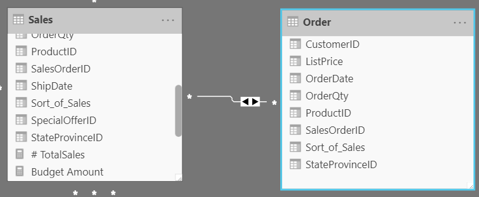
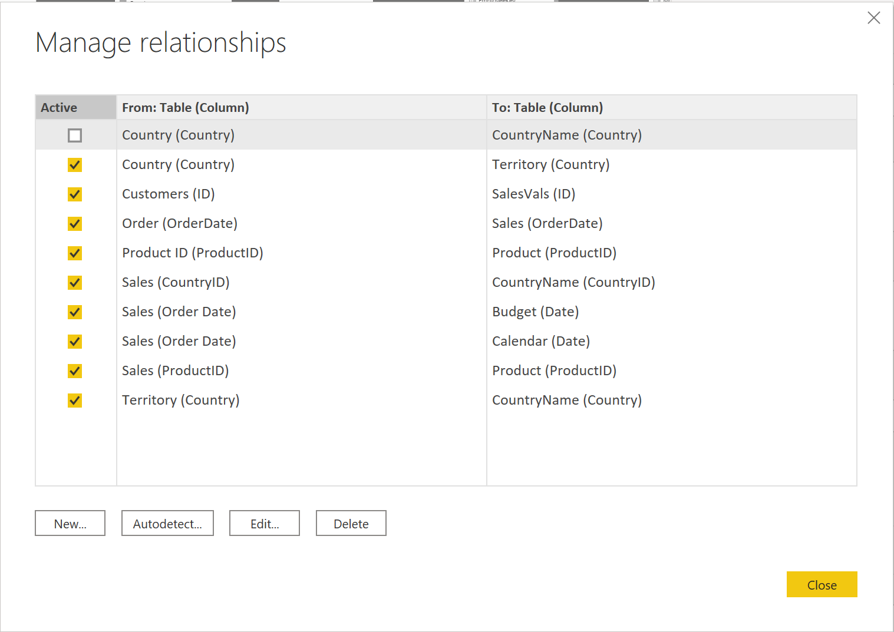
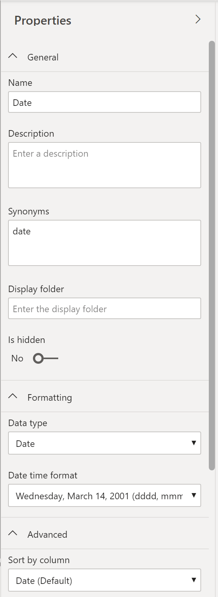
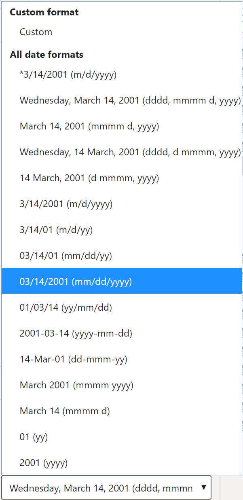
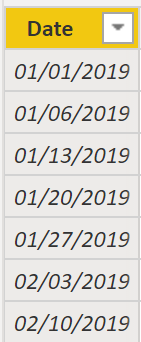

When users see fewer tables, they will enjoy using your data model considerably more. For example, suppose you've imported dozens of tables from many data sources and now the visual appears disorderly. In this case, you need to ensure that, before you begin working on building reports, your data model and table structure are simplified.

A simple table structure will:

-   Be simple to navigate because of column and table properties that are specific and user-friendly.

-   Have merged or appended tables to simplify the tables within your data structure.

-   Have good-quality relationships between tables that make sense.

The following sections further explain how you might work with your tables to ensure a simple and readable table structure.

Configure data model and build relationships between tables

Assuming that you've already retrieved your data and cleaned it in Power Query, you can then go to the **Model** tab, where the data model is located. The following image shows how the relationship between the **Order** and **Sales** tables can be seen through the **OrderDate** column. 

> [!div class="mx-imgBorder"]
> 

To manage these relationships, go to **Manage Relationships** on the ribbon, where the following window will appear.

> [!div class="mx-imgBorder"]
> 

In this view, you can create, edit, and delete relationships between tables and also autodetect relationships that already exist. When you load your data into Power BI, the **Autodetect** feature will help you establish relationships between columns that are named similarly. Relationships can be inactive or active. Only one active relationship can exist between tables, which is discussed in a future module.

While the **Manage Relationships** feature allows you to configure relationships between tables, you can also configure table and column properties to ensure organization in your table structure.

Configure table and column properties

The **Model** view in Power BI desktop provides many options within the column properties that you can view or update. A simple method to get to this menu to update the tables and fields is by Ctrl+clicking or Shift+clicking items on this page.

> [!div class="mx-imgBorder"]
> 

Under the **General** tab, you can:

-   Edit the name and description of the column.

-   Add synonyms that can be used to identify the column when you are using the Q&A feature, which is discussed later in this learning path.

-   Add a column into a folder to further organize the table structure.

-   Hide or show the column.

Under the **Formatting** tab, you can:

-   Change the data type.

-   Format the data.

For instance, suppose that the dates in your column are formatted, as seen in the previous screenshot, in the form of "Wednesday, March 14, 2001". If you want to change the format so that the date was in the "mm/dd/yyyy" format, you would select the drop-down menu under **All date time formats** and then choose the appropriate date format, as shown in the following figure.

> [!div class="mx-imgBorder"]
> 

After selecting the appropriate date format, return to the **Date** column, where you should see that the format has indeed changed, as shown in the following figure.

> [!div class="mx-imgBorder"]
> 

Under the **Advanced** tab, you can:

-   Sort by a specific column.

-   Assign a specific category to the data.

-   Summarize the data.

-   Determine if the column or table contains null values.

Additionally, Power BI has a new functionality to update these properties on many tables and fields by Ctrl+clicking or Shift+clicking items.

These examples are only some of the many types of transformations that you can make to simplify the table structure. This step is important to take before you begin making your visuals so that you don't have to go back and forth when making formatting changes. This process of formatting and configuring tables can also be done in Power Query.
