During report creation in Power BI, a common business requirement is to make calculations based on date and time. Organizations want to know how their business is doing over months, quarters, fiscal years, and so on. For this reason, it is crucial that these time-oriented values are formatted correctly. Power BI autodetects for date columns and tables; however, situations can occur where you will need to take extra steps to get the dates in the format that your organization requires.

For example, suppose that you are developing reports for the Sales team at your organization. The database contains tables for sales, orders, products, and more. You notice that many of these tables, including Sales and Orders, contain their own date columns, as shown by the **ShipDate** and **OrderDate** columns in the Sales and Orders tables. You are tasked with developing a table of the total sales and orders by year and month. How can you build a visual with multiple tables, each referencing their own date columns?

> [!div class="mx-imgBorder"]
> [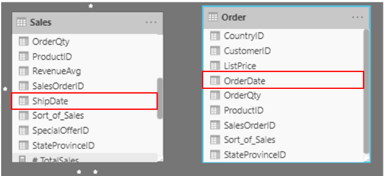](../media/03-data-model-excerpt-ssm.png#lightbox)

To solve this problem, you can create a common date table that can be used by multiple tables. The following section explains how you can accomplish this task in Power BI.

## Create a common date table 

Ways that you can build a common date table are:

-   Source data

-   DAX

-   Power Query

## Source data 

Occasionally, source databases and data warehouses already have their own date tables. If the administrator who designed the database did a thorough job, these tables can be used to perform the following tasks:

-   Identify company holidays

-   Separate calendar and fiscal year

-   Identify weekends versus weekdays

Source data tables are mature and ready for immediate use. If you have a table as such, bring it into your data model and don't use any other methods that are outlined in this section. We recommend that you use a source date table because it is likely shared with other tools that you might be using in addition to Power BI.

If you do not have a source data table, you can use other ways to build a common date table.

## DAX

You can use the Data Analysis Expression (DAX) functions CALENDARAUTO() or CALENDAR() to build your common date table. The CALENDAR() function returns a contiguous range of dates based on a start and end date that are entered as arguments in the function. Alternatively, the CALENDARAUTO() function returns a contiguous, complete range of dates that are automatically determined from your dataset. The starting date is chosen as the earliest date that exists in your dataset, and the ending date is the latest date that exists in your dataset plus data that has been populated to the fiscal month that you can choose to include as an argument in the CALENDARAUTO() function. For the purposes of this example, the CALENDAR() function is used because you only want to see the data from May 31, 2011 (the first day that Sales began its tracking of this data) and forward for the next 10 years.

In Power BI Desktop, go to the **Modeling** tab on the ribbon. Select **New Table**, and then enter in the following DAX formula:

```dax 
Dates  = CALENDAR(DATE(2011, 5, 31), DATE(2021, 5, 31))
```

> [!div class="mx-imgBorder"]
> [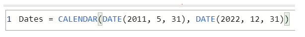](../media/03-dax-function-calendar-auto-01-ss.png#lightbox)

Now, you have a column of dates that you can use. However, this column is slightly sparse. You also want to see columns for just the year, the month number, the week of the year, and the day of the week. You can accomplish this task by selecting **New Column** on the ribbon and entering the following DAX equation, which will retrieve the year from your Date table.

```dax 
Year = YEAR(Dates[Date])
```

> [!div class="mx-imgBorder"]
> [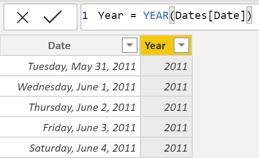](../media/03-adding-columns-dax.png#lightbox)

You can perform the same process to retrieve the month number, week number, and day of the week:

```dax
MonthNum = MONTH(Dates[Date])
```

```dax
WeekNum = WEEKNUM(Dates[Date])
```

```dax
DayoftheWeek = FORMAT(Dates[Date].[Day], "DDDD")
```

When you have finished, your table will contain the columns that are shown in the following figure.

> [!div class="mx-imgBorder"]
> [](../media/03-final-columns-dax-table-2-ss.png#lightbox)

You have now created a common date table by using DAX. This process only adds your new table to the data model; you will still need to establish relationships between your date table and the Sales and Order tables, and then mark your table as the official date table of your data model. However, before you complete those tasks, make sure that you consider another way of building a common date table: by using Power Query.

## Power Query

You can use M-language, the development language that is used to build queries in Power Query, to define a common date table.

Select **Transform Data** in Power BI Desktop, which will direct you to Power Query. In the blank space of the left **Queries** pane, right-click to open the following drop-down menu, where you will select **New Query > Blank Query**.

> [!div class="mx-imgBorder"]
> [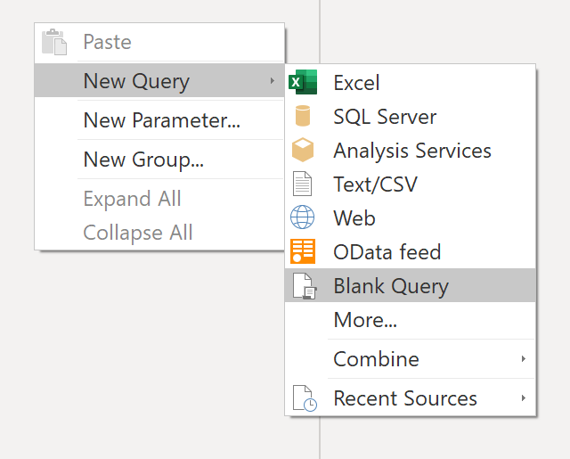](../media/03-new-query-common-date-table-03-ss.png#lightbox)

In the resulting **New Query** view, enter the following M-formula to build a calendar table:

```dax 
= List.Dates(#date(2011,05,31), 365*10, #duration(1,0,0,0)
``` 

> [!div class="mx-imgBorder"]
> [](../media/03-m-query-common-data-table-04-ss.png#lightbox)

For your sales data, you want the start date to reflect the earliest date that you have in your data: May 31, 2011. Additionally, you want to see dates for the next 10 years, including dates in the future. This approach ensures that, as new sales data flows in, you won't have to re-create this table. You can also change duration. In this case, you want a data point for every day, but you can also increment by hours, minutes, and seconds. The following figure shows the result.

> [!div class="mx-imgBorder"]
> [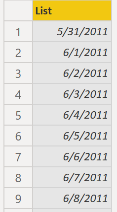](../media/03-list-power-query-11-ss.png#lightbox)

After you have realized success in the process, you notice that you have a list of dates instead of a table of dates. To correct this error, go to the **Transform** tab on the ribbon and select **Convert to Table**. As the name suggests, this feature will convert your list into a table. You can also rename the column to **DateCol**.

> [!div class="mx-imgBorder"]
> [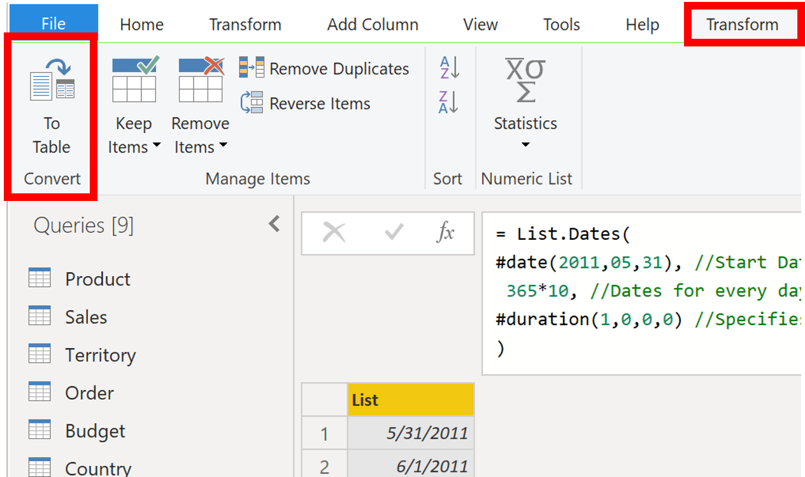](../media/03-converting-list-table-05-ssm.png#lightbox)

Next, you want to add columns to your new table to see dates in terms of year, month, week, and day so that you can build a hierarchy in your visual. Your first task is to change the column type by selecting the icon next to the name of the column and, in the resulting drop-down menu, selecting the **Date** type.

> [!div class="mx-imgBorder"]
> [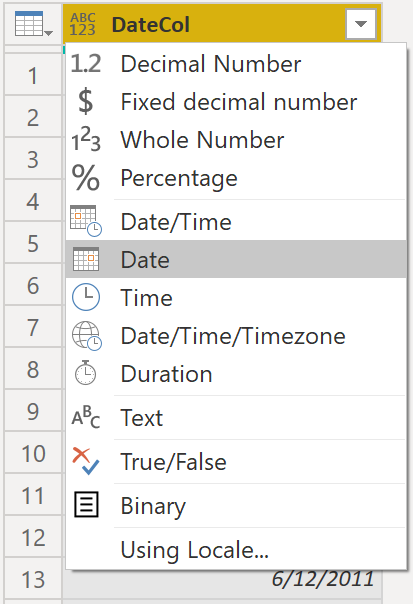](../media/03-change-type-date-3-ss.png#lightbox)

After you have finished selecting the **Date** type, you can add columns for year, months, weeks, and days. Go to **Add Column**, select the drop-down menu under **Date**, and then select **Year**, as shown in the following figure.

> [!div class="mx-imgBorder"]
> [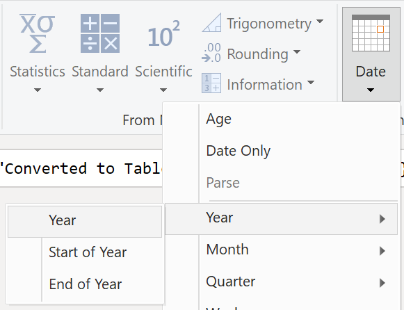](../media/03-adding-columns-power-query-5-ss.png#lightbox)

Notice that Power BI has added a column of all years that are pulled from **DateCol**.

> [!div class="mx-imgBorder"]
> [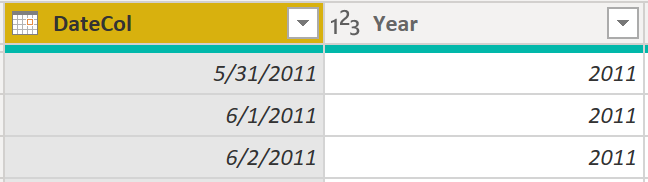](../media/03-adding-columns-table-power-query-6-ss.png#lightbox)

Complete the same process for months, weeks, and days. After you have finished this process, the table will contain the columns that are shown in the following figure.

> [!div class="mx-imgBorder"]
> [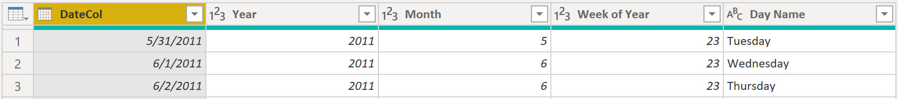](../media/03-final-columns-using-power-query-7-ss.png#lightbox)

You have now successfully used Power Query to build a common date table.

The previous steps show how to get the table into the data model. Now, you need to mark your table as the official date table so that Power BI can recognize it for all future values and ensure that formatting is correct.

## Mark as the official date table

Your first task in marking your table as the official date table is to find the new table on the **Fields** pane. Right-click the name of the table and then select **Mark as date table**, as shown in the following figure.

> [!div class="mx-imgBorder"]
> [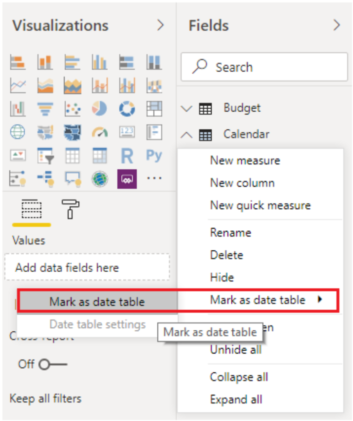](../media/03-mark-date-table-06-ss.png#lightbox)

By marking your table as a date table, Power BI performs validations to ensure that the data contains zero null values, is unique, and contains continuous date values over a period. You can also choose specific columns in your table to mark as the date, which can be useful when you have many columns within your table. Right-click the table, select **Mark as date table**, and then select **Data table settings.** The following window will appear, where you can choose which column should be marked as **Date**.

> [!div class="mx-imgBorder"]
> [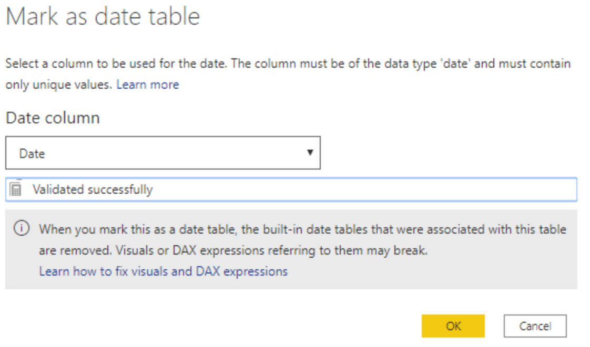](../media/03-mark-date-table-07-ss.png#lightbox)

Selecting **Mark as date table** will remove autogenerated hierarchies from the **Date** field in the table that you marked as a date table. For other date fields, the auto hierarchy will still be present until you establish a relationship between that field and the date table or until you turn off the **Auto Date/Time** feature. You can manually add a hierarchy to your common date table by right-clicking the year, month, week, or day columns in the **Fields** pane and then selecting **Create new hierarchy.** This process is further discussed later in this module.

## Build your visual

To build your visual between the Sales and Orders tables, you will need to establish a relationship between this new common date table and the Sales and Orders tables. As a result, you will be able to build visuals by using the new date table. To complete this task, go to **Model** tab **>** **Manage Relationships**, where you can create relationships between the common date table and the Orders and Sales tables by using the **OrderDate** column. The following screenshot shows an example of one such relationship.

> [!div class="mx-imgBorder"]
> [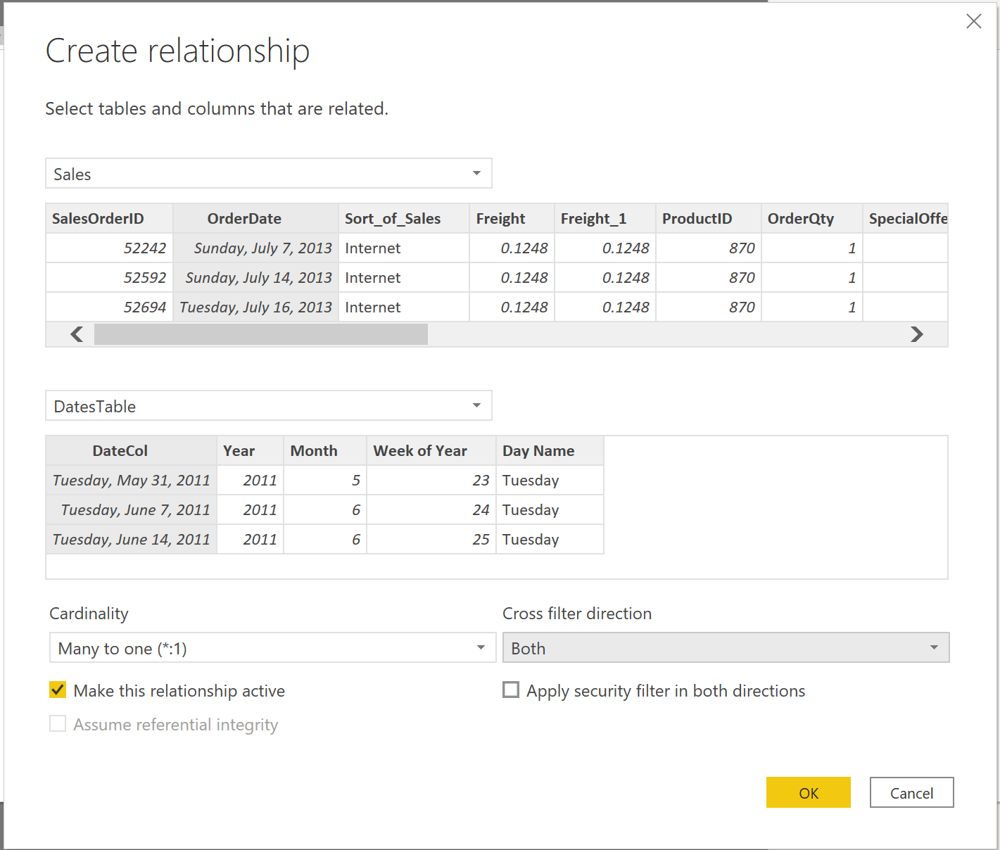](../media/03-create-relationship-8-ss.png#lightbox)

After you have built the relationships, you can build your **Total Sales and Order Quantity by Time** visual with your common date table that you developed by using the DAX or Power Query method.

To determine the total sales, you need to add all sales because the **Amount** column in the Sales table only looks at the revenue for each sale, not the total sales revenue. You can complete this task by using the following measure calculation, which will be explained in later discussions. The calculation that you will use when building this measure is as follows:

```dax 
#Total Sales = SUM(Sales[‘Amount’])
```

After you have finished, you can create a table by returning to the **Visualizations** tab and selecting the **Table** visual. You want to see the total orders and sales by year and month, so you only want to include the Year and Month columns from your date table, the **OrderQty** column, and the **#TotalSales** measure. When you learn about hierarchies, you can also build a hierarchy that will allow you drill down from years to months. For this example, you can view them side-by-side. You have now successfully created a visual with a common date table.

> [!div class="mx-imgBorder"]
> [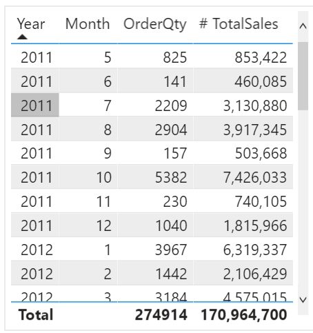](../media/03-common-date-dax-5-ss.png#lightbox)

