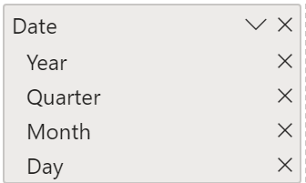
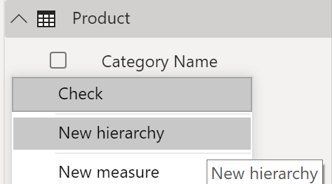
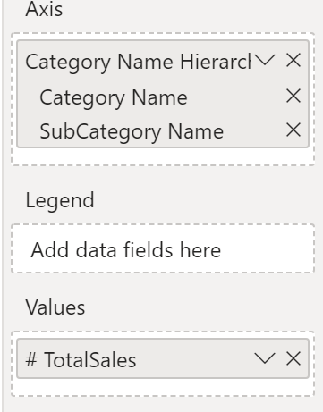
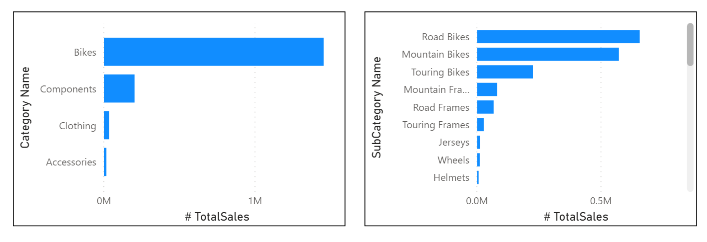
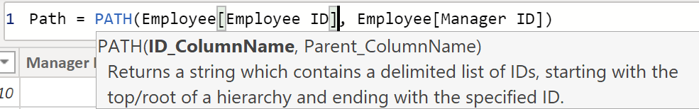
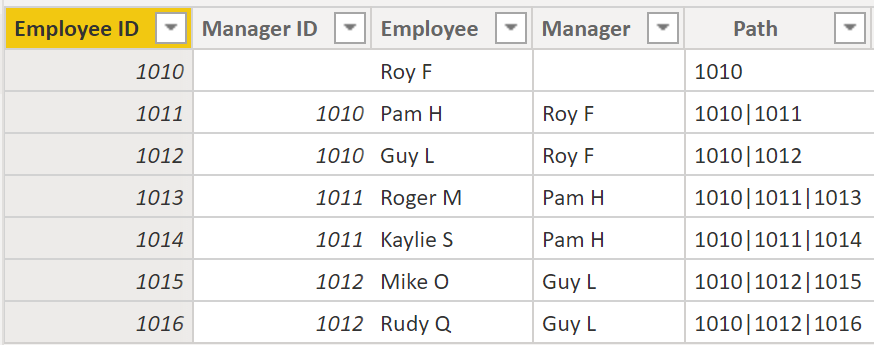
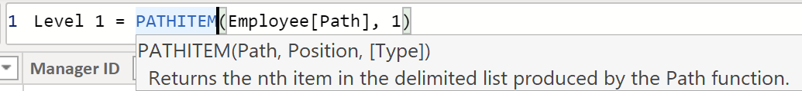
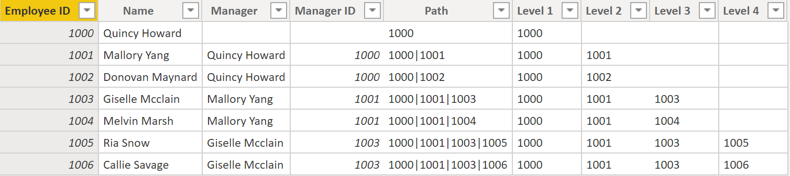
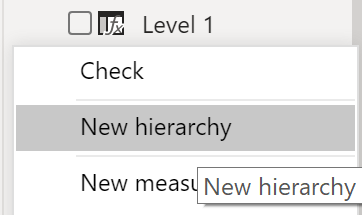
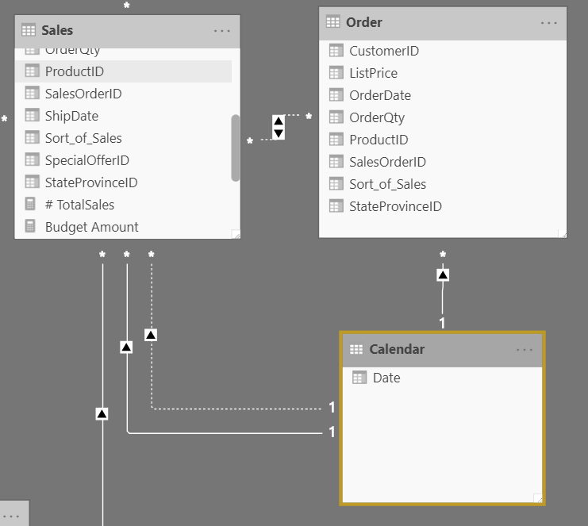

When building a star schema, you will have dimension and fact tables. Fact tables contain information about events such as sales orders, shipping dates, resellers, and suppliers. Dimension tables store details about business entities, such as products or time, and are connected back to fact tables through a relationship.

You can use hierarchies as one source to help you find detail in dimension tables. These hierarchies form through natural segments in your data. For instance, you can have a hierarchy of dates in which your dates can be segmented into years, months, weeks, and days. Hierarchies are useful because they allow you to drill down into the specifics of your data instead of only seeing the data at a high level.

## Hierarchies 

When you are building visuals, Power BI automatically enters values of the date type as a hierarchy (if the table has not been marked as a date table).

> [!div class="mx-imgBorder"]
> [](../media/04-example-hierarchy-7-ss.png#lightbox)

In the preceding **Date** column, the date is shown in increasingly finer detail through year, quarters, months, and days. You can also manually create hierarchies.

For example, consider a situation where you want to create a stacked bar chart of **Total Sales by Category and Subcategory**. You can accomplish this task by creating a hierarchy in the **Products** table for categories and subcategories. To create a hierarchy, go to the **Fields** pane on Power BI and then right-click the column that you want the hierarchy for. Select **Create New Hierarchy**, as shown in the following figure.

> [!div class="mx-imgBorder"]
> [](../media/04-new-hierarchy-8-ss.png#lightbox)

Next, drag and drop the subcategory column into this new hierarchy that you've created. This column will be added as a sublevel on the hierarchy.

> [!div class="mx-imgBorder"]
> [](../media/04-new-hierarchy-9-ss.png#lightbox)

Now, you can build the visual by selecting a stacked bar chart in the **Visualizations** pane. Add your **Category** hierarchy in the **Axis** field and the **Total Sales** hierarchy in the **Values** field.

> [!div class="mx-imgBorder"]
> [](../media/04-hierarchy-visual-7-ss.png#lightbox)

You can drill down on the visual to view both **Category** and **Subcategory**, depending on what you want to see. Hierarchies allow you to view increasing levels of data on a single view.

> [!div class="mx-imgBorder"]
> [](../media/04-example-hierarchy-8-ss.png#lightbox)

Now that you have learned about hierarchies, you can take a step further and examine parent-child hierarchies and their role in multiple relationships between fact tables and dimension tables.

## Parent-child hierarchy 

In the following example, you have an Employee table within the database that tells you important information about the employees, their managers, and their IDs. When looking at this table, you notice that **Roy F** has been repeated multiple times in the **Manager** column. As the image shows, multiple employees can have the same manager, which indicates a hierarchy between managers and employees.

> [!div class="mx-imgBorder"]
> [](../media/04-example-hierarchy-1-ss.png#lightbox)

The **Manager** column determines the hierarchy and is therefore the parent, while the "children" are the employees. For this example, you want to be able to see all levels of this hierarchy. Power BI does not default to showing you all levels of the hierarchy, so it is your responsibility to ensure that you see all levels of this hierarchy or "flatten" it so that you can see more data granularity.

## Flatten parent-child hierarchy 

The process of viewing multiple child levels based on a top-level parent is known as *flattening the hierarchy*. In this process, you are creating multiple columns in a table to show the hierarchal path of the parent to the child in the same record. You will use PATH(), a simple DAX function that returns a text version of the managerial path for each employee, and PATHITEM() to separate this path into each level of managerial hierarchy.

> [!IMPORTANT]
> DAX has not been covered yet; however, it will be in another module. This function is included in this section because it's explaining hierarchies. If use of DAX in this capacity is confusing, refer to the DAX module and then return to this section afterward.

While on the table, go to the **Modeling** tab and select **New Column**. In the resulting formula bar, enter the following function, which creates the text path between the employee and manager. This action creates a calculated column in DAX.

```dax Path = PATH(Employee[Employee ID], Employee[Manager ID])``` 

> [!div class="mx-imgBorder"]
> [](../media/04-dax-measure-hierarchy-2-ss.png#lightbox)

The completed path between the employee and the manager appears in the new column, as shown in the following screenshot.

> [!div class="mx-imgBorder"]
> [](../media/04-path-function-example-10-ss.png#lightbox)

If you look at Roger M, the path of IDs is **1010 | 1011 | 1013**, which means that one level above Roger M (ID 1013) is his manager, Pam H (ID 1011), and one level above Pam H is her manager Roy F (ID 1010). In this row, Roger M is on the bottom of the hierarchy, at the child level, and Roy F is at the top of the hierarchy and is at the parent level. This path is created for every employee. To flatten the hierarchy, you can separate each level by using the PATHITEM function.

To view all three levels of the hierarchy separately, you can create four columns in the same way that you did previously, by entering the following equations. You will use the PATHITEM function to retrieve the value that resides in the corresponding level of your hierarchy.

-	*Level 1 = PATHITEM(Employee[Path],1)*
-	*Level 2 = PATHITEM(Employee[Path],2)* 
-	*Level 3 = PATHITEM(Employee[Path],3)*

> [!div class="mx-imgBorder"]
> [](../media/04-path-item-function-12-ss.png#lightbox)

After you have finished, notice that you now have each level of hierarchy within your table. Roy F is at the top of the hierarchy and, as you go through **Levels 2-3**, notice that the managers and employees map with each other.

> [!div class="mx-imgBorder"]
> [](../media/04-parent-child-hierarchy-table-06-ssm.png#lightbox)

Now, you can create a hierarchy on the **Fields** pane, as you did previously. Right-click **Level 1**, because this is the first hierarchy level, and then select **New Hierarchy.** Then, drag and drop **Level 2** and **Level 3** into this hierarchy.

> [!div class="mx-imgBorder"]
> [](../media/04-employee-level-hierarchy-14-ss.png#lightbox)

You have now successfully flattened a hierarchy so that you can view individual levels.

Previously, you've considered dimensions that have only one relationship with a fact table. However, situations do occur where your dimension table will have multiple relationships with a fact table.

## Role-playing dimensions

Role-playing dimensions have multiple valid relationships with fact tables, meaning that the same dimension can be used to filter multiple columns or tables of data. As a result, you can filter data differently depending on what information you need to retrieve. This topic is complex, so it is only introduced in this section. Working with role-playing dimensions requires complex DAX functions that will be discussed in later sections.

> [!div class="mx-imgBorder"]
> [](../media/04-role-playing-dimension-05-ss.png#lightbox)

The preceding visual shows the Calendar, Sales, and Order tables. Calendar is the dimension table, while Sales and Order are fact tables. The dimension table has two relationships: one with Sales and one with Order. This example is of a role-playing dimension because the Calendar table can be used to group data in both Sales and Order. If you wanted to build a visual in which the Calendar table references the Order and the Sales tables, the Calendar table would act as a role-playing dimension.
