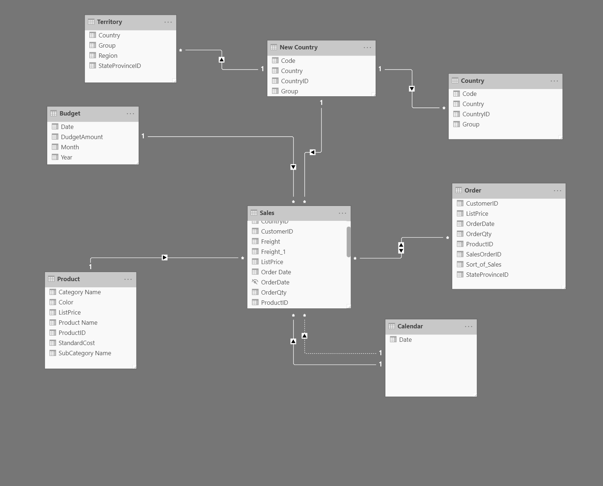
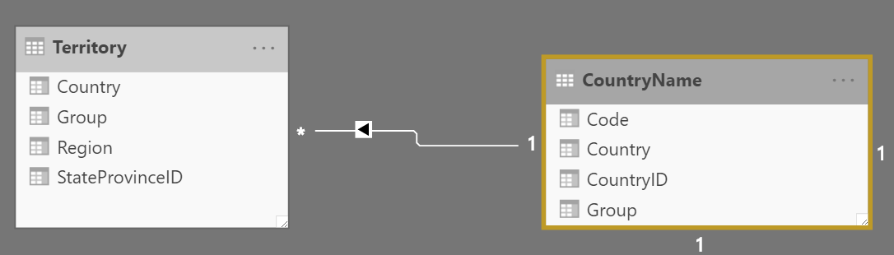
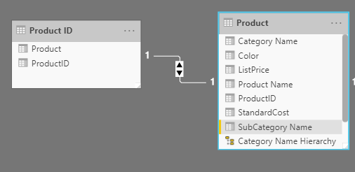
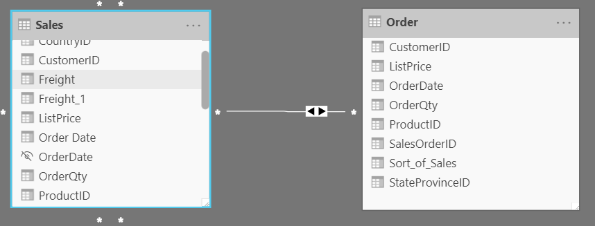
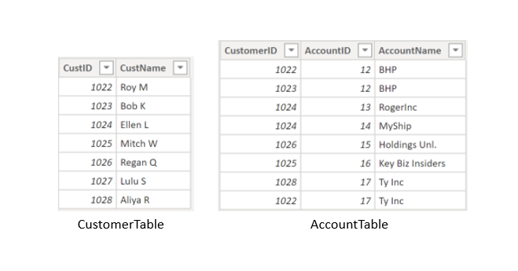
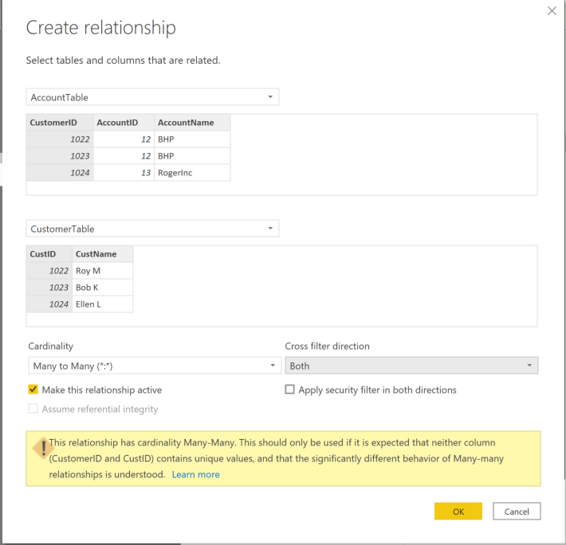

Unlike other database management systems, Power BI has the concept of *directionality* to a relationship. This directionality, or *cardinality*, plays an important role in filtering data between multiple tables. When you load data, Power BI automatically looks for relationships that exist within the data by matching column names. You can also use **Manage Relationships** to edit these options manually.

For example, you've retrieved many tables from the Sales database, and the following image is an example of your data model. Power BI has autodetected several relationships, but you can't discern what they mean. You want to make sure that the relationships accurately reflect those that exist in your data.

> [!div class="mx-imgBorder"]
> 

## Cardinality

The following are different types of cardinality that you'll find in Power BI.

Many-to-one (*:1) or one-to-many (1: *) cardinality:

-   Describes a relationship in which you have many instances of a value in one column that are related to only one unique corresponding instance in another column.

-   Describes the directionality between fact and dimension tables.

-   Is the most common type of directionality and is the Power BI default when you are automatically creating relationships.

An example of a one-to-many relationship would be between the CountryName and Territory tables, where you can have many territories that are associated with one unique country.

> [!div class="mx-imgBorder"]
> 

One-to-one (1:1) cardinality:

-   Describes a relationship in which only one instance of a value is common between two tables.

-   Requires unique values in both tables.

-   Is not recommended because this relationship stores redundant information and suggests that the model is not designed correctly. It is better practice to combine the tables.

An example of a one-to-one relationship would be if you had products and product IDs in two different tables. Creating a one-to-one relationship is redundant and these two tables should be combined.

> [!div class="mx-imgBorder"]
> 

Many-to-many (*.*) cardinality:

-   Describes a relationship where many values are in common between two tables.

-   Does not require unique values in either table in a relationship.

-   Is not recommended; a lack of unique values introduces ambiguity and your users might not know which column of values is referring to what.

For instance, the following figure shows a many-to-many relationship between the Sales and Order tables on the **OrderDate** column because multiple sales can have multiple orders associated with them. Ambiguity is introduced because both tables can have the same order date.

> [!div class="mx-imgBorder"]
> 

## Cross-filter direction 

Data can be filtered on one or both sides of a relationship.

With a **single cross-filter direction**:

-   Only one table in a relationship can be used to filter the data. For instance, Table 1 can be filtered by Table 2, but Table 2 cannot be filtered by Table 1.
    
    > [!TIP]
	> Follow the direction of the arrow on the relationship between your tables to know which direction the filter will flow. You typically want these arrows to point to your fact table.

-   For a one-to-many or many-to-one relationship, the cross-filter direction will be from the "one" side, meaning that the filtering will occur in the table that has unique values.

With **both cross-filter directions** or **bi-directional cross-filtering**:

-   One table in a relationship can be used to filter the other. For instance, a dimension table can be filtered through the fact table, and the fact tables can be filtered through the dimension table.

-   You might have lower performance when using bi-directional cross-filtering with many-to-many relationships.

A word of caution regarding bi-directional cross-filtering: You should not enable bi-directional cross-filtering relationships unless you fully understand the ramifications of doing so. Enabling it can lead to ambiguity, over-sampling, unexpected results, and potential performance degradation.

## Cardinality and cross-filter direction 

For one-to-one relationships, the only option that is available is bi-directional cross-filtering. Data can be filtered on either side of this relationship and result in one distinct, unambiguous value. For instance, you can filter on one Product ID and be returned a single Product, and you can filter on a Product and be returned a single Product ID.

For many-to-many relationships, you can choose to filter in a single direction or in both directions by using bi-directional cross-filtering. The ambiguity that is associated with bi-directional cross-filtering is amplified in a many-to-many relationship because multiple paths will exist between different tables. If you create a measure, calculation, or filter, unintended consequences can occur where your data is being filtered and, depending on which relationship that the Power BI engine chooses when applying the filter, the final result might be different. This situation is also true for bi-directional relationships and why you should be cautious when using them.

For this reason, many-to-many relationships and/or bi-directional relationships are complicated. Unless you are certain what your data looks like when aggregated, these types of open-ended relationships with multiple filtering directions can introduce multiple paths through the data.

## Create many-to-many relationships

Consider the scenario where you are tasked with building a visual that examines budgets for customers and accounts. You can have multiple customers on the same account and multiple accounts with the same customer, so you know that you need to create a many-to-many relationship.

> [!div class="mx-imgBorder"]
> 

To create this relationship, go to **Manage Relationships** **>** **New**. In the resulting window, create a relationship between the **Customer ID** column in CustomerTable and AccountTable. The cardinality is set to many-to-many, and the filter type is in both directions. Immediately, you will be warned that you should only use this type of relationship if it is expected that neither column will have unique values because you might get unexpected values. Because you want to filter in both directions, choose **bi-directional cross-filtering**.

Select **OK**. You have now successfully created a many-to-many relationship.

> [!div class="mx-imgBorder"]
> 

For more information, see [Many-to-many relationships in Power BI](https://docs.microsoft.com/power-bi/transform-model/desktop-many-to-many-relationships/?azure-portal=true).
