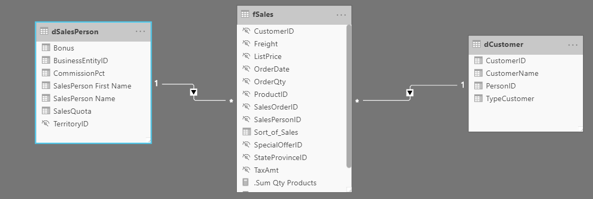

Modeling data is about establishing and maintaining relationships so that you can effectively visualize the data in the form that your business requires. When you are creating these relationships, a common pitfall that you might encounter are circular relationships.

For example, you are developing reports for the Sales team and are examining the relationships between tables. In a poorly designed data model, Table 1 has a many-to-one relationship with a column in Table 2, but Table 2 has a one-to-many relationship with Table 3 that has its own relationship with Table 1. This web of relationships is difficult to manage and becomes a daunting task to build visuals because it is no longer clear what relationships exist. Therefore, it is important that you are able to identify circular relationships so that your data is usable.

## Relationship dependencies

To understand circular relationships, you first need to understand dependencies.

For example, consider that you have the following calculated column **Total** in the Sales table.

Sales[‘TotalCost] = Sales[‘Quantity’] * Sales[‘Price’]

**TotalCost** depends on **Quantity** and **Price**, so if a change occurs in either quantity or price, a change will occur in **TotalCost** as well. This example outlines a dependency of a column on other columns, but you can also have dependencies between measures, tables, and relationships.

Consider the following relationships between **dSalesPerson**, **fSales**, and **dCustomer**. A change in **dCustomer** will result in a change in **fSales**, which results in changes in **dSalesPerson.** These types of dependencies can exist within relationships.

> [!div class="mx-imgBorder"]
> 
