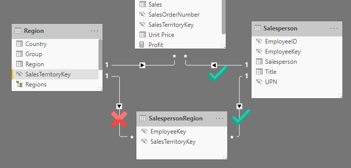
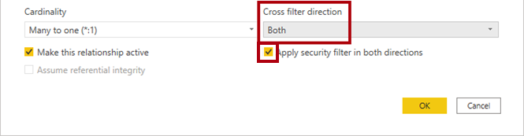
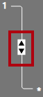
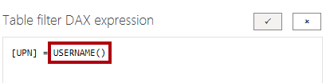

**The estimated time to complete the lab is 45 minutes**

In this lab you will create a many-to-many relationship between the **Salesperson** table and the **Sales** table. You will also enforce row-level security to ensure that a salesperson can only analyze sales data for their assigned region(s).

In this lab you learn how to:

- Configure many-to-many relationships

- Enforce row-level security

### **Lab story**

This lab is one of many in a series of labs that was designed as a complete story from data preparation to publication as reports and dashboards. You can complete the labs in any order. However, if you intend to work through multiple labs, for the first 10 labs, we suggest you do them in the following order:

1. [Prepare data in Power BI Desktop](https://docs.microsoft.com/learn/modules/get-data/lab-prepare/?azure-portal=true)

1. [Load data in Power BI Desktop](https://docs.microsoft.com/learn/modules/clean-data-power-bi/8-lab/?azure-portal=true)

1. [Model data in Power BI Desktop, part 1](https://docs.microsoft.com/learn/modules/design-model-power-bi/8-lab/?azure-portal=true)

1. **Model data in Power BI Desktop, Part 2** << You are here. This is the lab for the current module.

1. [Create DAX calculations in Power BI Desktop, part 1](https://docs.microsoft.com/learn/modules/create-measures-dax-power-bi/6-lab/?azure-portal=true)

1. [Create DAX calculations in Power BI Desktop, part 2](https://docs.microsoft.com/learn/modules/create-measures-dax-power-bi/8-lab/?azure-portal=true)

1. [Design a report in Power BI Desktop, part 1](https://docs.microsoft.com/learn/modules/visuals-power-bi/8-lab/?azure-portal=true)

1. [Design a report in Power BI Desktop, part 2](https://docs.microsoft.com/learn/modules/data-driven-story-power-bi/13-lab/?azure-portal=true)

1. [Create a Power BI dashboard](https://docs.microsoft.com/learn/modules/create-dashboards-power-bi/9-lab/?azure-portal=true)

1. [Perform data analysis in Power BI Desktop](https://docs.microsoft.com/learn/modules/ai-visuals-power-bi/5-lab/?azure-portal=true)

1. [Create a Power BI paginated report](https://docs.microsoft.com/learn/modules/create-paginated-reports-power-bi/6-lab/?azure-portal=true)

> [!NOTE]
> Each lab starts with a PBIX file that has all of the previous lab work completed. If you should lose your work for any reason, you can open the PBIX file that includes the progress up to that point from the folder indicated at the beginning of the next lab.

## Exercise 1: Create a many-to-many relationship

In this exercise, you will create a many-to-many relationship between the **Salesperson** table and the **Sales** table.

### Task 1: Get started

In this task, you will set up the environment for the lab.

> [!IMPORTANT]
> If you are continuing on from the previous lab (and you completed that lab successfully), do not complete this task. Instead, continue from the next task.

1. To open the Power BI Desktop, on the taskbar, select the Microsoft Power BI Desktop shortcut.

1. To close the getting started window, at the top-left of the window, select **X**.

1. To open the starter Power BI Desktop file, select the **File** ribbon tab to open the backstage view.

1. Select **Open Report**.

1. Select **Browse Reports**.

1. In the Open window, navigate to the **D:\DA100\Labs\04-configure-data-model-in-power-bi-desktop-advanced\Starter** folder.

1. Select the **Sales Analysis** file.

1. Select **Open**.

1. Close any informational windows that may open.

1. To create a copy of the file, select the **File** ribbon tab to open the backstage view.

1. Select **Save As**.

1. If prompted to apply changes, select **Apply**.

1. In the **Save As** window, navigate to the **D:\DA100\MySolution** folder.

1. Select **Save**.

### Task 2: Create a many-to-many relationship

In this task you will create a many-to-many relationship between the **Salesperson** table and the **Sales** table.

1. In Power BI Desktop, in Report view, in the **Fields** pane, select the following two fields to create a table visual:

    - Salesperson | Salesperson

    - Sales | Sales

    The labs use a shorthand notation to reference a field. It looks like this: **Salesperson | Salesperson**. In this example, **Salesperson** is the table name and **Salesperson** is the field name.

    > [!div class="mx-imgBorder"]
    > 

    The table displays sales made by each salesperson. However, there is another relationship between salespeople and sales. Some salespeople belong to one, two, or possibly more sales regions. In addition, sales regions can have multiple salespeople assigned to them.

    From a performance management perspective, a salesperson's sales (based on their assigned territories) need to be analyzed and compared with sales targets. In the next exercise, you'll create relationships to support this analysis.

1. Notice that Michael Blythe has sold almost $9 million.

1. Switch to Model view.

1. Drag the **SalespersonRegion** table to position it between the **Region** and **Salesperson** tables.

1. Use the drag-and-drop technique to create the following two model relationships:

    - **Salesperson | EmployeeKey** to **SalespersonRegion | EmployeeKey**

    - **Region | SalesTerritoryKey** to **SalespersonRegion | SalesTerritoryKey**

    The **SalespersonRegion** table can be considered a bridging table.

1. Switch to Report view, and then notice that the visual has not updated. The sales result for Michael Blythe has not changed.

1. Switch back to Model view, and then follow the relationship filter directions (arrowhead) from the **Salesperson** table.

    Consider that the **Salesperson** table filters the **Sales** table. It also filters the **SalespersonRegion** table, but it does not continue to propagate filters to the **Region** table. (The arrowhead is pointing the wrong way.)

    > [!div class="mx-imgBorder"]
    > 

1. To edit the relationship between the **Region** and **SalespersonRegion** tables, double-click the relationship.

1. In the **Edit Relationship** window, in the **Cross filter direction** dropdown list, select **Both**.

1. Select the **Apply Security Filter in Both Directions** checkbox.

    This setting will ensure that bi-directional filtering is applied when row-level security is being enforced. You'll configure a security role in the next exercise.

    > [!div class="mx-imgBorder"]
    > 

1. Select **OK**.

1. Notice that the relationship has a double arrowhead.

    > [!div class="mx-imgBorder"]
    > 

1. Switch to Report view, and then notice that the sales values have not changed.

    The issue now relates to the fact that there are two possible filter propagation paths between the **Salesperson** and **Sales** tables. This ambiguity is internally resolved, based on a "least number of tables" assessment. To be clear, you should not design models with this type of ambiguity. The issue will be addressed in part later in this lab, and by the completion of the **Create DAX calculations in Power BI Desktop, Part 1** lab.

1. Switch to Model view.

1. To force filter propagation via the bridging table, double-click the relationship between the **Salesperson** and **Sales** tables.

1. In the **Edit Relationship** window, clear the **Make This Relationship Active** checkbox.

1. Select **OK**.

    The filter propagation now follows the only active path.

1. In the diagram, notice that the inactive relationship is represented by a dashed line.

    > [!div class="mx-imgBorder"]
    > 

1. Switch to Report view, and then notice that the sales for Michael Blythe is now nearly $22 million.

    > [!div class="mx-imgBorder"]
    > 

1. Notice also, that the sales for each salesperson, if added, would exceed the table total.

    It’s a common observation of a many-to-many relationship due to the double, triple, etc. counting of regional sales results. Consider Brian Welcker, the second salesperson listed. His sales amount equals the total sales amount. It’s the correct result simply due to the fact the he’s the Director of Sales; his sales are measured by the sales of all regions.

    While the many-to-many relationship is now working, it’s now not possible to analyze sales made by a salesperson (because the relationship is inactive). You’ll be able to reactivate the relationship when you introduce a calculated table that to represent salesperson for performance analysis (of their regions) in the **Create DAX calculations in Power BI Desktop, Part 1** lab.

1. Switch to Modeling view, and then in the diagram, select the **Salesperson** table.

1. In the **Properties** pane, in the **Name** box, replace the text with **Salesperson (Performance)**.

    The renamed table now reflects its purpose: it is used to report and analyze the performance of salespeople based on the sales of their assigned sales regions.

### Task 3: Relate the Targets table

In this task, you will create a relationship to the **Targets** table

1. Create a relationship from the **Salesperson (Performance) | EmployeeID** column and the **Targets | EmployeeID** column.

1. In Report view, add the **Targets | Target** field to the table visual.

1. Widen the table visual to reveal all data.

    > [!div class="mx-imgBorder"]
    > 

    It's now possible to visualize sales and targets. But take care, for two reasons. First, there is no filter on a time period, and so targets also include future target values. Second, targets are not additive, and so the total should not be displayed. They can either be disabled by using a visual formatting property or removed by using calculation logic. You’ll follow the second approach by creating a target measure in the **Create DAX calculations in Power BI Desktop, Part 2** lab that’ll return BLANK when more than one salesperson is filtered.

## Exercise 2: Enforce row-level security

In this exercise you will enforce row-level security to ensure a salesperson can only ever see sales made in their assigned regions.

### Task 1: Enforce row-level security

In this task you will enforce row-level security to ensure a salesperson can only see sales made in their assigned regions.

1. Switch to Data view.

1. In the **Fields** pane, select the **Salesperson (Performance)** table.

1. Review the data, noticing that Michael Blythe (EmployeeKey 281) has a UPN value of: `michael-blythe@adventureworks.com`

    Recall that Michael Blythe is assigned to three sales regions: US Northeast, US Central, and US Southeast.

1. Switch to Report view.

1. On the **Modeling** ribbon tab, from inside the Security group, select **Manage Roles**.

   > [!div class="mx-imgBorder"]
   > 

1. In the **Manage Roles** window, select **Create**.

1. In the **Roles** box, replace the selected text with the name of the role: **Salespeople**, and then press **Enter**.

   > [!div class="mx-imgBorder"]
   > 

1. To assign a filter for the **Salesperson (Performance)** table, select the ellipsis icon (…), and then select **Add Filter | [UPN]**.

   > [!div class="mx-imgBorder"]
   > 

1. In the **Table Filter DAX Expression** box, modify the expression by replacing **Value** with **USERPRINCIPALNAME()**.

   > [!div class="mx-imgBorder"]
   > 

   USERPRINCIPALNAME() is a Data Analysis Expressions (DAX) function that returns the name of the authenticated user. It means that the **Salesperson (Performance)** table will filter by the User Principal Name (UPN) of the user querying the model.

1. Select **Save**.

1. To test the security role, on the **Modeling** ribbon tab, from inside the **Security** group, select **View As**.

1. In the **View as roles** window, select the **Other User** item, and then in the corresponding box, enter: `michael-blythe@adventureworks.com`

1. Select the **Salespeople** role.

   > [!div class="mx-imgBorder"]
   > 

    This configuration results in using the **Salespeople** role and impersonating the user with your Michael Blythe’s name.

1. Select **OK**.

1. Notice the yellow banner above the report page, describing the test security context.

   > [!div class="mx-imgBorder"]
   > 

1. In the table visual, notice that only the salesperson **Michael Blythe** is listed.

   > [!div class="mx-imgBorder"]
   > 

1. To stop testing, at the right side of the yellow banner, select **Stop Viewing**.

   When the Power BI Desktop file is published to the Power BI service, you’ll need to complete a post-publication task to map security principals to the **Salespeople** role. You won’t do that in this lab.

1. To delete the role, on the **Modeling** ribbon tab, from inside the **Security** group, select **Manage Roles**.

    You won’t work any further with row-level security in the labs.

1. In the **Manage Roles** window, select **Delete**.

   > [!div class="mx-imgBorder"]
   > 

1. When prompted to confirm the deletion, select **Yes**, **Delete**.

1. Select Save.

### Task 2: Finish up

In this task you will complete the lab.

1. Save the Power BI Desktop file.

1. If prompted to apply queries, select **Apply Later**.

1. If you intend to start the next lab, you can opt to leave Power BI Desktop open.

    > [!WARNING]
    > If you leave the lab open, it will time out after one to four hours. Your work in the *current* module's lab will be lost, but each lab after the first one includes a PBIX file with the work from all previous labs completed so that you don't need to start over.

You’ll enhance the data model with calculations using DAX in the **Create DAX calculations in Power BI Desktop, Part 2** lab.

[!INCLUDE ]
