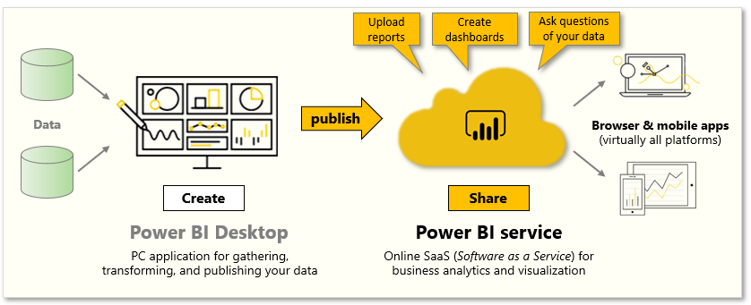

This unit explores the Power BI service and shows how it can help you turn your business intelligence data into data insights.

The following are the tasks that you will complete in this module:
- Upload reports
- Create dashboards
- Ask questions of your data

**Video**: Introduction to the Power BI service
> [!VIDEO https://www.microsoft.com/videoplayer/embed/RE3p3lQ]

The Power BI service is the natural extension of Power BI Desktop, and you can use its features for uploading reports, creating dashboards, and asking questions of your data by using natural language. Additionally, you can use the service to set data refresh times, share data with your organization, and create customized service packs.

## Sign in to the Power BI service
Before you can sign in to Power BI, you'll need an account. To get a free trial, go to [app.powerbi.com](http://app.powerbi.com) and sign up with your email address. 

For detailed steps on setting up an account, see [Sign in to Power BI service](https://docs.microsoft.com/power-bi/consumer/end-user-sign-in).
