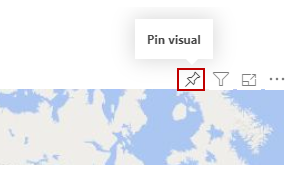
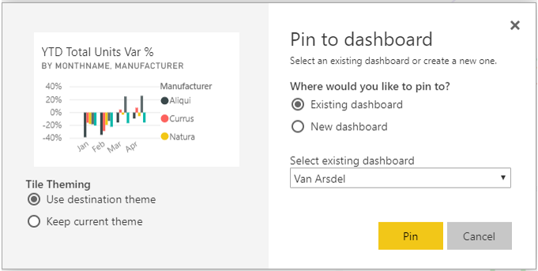
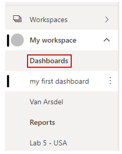

Dashboards in Power BI are one-page collections of visualizations that are created from within the Power BI service. You can create dashboards by pinning visuals from reports. 

**Video**: Create a dashboard
> [!VIDEO https://www.microsoft.com/videoplayer/embed/RE3oYa2]

Pinning a visual to a dashboard is a lot like pinning a picture to a corkboard on a wall, where the visual is pinned to a particular spot for others to see. To pin a visual, open its report on the Power BI service. Hover over the visual that you want to pin and select the pin icon.

You can select a destination dashboard for the visual from the drop-down menu or create a new dashboard. You can pin visualizations from multiple reports and pages to a single dashboard, allowing you to combine different datasets and sources into a single page of insights.

On dashboards, you can add any sort of visualization, including graphs, maps, images, and shapes, by pinning them. After a visual has been pinned to a dashboard, it's called a tile.

Your dashboards appear in the **Dashboards** section on the left side of the Power BI service. Select a dashboard from the list to view it.

You can change the layout of visuals on a dashboard however you'd like. To resize a tile, drag its handles in or out. To move a tile, simply select and drag it to a different location on the dashboard. Hover over a tile and select the pencil icon to open the **Tile details** form, where you can change information in the **Title** or **Subtitle** fields.

Select a dashboard tile to view the report from which it originated. You can also change that link by using the **Set custom link** field on the **Tile details** form.

You can pin tiles from one dashboard to another, for example, if you have a collection of dashboards and want to create one summary board. The process is the same: hover over the tile and select the pin icon. Dashboards are simple to create and to change. You can customize your one-page dashboard to show exactly the information that it should.

For more information, see [Introduction to dashboards for Power BI designers](https://docs.microsoft.com/power-bi/service-dashboards/?azure-portal=true).
