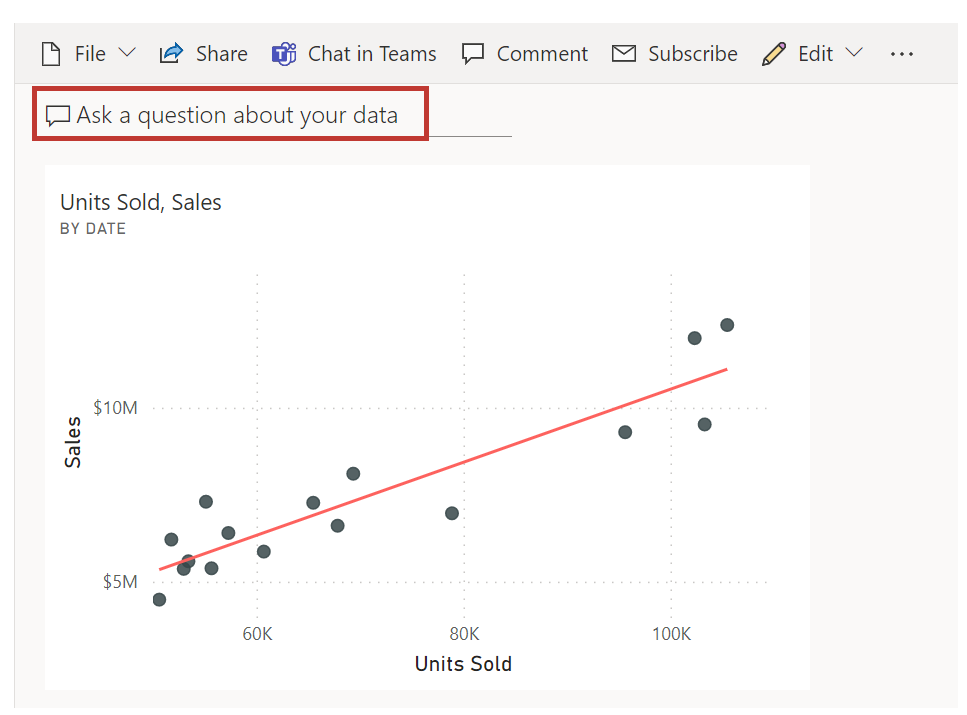
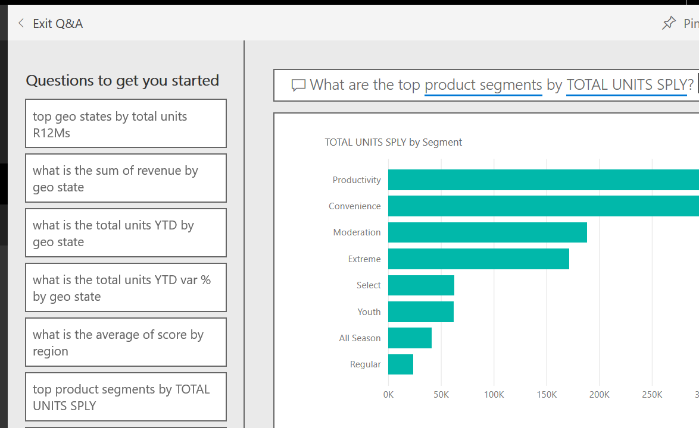
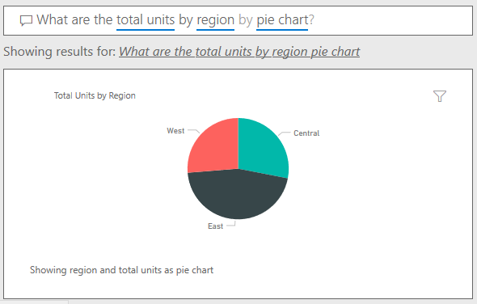

Sometimes, the fastest way to get answers about your data is by asking questions in the Q&A feature of Power BI. 

> [!VIDEO https://www.microsoft.com/videoplayer/embed/RE3x4jC]

> [!NOTE]
> Currently, Power BI Q&A only supports answering queries that are asked in English; however, a preview is available for Spanish that can be enabled by your Power BI administrator.

**Explore Q&A**

You can use Q&A to explore your data by using the intuitive, natural language capabilities of Power BI and receive answers in the form of charts and graphs. 

## Ask a question

Ask a question about your data in Q&A by using natural language. Natural language refers to the ordinary language that humans use to communicate with one another every day. An example would be, “What are the total units by region?”

Q&A is available on dashboards and reports in Power BI. Go to the dashboard and place your cursor in the question box to open the Q&A screen.

If the visuals' axis labels and values include the words *sales*, *account*, *month*, and *opportunities*, then you can confidently ask questions. For example, "Which account has the highest opportunity" or "Show sales by month as a bar chart."

Other helpful items are provided on the side of the screen. For each dataset, Q&A shows you keywords and occasionally shows you some sample or suggested questions. Select any of these to add them to the question box.

Another way that Q&A helps you ask questions is with prompts, autocomplete, and visual cues.

## Q&A visuals

Q&A picks the best visual based on the data that is being displayed. For example, numbers might be displayed as a line chart while cities are more likely to be displayed as a map.

You can also tell Q&A which visual to use by adding it to your question. Q&A will prompt you with a list of workable visual types. By using the previous example, you could ask, "What are the total units by region by pie chart?"

For more information, see [Create a visual with Power BI Q&A](https://docs.microsoft.com/power-bi/power-bi-visualization-introduction-to-q-and-a).
