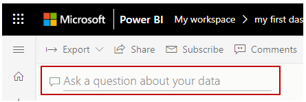
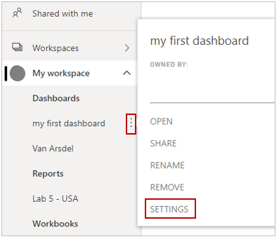
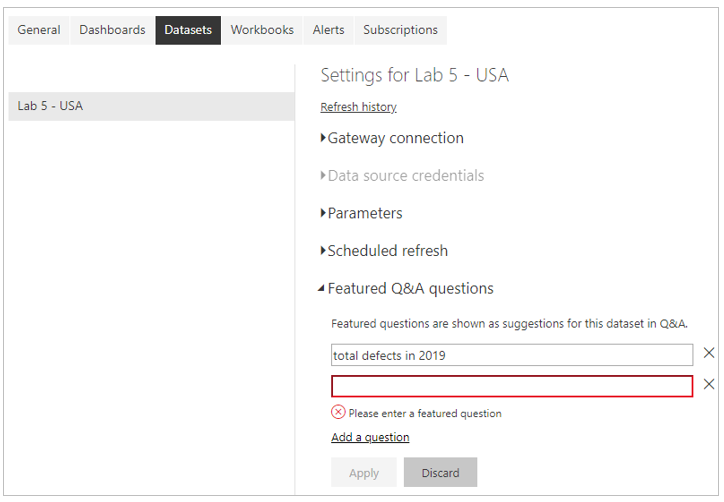

With Power BI, you can add your own suggested questions for others who use the natural language query box. 

> [!VIDEO https://www.microsoft.com/videoplayer/embed/RE3oYa3]

Users will see your suggested questions when they ask a question.

To add your own questions, select the ellipsis next to the dashboard that you want to use. Select **Settings** from the menu. You can completely disable the Q&A search input box from the **Dashboards** section of the **Settings** page. 

To add questions, select the **Datasets** section. All datasets that are associated with the dashboard are displayed. Select the dataset that is associated with your dashboard from the list, select **Featured Q&A questions**, and then select the **Add a question** link. Enter your question or prompt into the input box and then select **Apply**.

When anyone selects the search input box, they'll see your suggested entries at the top of the prompt list. Custom questions are a valuable way to get dashboard users to think about the type of data that is available and how to best use it.

For more information, see [Create featured questions for Power BI Q&A](https://docs.microsoft.com/power-bi/service-q-and-a-create-featured-questions).
