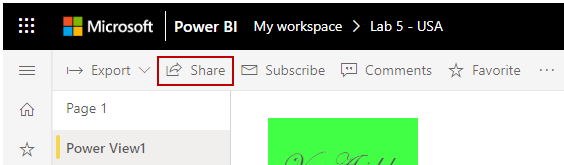
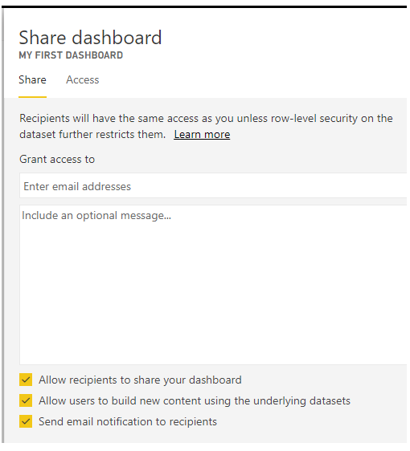

Power BI reports help you find data, collect it in a data model, and build reports and visualizations. These features are even more powerful when you share your insights with others in your organization.

> [!VIDEO https://www.microsoft.com/videoplayer/embed/RE3p0Lp]

To share a dashboard, open it in the Power BI service and select the **Share** link in the top left-hand corner.

From the **Share dashboard** page, select the **Invite** section. In the **Email address** field, enter the names of people whom you'd like to grant access to your dashboard. You can also copy and paste email addresses into this field, or you can use a distribution list, security group, or Office 365 group.

If you select the **Send email notification to recipients** check box, then your recipients will receive an email with a link to the shared dashboard. You can add an optional note to the email.

> [!NOTE]
> Recipients without an existing Power BI account will be taken through the sign-up process before viewing your dashboard.
> 
> 

Anyone whom you share a dashboard with can see and interact with it exactly as you do. However, they have read-only access to the underlying reports, and they have *no access* to the underlying datasets.

For more information, see [Share Power BI dashboards and reports with coworkers and others](https://docs.microsoft.com/power-bi/service-share-dashboards).
