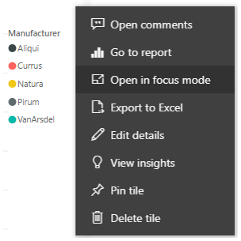

When you're looking at dashboards or reports in the Power BI service, it can be helpful to expand and focus on an individual chart or visual. You can do that in two different ways.

> [!VIDEO https://www.microsoft.com/videoplayer/embed/RE3oQlX]

Hover over a dashboard tile and select the ellipsis to see possible actions for the tile. Select **Open in focus mode** to expand the tile to encompass the full dashboard space.

Focus mode allows you to see more detail in your visuals and legends. For example, some of the columns might not be shown because of the space that is available in the tile.

In Focus mode, you can pin the visual directly to a different dashboard by selecting the pin icon. To exit Focus mode, select the **Exit focus mode** icon in the top-left corner.

The process is similar when you are viewing a report. A visual is still interactive in Focus mode, though you will temporarily lose any cross-filter effect between visuals.
