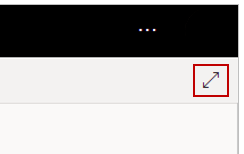
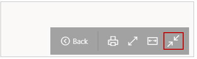
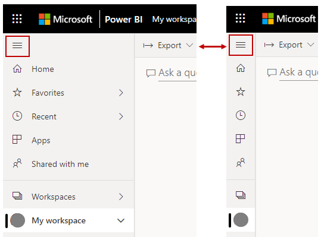

You might find that you have more content than you can fit on a canvas. You can get a full view of your dashboard content by managing how dashboard space is displayed.

**Video**: Get more space on your dashboard
> [!VIDEO https://www.microsoft.com/en-us/videoplayer/embed/RE3wZ5j]

The easiest method to display your entire dashboard in one screen is to select the **Full Screen Mode** button in the top right-hand corner of the dashboard.

Selecting the **Full Screen Mode** button removes all chrome elements from around the dashboard, which increases the amount of viewable space.

From within **Full Screen Mode**, you can select **Fit to Width** to shrink all your tiles to a single screen. This mode without scrollbars is commonly called *TV mode* and is useful for giving presentations.

You can also collapse the navigation pane on the left-hand side of the page by selecting the hamburger icon. To expand the navigation pane, select the icon again.

You can ensure that a dashboard will always have a collapsed navigation bar by appending the following to the end of the URL:

> ?collapseNavigation=true

Users who follow that link will open the dashboard with a collapsed navigation bar.

