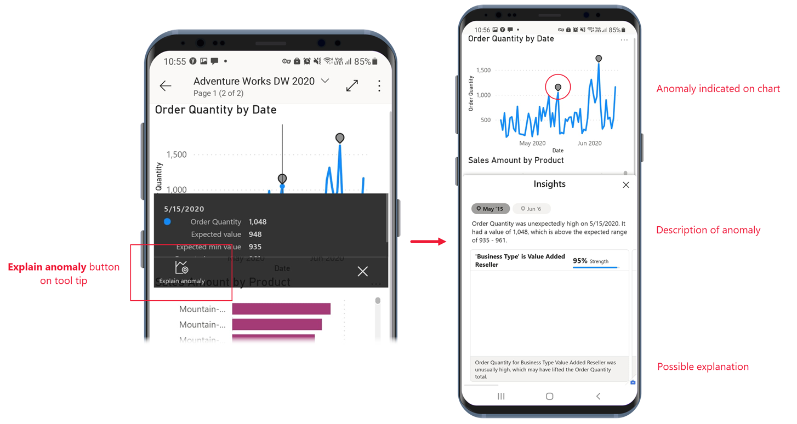
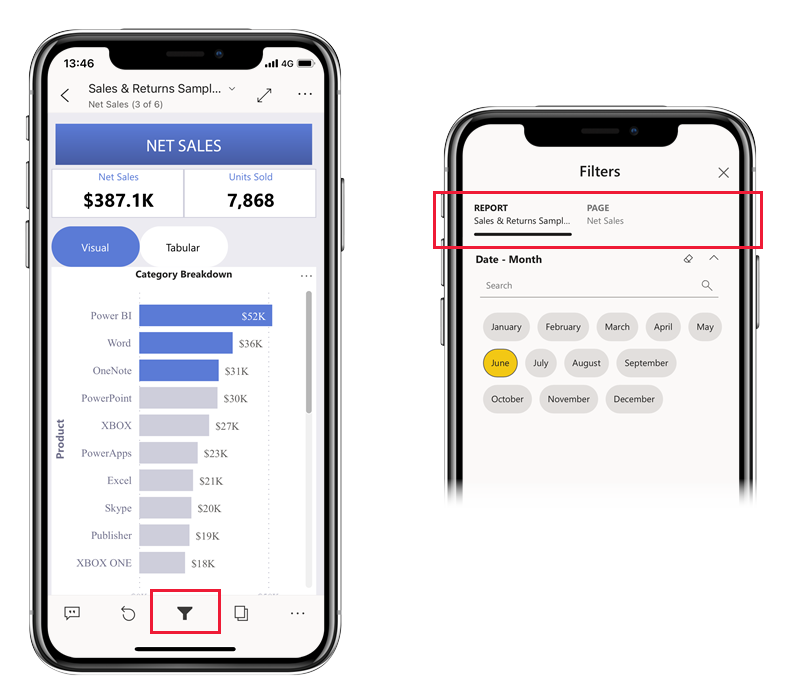
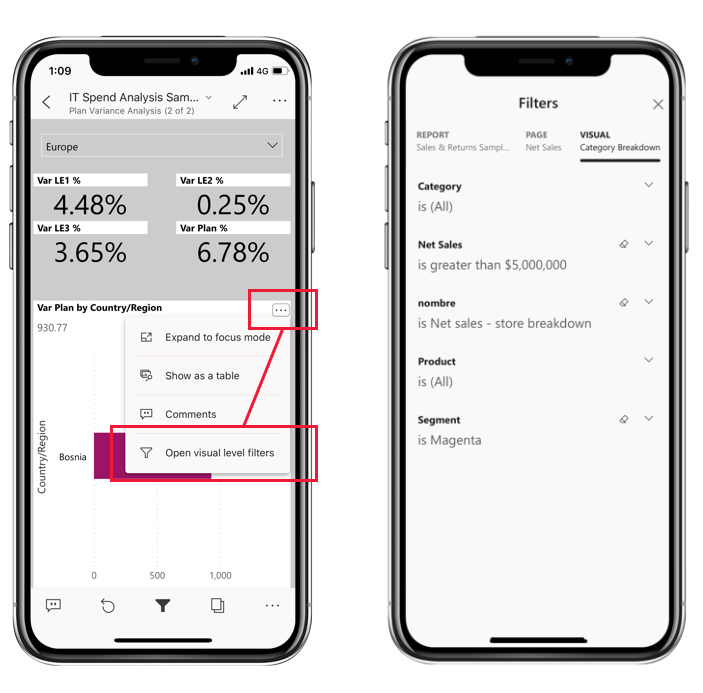

After you have a report open in the app, you can start working with it. You can do many things with your report and its data. By tapping and long tapping on the data that is shown in the report, you can slice and dice the data. In the report footer, you'll find actions that you can take on the report.
 
We generally hold our phones in portrait orientation when looking at them. Some reports have pages that are optimized for mobile viewing and are easy to read in portrait orientation. Whenever you come to a page that is not optimized for mobile viewing, it will appear as it does in the Power BI service. In portrait orientation this might be a bit small for convenient viewing. In such cases you can flip your phone to landscape orientation for a larger view, or you can just stay in portrait orientation and zoom in to the data you want to view in detail.

 
## Tap to select and cross-highlight data points

Tap a data point on a visual to select it. When you select a data point, other report visuals change according to your selection. 

## Select single or multiple data points

When you're exploring your data, you might want to see how selecting a single data point will affect the data you're viewing. Other times, you may want to observe how selecting a combination of data points affects what you're seeing.

Both of these ways of viewing data are possible using *single-select* and *multi-select* mode. In single-select mode, each time you tap a data point on a report page, the new selection replaces the current selection. In multi-select mode, you can select multiple data points. Each data point you tap gets added to any other selected data points, and the combined results are automatically highlighted in all the visuals on the page.

You can switch between single-select and multi-select modes in the app settings, as explained in the [Configure app settings](/learn/modules/explore-power-bi-mobile-apps/6-configure-app-settings) unit of this module.

## Tooltips

You can *long tap* (tap and hold) a data point to display a tooltip on the point. The tooltip shows the values that the data point represents. The following image shows that a long tap on the Revenue Var % to Budget chart has revealed the tooltip with the details of the October data point.

 
## Drill up, down, and through your data

Report authors can define hierarchies in the data and relationships among report pages. Hierarchies allow you to drill down, drill up, and drill through to another report page from a visual and a value. If drill up, drill down, or drillthrough have been configured on a visual, you can perform these actions by tapping and holding a data point on the visual. A tooltip will appear that contains buttons you can tap to drill down, up, or through the data.

 
## Investigate anomalies

Anomaly detection is a Power BI feature that automatically detects values that lie outside expected ranges and provides possible explanations of the cause of the anomalous values.

If a report creator has set up anomaly detection for a report visual, the tooltip on a data point will have an **Explain anomaly** button that will open the Anomalies pane, where you can see if the unexpectedly high peaks and low dips in your data are caused by data outliers, and view possible explanations.

 
## Open visuals in focus mode

When viewing reports on the app, you can use focus mode for report visuals. Focus mode gives you a larger view of a single visual and makes it easier to explore.

In a phone report, tap **More options (...)** in the upper-right corner of a visual and then tap **Expand to focus mode**.

 
In focus mode, you can long tap data points to get tooltips and drill down on data, just like you can when you're not in focus mode. You'll also have a footer and a **More options (…)** menu that offer more ways of exploring and interacting with the data of the visual.

 
Some options change, depending on the kind of visual you're focusing on. Possible options are described in the following table.

|Option  | Description|
|---------|---------|
|Filters|Open the filters pane to the visual-level filter|
|Reset visual|Return the visual to the state it was in before you started exploring it in focus mode|
|Comments|Open to Comments pane|
|Explore|Show options for drilling down to the next level in the visual|
|Sort|Sort the values in the visual|
|Annotate|Open the annotation screen, where you can draw on the visual and share your insights with colleagues|

What you do in focus mode carries over to the report canvas and vice versa. For example, if you highlight a value in a visual and then return to the whole report, the report will be filtered to the value you highlighted in the visual.

To clear all exploration from a visual, tap the **Reset visual** button .

## Zoom in and out of your data

Use the pinch gesture to zoom in and out of your reports to examine them in greater detail.

## Filter your data

Report authors often create filters to highlight specific data. Several kinds of filters can be created:

* **Report-level filters**, which apply to all the data in the report.
* **Page-level filters**, which apply just to the data on the page they're defined on.
* **Visual-level filters**, which apply only to the data included in the visual they're defined on.

In the mobile apps, you interact with filters on the filters pane. When you're in a report, you can open the filters pane using the filter icon in the report footer.

The filters pane has tabs that display the filters that are relevant for the level you're viewing. For instance, in the report pictured in the image below, there are filters that apply to the whole report, filters that apply to the specific page you're on. As a result, you see two tabs on the filters pane. Tap a tab to see and change the filters for the particular level you're interested in.

 
From a visual, you tap the **More options (...)** menu in the upper-right corner of the visual and then tap the **Open visual-level filters** option. The filters pane will open to the visual-level tab.

 
                      
If you had opened the filters pane from a report page, you would have seen only two tabs, one for report-level filters and another for the page-level filters, because only those tabs would be the relevant filters for that context.

## Browse report pages

You can browse through report pages in numerous ways:

* Tap the down arrow next to the report title to display the navigation pane, and then select the desired page.

    

* Swipe firmly from the side of the screen toward the center. Swipe from the right side to advance, and swipe from the left side to go back.

    

* Tap the Pages icon in the report footer.

    

## Report actions

The report footer contains icons that you can use to perform common actions. You’ve already seen a few of them in previous sections. 

 
The **More options (...)** menu contains all report actions: both the common actions you see on the report footer as well as a number of other actions.

For more information, see [Explore reports in the Power BI mobile apps](/power-bi/consumer/mobile/mobile-reports-in-the-mobile-apps).

## Bookmarks

A bookmark captures a particular, configured view of a report page, including filters, slicers, and the state of visuals. In the Power BI mobile apps, just like in the Power BI service, when you're viewing a report that has bookmarks, you can use those bookmarks to jump to the particular views they represent. On Windows devices, you can even set up your slideshows to cycle through bookmarks if they exist.
 
In the Power BI mobile apps, you can't create bookmarks - you can only *use* them to display report views. Bookmarks are created in Power BI Desktop or in the Power BI service. There are two kinds of bookmarks – *report bookmarks*, which are created by the report designer, and *personal bookmarks*, which you as a report viewer can create yourself in the Power BI service. The mobile apps support both personal and report bookmarks.

You can see any bookmarks that have been created for a report on the bookmarks menu under **More options (...)** on the report actions toolbar. While you can't create bookmarks in the mobile apps, you can mark an existing personal bookmark as the default bookmark by selecting the **More options (...)** ellipsis that follows the personal bookmark name and choosing **Make default**. If you do this, the next time you open the report, it will open to the view defined by that default bookmark.

  
## Refresh your data

Report data refreshes when you open a report. You can also refresh report data manually by pulling down slightly from top to bottom on the report page.

>[!NOTE]
> In the mobile apps, data is always refreshed with the data as it is in the Power BI service, never directly from the data source.
 
On Android devices, it is possible to have a button for refresh, as explained in the [Configure app settings](/learn/modules/explore-power-bi-mobile-apps/6-configure-app-settings) unit of this module.

## View your data offline

One advantage of viewing Power BI in a mobile app rather than in a mobile browser is that you can see your data even when you're offline. While offline, you can access and interact with dashboards you've previously accessed from the mobile app. In addition, you can also access any Power BI reports you've accessed previously. However, with a report, while you can see the full report when you're offline, you can't filter, cross-filter, sort, or use slicers on it.

Power BI provides clear indicators when you go in and out of offline mode, as well as indicators for missing dashboards, reports, and tiles that aren't available offline. Some other types of content may not be available as well.
 
For more information, see [View your data offline in the Power BI mobile apps](/power-bi/consumer/mobile/mobile-apps-offline-data).