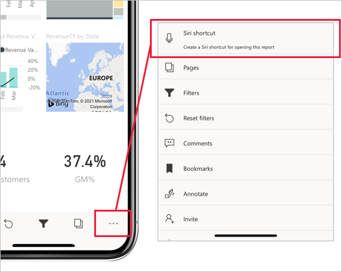
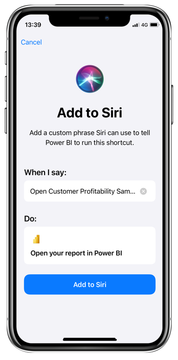
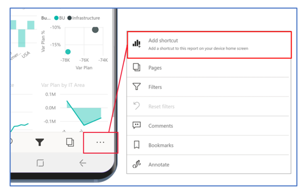
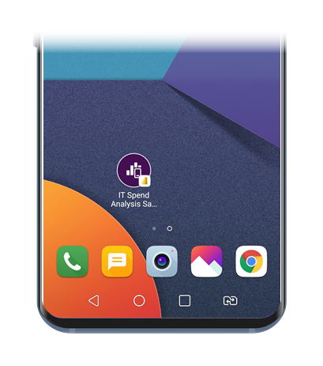
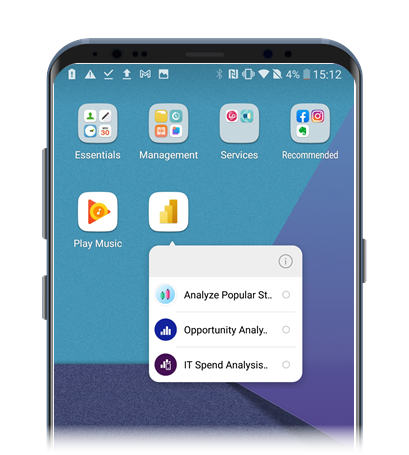
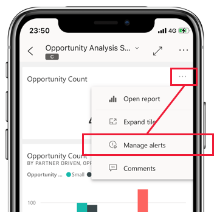
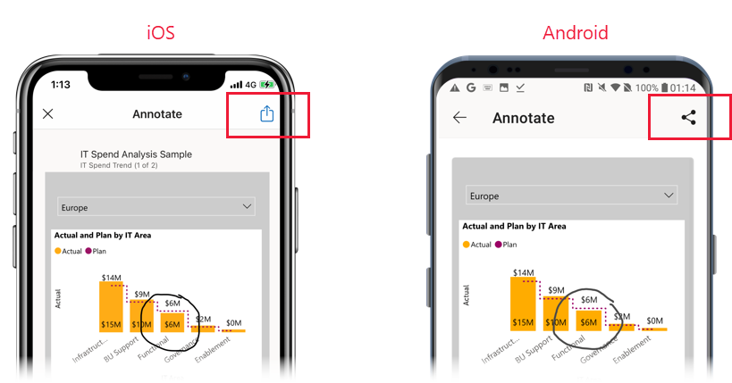

To maximize your experience with the mobile app, you can create shortcuts and alerts, share reports and dashboards, play reports as slideshows, and use split-screen mode to multi-task with other apps.

## Use shortcuts to get straight to your reports and dashboards

To quickly get to your frequently used reports or dashboards on your mobile device, you can create shortcuts that get you straight to where you want to go.

On iOS devices, you can create voice-activated Siri shortcuts as well as shortcuts that you can put on your home screen.

To create a Siri shortcut, tap **Siri shortcut** under the **More options(...)** menu on the footer of your report or dashboard.

 
On the **Add to Siri** page that appears, type in a phrase that Siri can use to open your item in Power BI, and then tap **Add to Siri**.

 
After you've created the Siri shortcut, you can access your dashboard or report by activating Siri by voice and saying the shortcut phrase. Siri will launch Power BI and take you right to the report or dashboard you wanted.

After you've created a Siri shortcut to some Power BI content, you can also add it to your device's home screen. Then, with a single tap on your home screen, you can open your content directly. To create a Sira home screen shortcut, follow the instructions on Apple support's [Shortcuts User Guide](https://support.apple.com/en-il/guide/shortcuts/apd735880972/ios) page.

For more information, see [Using Siri shortcuts in the Power BI Mobile iOS App](/power-bi/consumer/mobile/mobile-apps-ios-siri-shortcuts).

On Android devices, you can also create shortcuts to put on your home screen. Select the **Add shortcut** option under the **More options(...)** menu on the report or dashboard's footer.

              
After you’ve created a shortcut, you can access your dashboard or report by tapping the shortcut icon on the home screen.

 
On Android devices, shortcuts to frequently viewed reports and dashboards are also available on a quick access menu that you can display with a long tap on the app launcher icon (the icon that you got when you installed the mobile app on your device). This quick access menu changes from time to time, depending on what you've been looking at. From the quick access menu, you can create a permanent home screen shortcut by dragging it onto the home screen.

 
For more information, see [Use Android app Shortcuts in the Power BI Android app](/power-bi/consumer/mobile/mobile-app-quick-access-shortcuts).

## Create alerts for when data needs your attention

While you're on the go, you can set up alerts on dashboards in the Power BI mobile apps to notify you when data that you're interested in has changed. Alerts that you set up on your mobile device will also be visible in the Power BI service. Likewise, in the mobile apps you will receive alerts that you have set up in the Power BI service.

Alerts can be set up for tiles that feature a single number, such as cards and gauges, but not for tiles with streaming data.
To set up an alert, find the visual you're interested in, tap **More options (...)** in the upper-right corner of the visual, and then select **Manage alerts**. 
 

For more information, see [Set data alerts in the Power BI mobile apps](/power-bi/consumer/mobile/mobile-set-data-alerts-in-the-mobile-apps).

## Share reports and dashboards 

Sharing views of your reports and dashboards with colleagues is simple from the Power BI mobile apps. To share views, go to the item that you want to share, apply the filters or bookmarks that you need to get the view of the data that you want to share, and then select the **Share** option, which is located in the header under **More options (...)**. If enough space is available on the header, the **Share** option might already be visible on the header. 

 
When you tap the **Share button**, you'll be able to choose one of the communications apps that you have on your device, such as your email app. A link to the view that you created will be sent through the app that you chose.
 
You can also share your reports when you annotate them. Select the options menu on the report footer, choose **Annotate**, make your annotations, and then share them by tapping the **Share** icon in the upper-right corner of the screen.

 
## Play reports as slideshows

On Windows devices, you can play a report as a slideshow that cycles through the report’s pages, bookmarks, or both, depending on what you choose. You can also set up your slideshow to start playing automatically whenever the app is launched. This feature is useful for creating kiosk-like experiences where you want your report to run in a public display without manual intervention.

Learn more about [slideshows](/power-bi/consumer/mobile/mobile-windows-10-app-presentation-mode#slideshows) in the Power BI mobile app documentation.

## Use split screen mode to work with other apps side by side

There may be times when you want to view and interact with your data while working in another app, such as writing an email. If your iPad or Android tablet has multi-window support, you can open the two apps side by side.

 
Once both your apps are open side by side, you can adjust the size of the screens by dragging the border between the apps left and right.

Check your tablet's documentation to see how to open apps in split screen mode on your device.