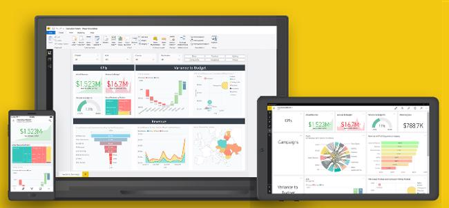
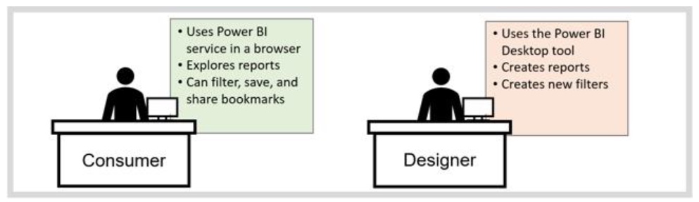
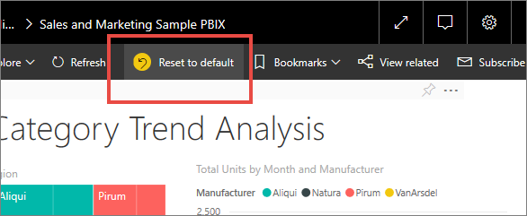
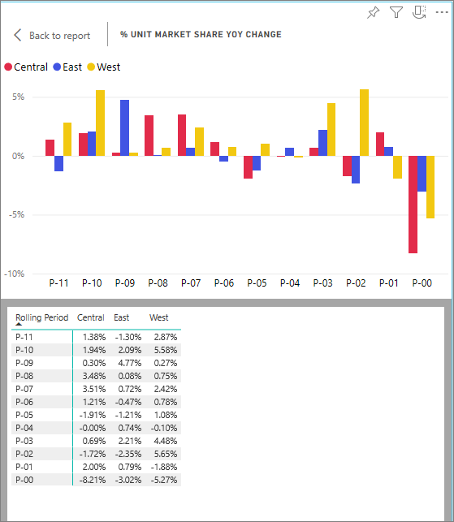
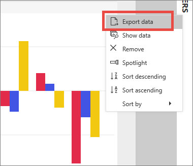
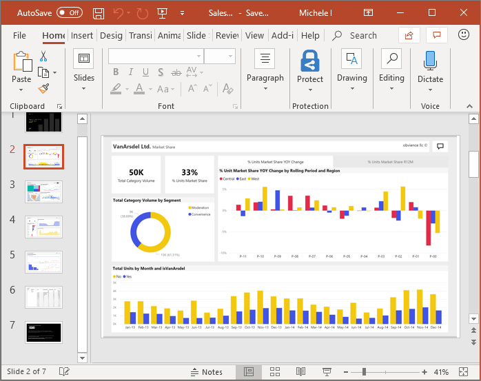
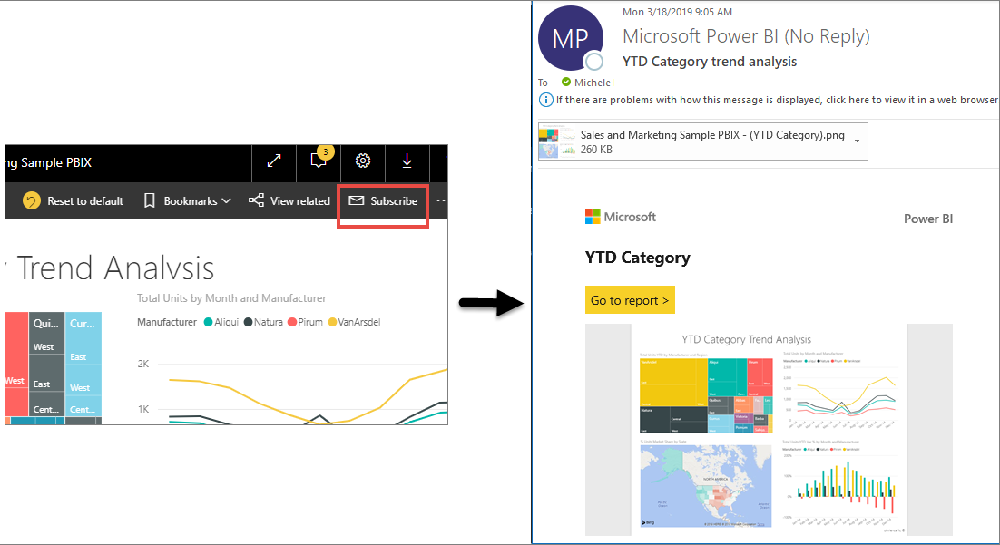
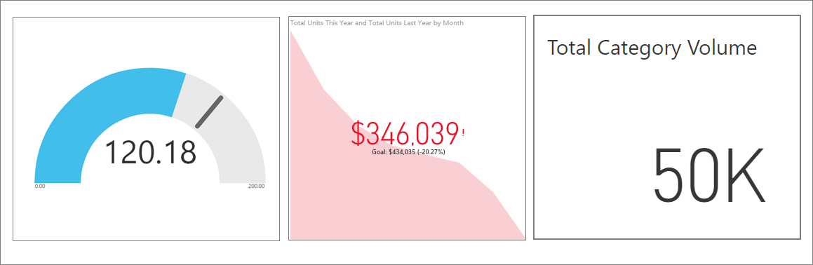

We all live in a data culture where business decisions should be based on facts, not opinions. We need data to help us make these decisions.

> [!VIDEO https://www.microsoft.com/videoplayer/embed/RE2PMcs]

Every day, colleagues send you all types of data, from reports to spreadsheets, emails with charts, and even printed handouts. As the data accumulates, the task of quickly finding what you need, when you need it, becomes more difficult. Too much data increases the risk that you're not using the most recent information.

Power BI can help make your job easier and more effective at the same time by converting all that data into charts and graphs to help you visualize your data in meaningful ways.

You can view data insights from colorful and compelling visuals instead of just lists and tables.

You and your colleagues can work from the same trusted dashboards and reports from a browser or mobile device. Because your data updates and refreshes automatically, you’re always working with the freshest content.

Furthermore, because the content isn’t static, you can explore your data further by looking for trends, insights, and other business intelligence. The intuitive features of Power BI allow you to slice the content and even ask questions by using your own words. Let Power BI monitor your data for you, and send you alerts when data changes above or below a threshold you set. All your data is available anytime, whether it’s in the cloud or on-premises, from any device.

## How to know if you're a Power BI consumer

The way you interact with Power BI depends on your job role. As a user or consumer, you're the person who receives dashboards, reports, and apps from designers who create them. Also, you work in the online version of Power BI (called Power BI service) reviewing and interacting with this data to make business decisions.

You don’t need to be a data scientist to perform complex data analysis. Power BI does the complex work for you with straightforward and intuitive controls.

All you need to get started is simply a browser or mobile device and an internet connection.

## Safely interact with content

You can explore and interact with your content, filter, slice, subscribe, and export, without affecting the underlying dataset or the original dashboards, reports, or apps.

> [!NOTE]
> Remember, you cannot hurt your data. Power BI is a great place for you to explore and experiment without worrying that you’ll “break” anything.

That doesn't mean you can't save your changes; you can, but your changes only affect your view of the content. Furthermore, reverting to the original default view is as simple as selecting the **Reset to default** button.

## Display details on a visual

Visuals are made up of datapoints, and by hovering over a datapoint, you can view the details.

## Show data that is used to create a visual

Use the Show Data feature if you want to view data that Power BI is using to build a visual. The selected visual expands to fill the canvas, and the data displays below or alongside.

## Export data

In addition to showing the data that is used to create a visual, you can also export that data and view it in Microsoft Excel. When you export to Excel, you’re creating a separate document, a spreadsheet that isn't part of Power BI. Any changes that you make in the Excel file won’t impact the data in Power BI. Whether you want to take a closer look at the data, or you want to use the data in another application or for another purpose, Power BI gives you that flexibility.

Exporting isn’t limited to individual visuals; you can export entire reports to PowerPoint or PDF to share with your colleagues.

## Cross highlight and cross filter report content

All visuals in a report are related. Highlight or select a value in one visual and instantly view its impact on the other visuals.

## Collaborate with colleagues

Skip the email. With the Power BI comment feature, you can add a personal comment or start a conversation with colleagues about a dashboard, right there on that dashboard. The comment feature is just one of the ways you can collaborate with others.

## Let Power BI work for you

With subscriptions and alerts, Power BI sends information to you in email, on a schedule that you set.  

### Subscribe to reports and dashboards

To stay up-to-date on your most important content, you can subscribe to report pages and dashboards that matter most to you. Power BI will send a snapshot to your email inbox.

### Get alerts when your data reaches a threshold

Your data is live, and your visuals will update automatically. If you want to be notified when data changes above or below a threshold that you have set, use data alerts.

Power BI sends you an email when the value passes any upper or lower limit that you set.

Power BI can enable everyone—not just data specialists—with real insight into what is happening. It allows you, as a consumer, to make better and more informed decisions.

In Power BI, you have the tools to explore and interact with the data to find answers to questions and to discover new insights. Additionally, you can:

- ask questions by using natural language
- collaborate with your team
- share what you discover, and
- take action from your desk or on the go.

Power BI is straightforward and delivers powerful data-backed business intelligence to help you answer questions, make decisions, track progress, make predictions, stay up-to-date on a regular cadence, and much more.

> [!VIDEO https://www.microsoft.com/videoplayer/embed/RE2PHbV]

Now you know what Power BI is and why to use it. In the next unit, you'll learn how to navigate the Power BI user interface.
