In Power BI, the term *content* refers to apps, dashboards, and reports. Content is created by Power BI designers, who share it with colleagues like you. Your content is accessible and viewable in Power BI, and the best place to start is from your Power BI home.

## Explore Power BI Home 

When you sign in, Power BI opens and displays your Home canvas, as shown in the following figure.

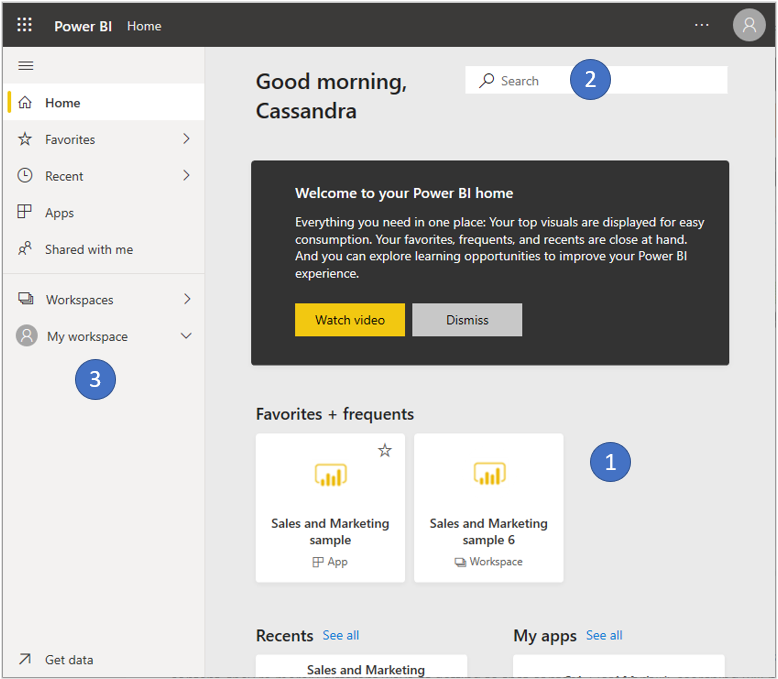

Power BI Home offers three ways of locating and viewing your content. Though all three accesses the same pool of content, they’re merely different ways of getting to that content. Occasionally, searching will be the easiest and quickest way to find something, while other times, selecting a tile on the Home canvas will be your best option.

1.  The Home canvas displays and organizes your favorite and most recent content, along with recommended content and learning resources. Each piece of content displays as a tile, with a title and icon. Selecting a tile opens that content.

2.  Along the side, is a navigation pane. On this pane, your same content is organized a little differently, by Favorites, Recent, Apps, and Shared with me. From here, you can view lists of content and select the one to open.

3.  In the upper right corner, the global search box lets you search for content by title, name, or keyword.

The following sections review each of these options for finding and viewing content.

### Home canvas

On the Home canvas, you can view all the content that you have permission to use. At first, you might not have much content, but that will change as you start to use Power BI with your colleagues.

Your Home canvas also updates with recommended content and learning resources. You can find this learning path in the **Learn how to use Power BI** section.

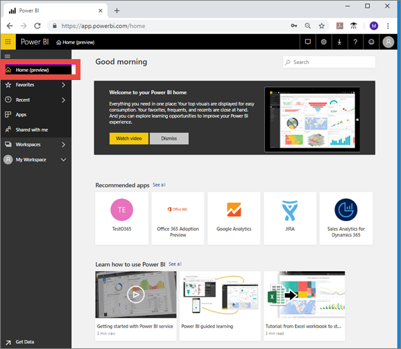

As you work in Power BI, you’ll receive dashboards, reports, and apps from colleagues, and your Home canvas will eventually fill in. Over time, it might resemble the following Home canvas.

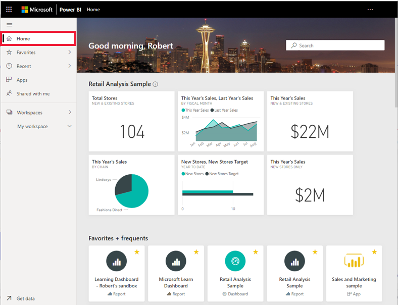

The next few sections take a closer look at the Home canvas, from top to bottom.

#### Key metrics at a glance

As previously mentioned, on your Home canvas, you can view all the content that you have permission to use. Each piece of content is a tile, and selecting a tile takes you to that piece of content. For example, selecting a tile for a dashboard opens the dashboard.

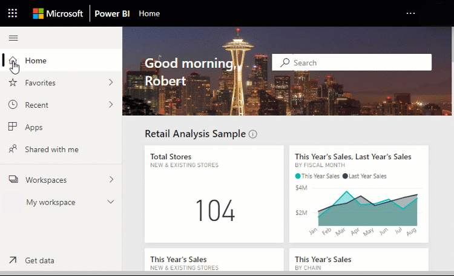

### Most important content at your fingertips

#### Favorites and frequents

This top section contains links to the content that you visit most often or that you’ve tagged as a *favorite*. Notice that two tiles have yellow stars; that app and that report have been tagged as favorites.

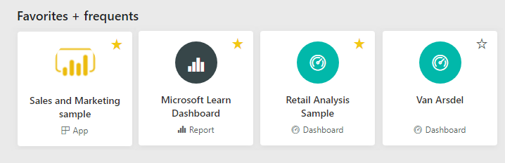

#### Recents and My apps

The next section displays the content you’ve visited most recently. Notice the timestamp on each tile. The **My apps** section lists apps that have been shared with you; the most recent apps are listed here. You can select **See all** to display a list of all apps that are shared with you.

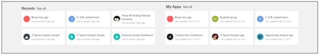

#### Recommended apps

Based on your activity and account settings, Power BI displays a set of recommended apps. Selecting an app tile opens the app.

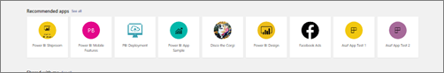

#### Shared with me

Colleagues share apps with you, and they also share individual dashboards and reports. In the **Shared with me** section, notice that there are five dashboards and one report that your colleagues have shared with you.

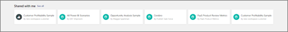

#### Learning resources

At the bottom of the Home canvas, is a set of learning resources. The exact resources that appear depend on your activity and settings. 

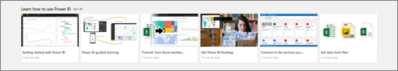

#### Explore the navigation pane

Use the navigation pane to locate and move between dashboards, reports, and apps. Occasionally, using the navigation pane will be the quickest way to get to content.

The nav pane is there when you open Home, and remains static as you open other areas of Power BI.

The nav pane organizes your content into categories that are similar to what you’ve already seen on the Home canvas: **Favorites**, **Recent**, **Apps**, and **Shared with me**. However, to view the most-recent content in each of these sections, select the arrow to the right of the heading.

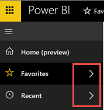

To open one of these content sections and display a list of all items, select the heading.

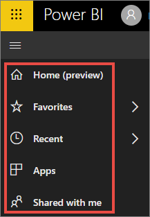

The navigation pane is another way for you to find the content you want, quickly. Content is organized in a manner similar to the Home canvas, but shown in lists instead of tiles.

### Search all of your content

Sometimes, the fastest way to find your content is to search for it. Perhaps you’ve discovered that a dashboard you haven’t used in a while isn’t showing up on your Home canvas. You remember that your colleague, Aaron, shared it with you but you don’t remember what he called it or whether it was a report or a dashboard.

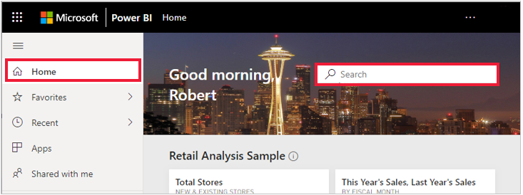

You can enter the full or partial name of that dashboard and search for it. Additionally, you can enter your colleague’s name and search for content that they've shared with you. The search is scoped to look for matches in all the content that you own or have access to.
