Now that you have a basic understanding of the role that dashboards, reports, and apps play in Power BI, it's time to closely examine the different ways you’ll use them to choose the content you need to make better business decisions.

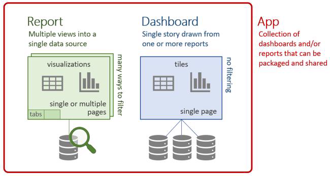

Let's start with dashboards.

### Dashboards

A Power BI dashboard is made up of tiles that, together, tell a story. Because it is limited to one page, a well-designed dashboard contains only the most important elements of that story. You can't edit the dashboard, but there are plenty of ways to use the data on the dashboards to monitor your business and make data-backed decisions. 

Suppose that you're the Marketing Manager for a clothing manufacturing company named Van Arsdel. The following **Marketing and sales** dashboard example provides you with a high-level snapshot of your business. By viewing this dashboard, you can monitor how your company is performing versus the competition.

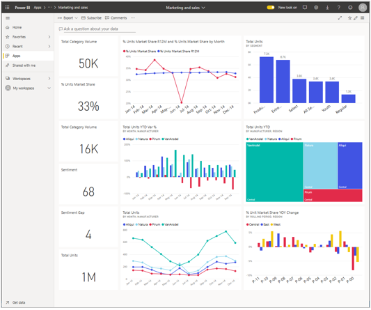

You'll find dashboards on your Home page. Look for the dashboard icon , and select to open.

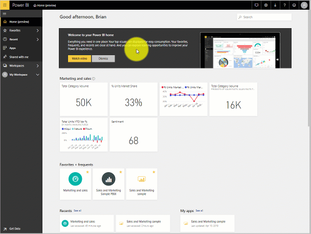

#### Hover to view details
Tiles on a dashboard are more than just pictures. Hover over a tile to view details about the data behind the visual. You can view details like these on both dashboards and reports. 

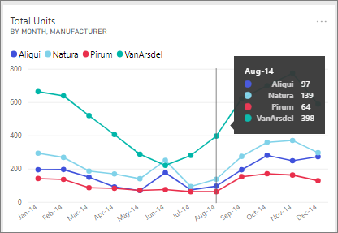

### Open a report from a dashboard
The tiles on your dashboard are visualizations from reports. Opening a report is as simple as selecting a tile. 

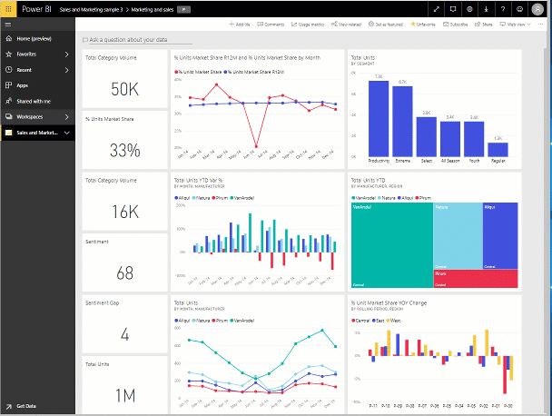

The report opens to a page that contains the content that you just selected. 

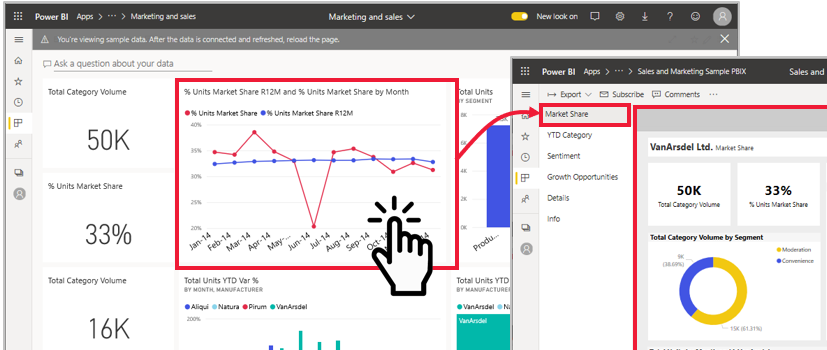

Now that a report is open, you can explore it.

### Reports

#### Collapse the nav pane

The first thing you might notice is that the navigation pane is still available for you to move around in Power BI. Because you’re going to concentrate on the report canvas at this time, collapse the navigation pane by selecting the "hamburger"  icon.

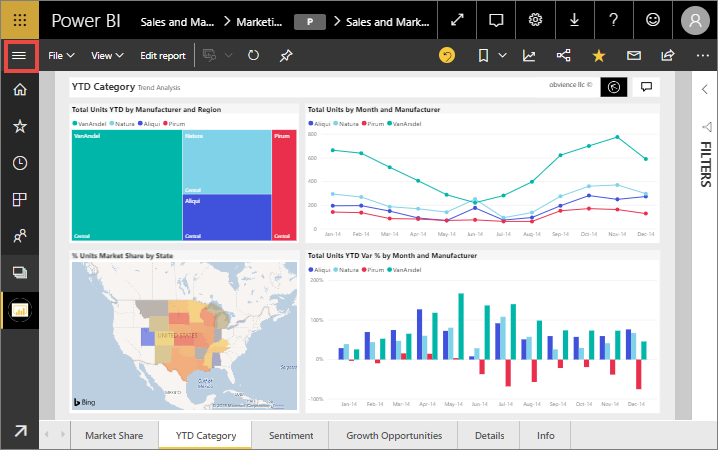

#### Visit report pages

When you receive a new report, you'll want to familiarize yourself with the data and insights it contains. A good way to start is by visiting each of the report pages. Each tab at the bottom of the report canvas represents a report page. Select a tab to display that page.

Each page has a different set of visualizations that tell a story. In this example, the **Sentiment** page compares how customers feel about the Van Arsdel company and industry, by month and geography. After a dip mid-year, the company’s positive sentiment is at an all-time high.

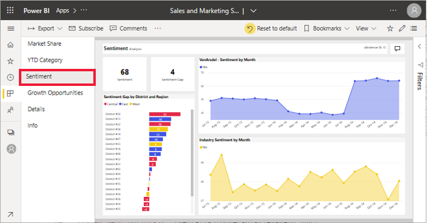

#### Change report view options

Reports can be viewed on many different devices, with varying screen sizes and aspects. By default, reports are set to **Fit to page**, which means that you don't have to scroll, but the type might be small. On the **View** menu, select **Actual size** to view the information on the report at full size, but be aware that you might need to scroll.  

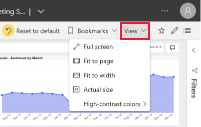

The **View** menu has many options that control how your report page displays. Select the option that works best for your screen size, the audience you are presenting to, and your personal preference. 

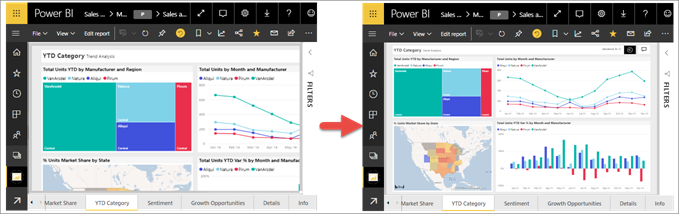

To meet your accessibility needs, use the **High contrast colors** option. 

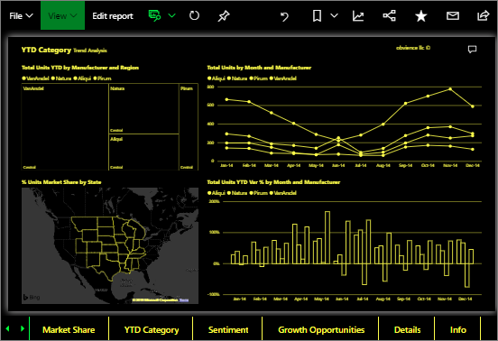

#### View bookmarks in your report

A report designer might give you alternative views of the same data. For example, while one view shows data for the Central region, another view shows data for the Southern region, and a third for the Northern region. By selecting a bookmark, you can switch between the three different views of the same report page.  

Not all reports have bookmarks. To determine if your report does, open the Bookmarks pane from the **View** menu. 

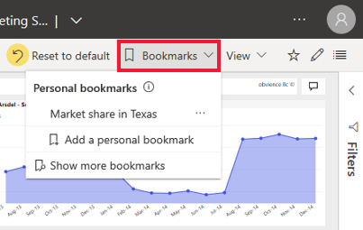

> [!TIP] 
> You’ll learn how to create your own personal bookmarks in Module 2.

In the following example, the **Market Share** page has two bookmarks: B1 and B2. Watch what happens when each bookmark is selected. 

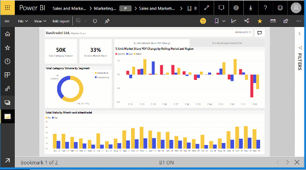

#### Understand the way your report is filtered

When a colleague shares a report with you, be sure to look at the Filters pane. Filters let your colleagues highlight specific data, usually by not showing all of the available information. 

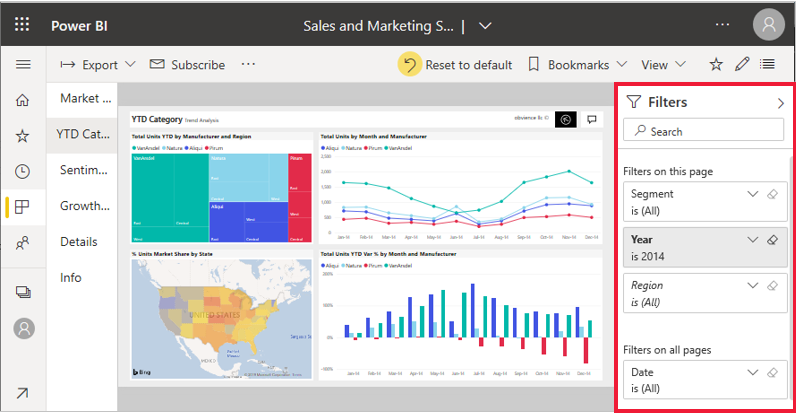

Remember, each report page is telling a story. To fully understand the story, you need to know *if* filters are being applied and *what* those filters are. 

The Filters pane shows the filters that are applied to the current report, report page, and visual (if one is selected). In the following example, the column chart is selected. Notice that there are three page filters (Segment, Year, Region), one filter applied to all report pages (Date), and three visual filters (Manufacturer, Month, and Total Units YTD Var %). 

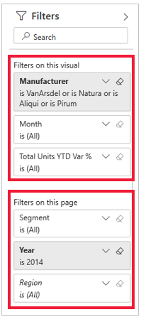

If the filter has the word All next to it, that means all the values in the field are included in the filter, so no data is being excluded. On this page, all segments are included, and in the column chart, all months are included. The Filters on the page **Year is 2014** tells us that this report page only includes data for the year 2014.

### Enlarge a dashboard tile or report visual
Occasionally, you will have a dashboard or report that is a little crowded, and you will want to zoom in on only one visual. This is a perfect use of **Focus mode**. Simply hover over the visual to reveal the action menu, and then select **Open in focus mode** or the focus icon 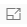. 

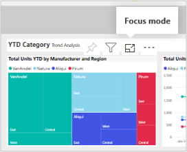

The visual fills the entire canvas, and you can still hover to view details and access the Filters pane.

If the view isn’t large enough, open that same visual in *full screen mode* so that it fills your entire screen. Notice that all the menu bars disappear, except for the Filters pane. 

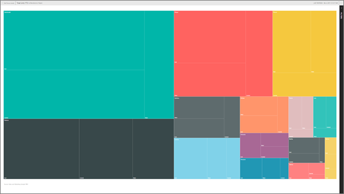

This mode is often used for presentations because you can even display entire dashboards and entire report pages in full screen mode. 

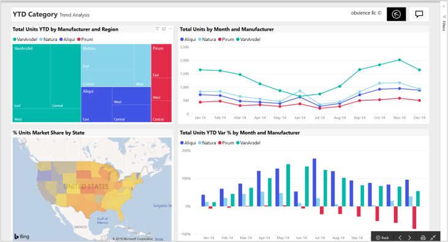
