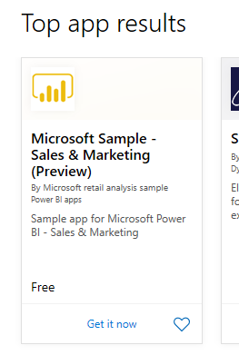
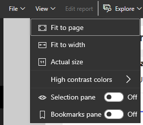
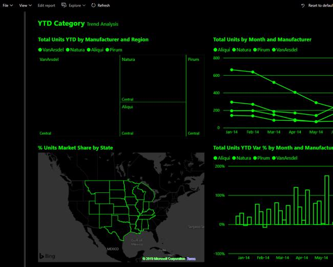

## Learning objectives

At the end of lab, you will be able to perform the following tasks: 
- Install a power BI app
- Find and view a Power BI dashboard and report
- Create an alert
- Add comments
- Set accessibility options

Estimated time to finish this lab: 20 to 30 minutes

## Scenario

Congratulations. You are the new sales manager at a clothing manufacturing company named *Van Arsdel*. Your first assignment is to view your sales and marketing dashboard and reports.

## Procedure

### Add the Sales and Marketing Sample app

1. Sign in to [http://app.powerbi.com](http://app.powerbi.com).
2. Select the **Apps** tab on the left.
3. Select the **Get apps** button.
4. Select “**Find more apps and consulting services at AppSource**” link at the bottom of the menu.
5. Search for *Sales and Marketing sample*.   

 

6.  Select the “**Get it now**” link and wait for the app to install.
7. From the **Get started with your new app** screen, select the **Explore App** button. The app dashboard opens.

**Open and view the dashboard and report**

1.  View the **Marketing and Sales** app dashboard.
2.  Select one of the column chart or line chart tiles to open the associated detailed report.
3.  To return to the dashboard, select the back arrow in your browser.

    <!-- need to redo this aGIF, it doesn't look like this any longer [Animated image of moving between dashboards and reports.](../media/lab-1/power-bi-dashboard-report.gif)--!>

### Create an alert

1.  From the **Marketing and sales** app dashboard, mouse over the Total Category Volume tile (the upper left corner of the canvas), and select the “…” (ellipses).
2. Select **Manage alerts**.
3.  Select **+ Add alert rule**.
4.  Scroll down to the **Threshold** field and type in _49000_.
5. Select the checkbox for **At most every 24 hours**.
5.  Select the checkbox for **Send me email, too**.
6.  Select the **Save and close**.

> [!NOTE]
> Since total category volume is already above 49,000, you will receive an email within 24 hours. 

### Add a comment on your dashboard

1.  Mouse over the **Total Units** tile (top right), select the **“…”** (ellipsis), and then select **Add a comment**.
3.  Add a comment to the visual tile like, “Will we include the Winter segment here?”
4.  Select the **Post** and then **Close**.
5.  Next to the **Total Units** title, select the conversation icon that just appeared to see your comment.

### Report and accessibility display options
Reports are viewed on many different devices, with varying screen sizes and aspects. The View menu has many options that control how your report page displays. Select the option that works best for your screen size, your audience, or your personal preference. Try the following:

1.  Select the **Total Units** tile to ope the associated report. 

2. From the upper menubar, select **View.**

 

3.  The first three options control the display of your report. Select each of the three options to learn how they work.
    *   To display your report page at the largest size possible without resorting to scrollbars, select **Fit to page**.
    *   Too fill the entire width of the available space. Select the **Fit to width**.
    *   To view the report at the best resolution (and if you don’t mind the possibility of double scrollbars), select **Actual size**.

     <!-- this gif uses the old report, not the app  --!>

4.  There are several accessibility settings available from the View menu. These setting make reports easier to consume by people with color blindness or other sight challenges. From the **View** menu, select **High contrast colors** and choose one of the options. In the example below, we’ve chosen **High contrast #2**.

 
