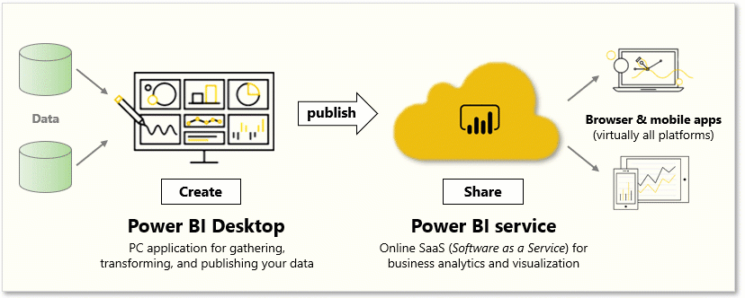

Power BI Desktop is a free application for PCs that lets you gather, transform, and visualize your data. In this module, you'll learn how to find and collect data from different sources and how to clean or transform it. You'll also learn tricks to make data-gathering easier.

Power BI Desktop and the Power BI Service work together. You can create your reports and dashboards in Power BI Desktop, and then publish them to the Power BI Service for others to consume. 

The following are the tasks that you will complete in this module:

&nbsp;

**Video**: Introduction to Power BI Desktop

> [!VIDEO https://www.microsoft.com/videoplayer/embed/RE3kZ3T]

To perform the exercises in this module, you’ll need to have Power BI desktop installed and have a Power BI Service account set up. 

## Download Power BI Desktop

You can download Power BI Desktop from the web or as an app from the Microsoft Store on the Windows tab.

| Download Strategy | Link | Notes |
|-------------------|------|-----------------------------------|
| Windows Store App | <a href="https://go.microsoft.com/fwlink/?linkid=2101122" target="_blank">Windows Store</a>| Will automatically stay updated |
| Download from web | [Download .msi](http://go.microsoft.com/fwlink/?LinkID=521662) | Must manually update periodically |

## Sign in to Power BI service
Before you can sign in to Power BI, you'll need an account. To get a free trial, go to <a href="https://go.microsoft.com/fwlink/?linkid=2101313" target="_blank">app.powerbi.com</a> and sign up with your email address. 

For detailed steps on setting up an account, see [Sign in to Power BI service](https://docs.microsoft.com/power-bi/consumer/end-user-sign-in).

