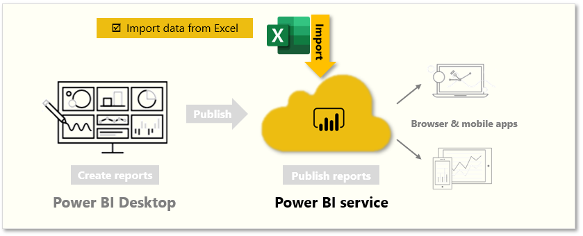
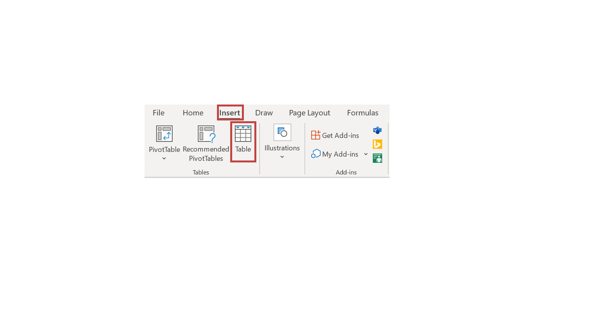
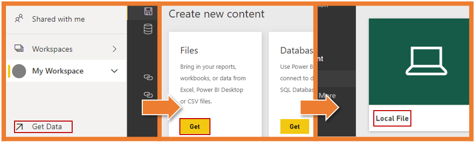
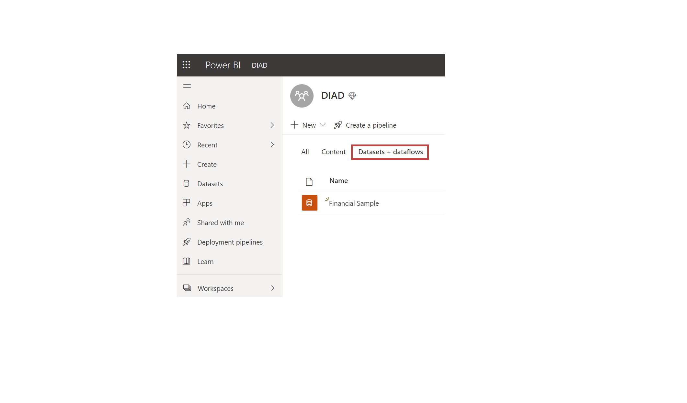
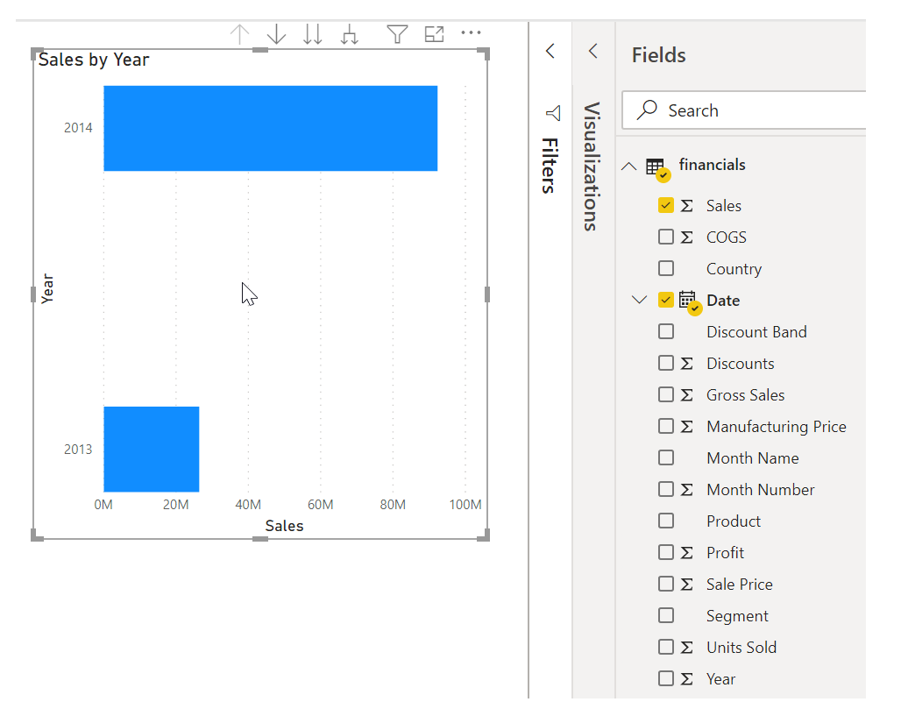

Likely, you've used Microsoft Excel to create or view reports or to build pie charts or other visuals. Getting your Excel data into Power BI is a straightforward process. 

In this unit, you will bring Excel workbooks into Power BI.

&nbsp;

**Video**: 
> [!VIDEO https://www.microsoft.com/en-us/videoplayer/embed/RE3nkKG]

This unit explains how you can import an Excel workbook file that contains a simple table from a local drive into Power BI. You'll then learn how to begin exploring that table's data in Power BI by creating a report.

## Make sure that your data is formatted as a table
For Power BI to import data from your workbook, that data needs to be  formatted as a table. In Excel, you can highlight a range of cells, and then on the **Insert** tab of the Excel ribbon, select **Table**.

Make sure that each column has a good name; it will make it easier for you to find the data that you want when creating your reports in Power BI.

## Import from a local drive
Wherever you keep your files, Power BI makes importing them simple. In Power BI, you can go to **Get Data > Files > Local File** to select the Excel file that you want.

After the file has been imported into Power BI, you can begin creating reports.

Your files don't have to be on a local drive. If you save your files on OneDrive or SharePoint Team Site, that's even better. This module will go into more details about the best ways to save your files later.

## Create reports
After your workbook's data has been imported, a dataset is created in Power BI and it will appear under **Datasets**. 

Now, you can begin exploring your data by creating reports and dashboards. Select the **Open menu** icon next to the dataset and then select **Explore**. A new blank report canvas appears. On the right-hand side, under **Fields**, are your tables and columns. Select the fields for which you want to create a new visualization on the canvas.

You can change the type of visualization and apply filters and other properties under **Visualizations**.

If you use any of Excel's advanced BI features like **Power Query**, **Power Pivot**, or **Power View**, you can import that data into Power BI, too.

For more information, see [Get data from Excel workbook files](https://docs.microsoft.com/power-bi/service-excel-workbook-files).
